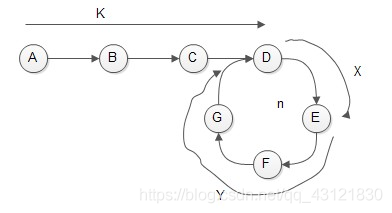

## 链表问题

面试时链表解题的方法论 

1) 对于笔试，不用太在乎空间复杂度，一切为了时间复杂度

2) 对于面试，时间复杂度依然放在第一位，但是一定要找到空间最省的方法

链表面试题常用数据结构和技巧

1. 使用容器(哈希表、数组等)

2. 快慢指针

## 快慢指针

### 判断是否存在环

如果链表中存在环，那么快慢指针进入环之后，因为存在速度差，两个指针迟早会相遇，那么只需判断两个指针的值是否相等即可，若果有相等的情况就存在环，不相等就不存在。

相遇表示有环，第一个相交点的证明：



假设快慢指针在E点相遇，设置如上图所示的变量

1. K： 没入环之前两个指针走过的距离（注意，是距离，不是结点个数）
2. X：相遇点处，逆向到**入环点**的距离
3. Y：相遇点处，顺时到**入环点**的距离
4. N：相遇时，**快指针**完整绕环的圈数
5. n： 相遇时，**慢指针**完整绕环的圈数

公式推导：

1. 慢指针走过的路程：K+X+n*(X+Y)
2. 快指针走过的路程：K+X+N*(X+Y)
3. 两者是二倍的关系：2(K+X+n*(X+Y)) = K+X+N\*(X+Y)   =>   K + X = (N-2n) * (X+Y)
4. 分析：K+X的值恰好为**圈数的整数倍**，也就是说K+X大于等于1圈的距离，且为整数倍
5. 所以，将相遇处的快指针移动到起点处，快慢指针以相同的每次一步的速度前进，当快指针走K步，慢指针走**圈数的整数倍 - X**，两者会在入环点相遇

### 无环链表

查找链表的中点：

1. 输入链表头节点，奇数长度返回中点，偶数长度返回上中点
2. 输入链表头节点，奇数长度返回中点，偶数长度返回下中点
3. 输入链表头节点，奇数长度返回中点前一个，偶数长度返回上中点前一个
4. 输入链表头节点，奇数长度返回中点前一个，偶数长度返回下中点前一个

**注意边界条件，快慢指针有速度差，快指针为空时，慢指针到达中点**

- 输入链表头节点，奇数长度返回唯一中点，偶数长度返回上中点

```java
// head 头
public static Node midOrUpMidNode(Node head) {
    if (head == null || head.next == null || head.next.next == null) {
        return head;
    }
    // 链表有3个点或以上
    Node slow = head.next;
    Node fast = head.next.next;
    while (fast.next != null && fast.next.next != null) {
        slow = slow.next;
        fast = fast.next.next;
    }
    return slow;
}
```

- 输入链表头节点，奇数长度返回中点，偶数长度返回下中点

```java
public static Node midOrDownMidNode(Node head) {
    if (head == null || head.next == null) {
        return head;
    }
    Node slow = head.next;
    Node fast = head.next;
    while (fast.next != null && fast.next.next != null) {
        slow = slow.next;
        fast = fast.next.next;
    }
    return slow;
}
```

- 输入链表头节点，奇数长度返回中点前一个，偶数长度返回上中点前一个

```java
public static Node midOrUpMidPreNode(Node head) {
    if (head == null || head.next == null || head.next.next == null) {
        return null;
    }
    Node slow = head;
    Node fast = head.next.next;
    while (fast.next != null && fast.next.next != null) {
        slow = slow.next;
        fast = fast.next.next;
    }
    return slow;
}
```

- 输入链表头节点，奇数长度返回中点前一个，偶数长度返回下中点前一个

```java
public static Node midOrDownMidPreNode(Node head) {
    if (head == null || head.next == null) {
        return null;
    }
    if (head.next.next == null) {
        return head;
    }
    Node slow = head;
    Node fast = head.next;
    while (fast.next != null && fast.next.next != null) {
        slow = slow.next;
        fast = fast.next.next;
    }
    return slow;
}
```

## 常见链表面试题

- 给定一个单链表的头节点head，请判断该链表是否为回文结构。

  1. 栈方法特别简单（笔试用） 额外空间复杂度O(N)

  2. 快慢指针，栈  ，额外空间复杂度O(N/2)

  3. 快慢指针，反转链表， 额外空间复杂度O(1)，

     改原链表的方法，需要注意边界了（面试用）

- 将单向链表按某值划分成左边小、中间相等、右边大的形式

  1. 把链表放入数组里，在数组上做partition（笔试用）

  2. 分成小、中、大三部分，再把各个部分之间串起来（面试用）

- 深度复制带有rand指针的链表:

  ```java
  // 一种特殊的单链表节点类描述如下 
  class Node { 
      int value; 
      Node next; 
      Node rand; 
      Node(int val) { value = val; } 
  } 
  ```

  rand指针是单链表节点结构中新增的指针，rand可能指向链表中的任意一个节点，也可能指向null。

  给定一个由Node节点类型组成的无环单链表的头节点 head，请实现一个函数完成这个链表的复制，并返回复制的新链表的头节点。

  【要求】时间复杂度O(N)，额外空间复杂度O(1) 

- 两个可能有环的单链表相交的第一个节点

  给定两个可能有环也可能无环的单链表，头节点head1和head2。请实现一个函数，如果两个链表相交，请返回相交的 第一个节点。如果不相交，返回null 

  【要求】如果两个链表长度之和为N，时间复杂度请达到O(N)，额外空间复杂度 请达到O(1)。 

  能不能不给单链表的头节点，只给想要删除的节点，就能做到在链表上把这个点删掉？

- 不给头节点,删除单链表上的节点

  做法1: 找到要删除节点的next节点, 然后将next节点的值赋给删除节点, 删除节点的next指向null (是表示一块特殊的空间, 必须指向它.)

  没有真实的删除，只是用next节点替换删除节点的内容。

  产生的问题: 最后一个节点无法删除.  且将next节点的值赋给删除节点这个过程, 需要深度复制, 也无法将next节点的引用依赖复制给要删除节点.
  
  结论: 要删除节点, 必须要给出删除节点的上一个节点.