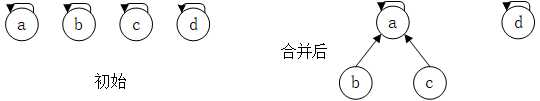
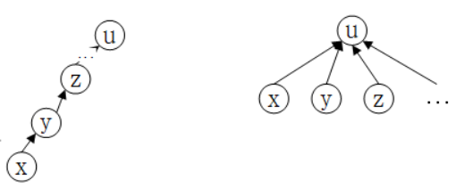
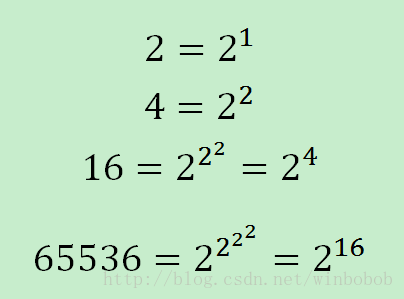
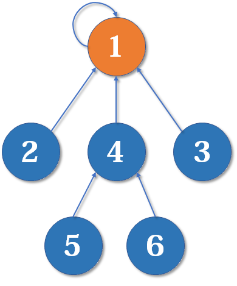

# 并查集

## 定义

一些有n个元素的集合应用问题中，通常在开始时让每个元素构成一个单元素的集合，然后按一定顺序将属于同一组的元素所在的集合合并，其间要反复查找一个元素在哪个集合中。

为了快速解决问题，便有了并查集的概念。

**并查集维护了一个不相交的动态集的集合$S_1,S_2,\dots,S_n$，每个集合将有一个首领来标识该集合**，首领的父节点就是自己，一般不关心集合的哪个成员成为首领。（有些问题需要选择适合特定规则的成员作为首领，例如最大成员做首领）

它是最简洁而优雅的数据结构之一，主要用于解决一些**元素分组**的问题。

## 操作

它管理一系列**不相交的集合**，并支持三种操作：

- 初始化（makeSet)：初始化每个集合的首领和集合大小，初始集合都只有一个元素，且父节点就是自己
- **合并**（Union）：把两个不相交的集合合并为一个集合。
- **查询**（Find）：查询两个元素是否在同一个集合中。

示例：

1. 有若干个样本a、b、c、d…类型假设是V  
2. 在并查集中一开始认为每个样本都在单独的集合里  
3. 用户可以在任何时候调用如下两个方法  ：
   1.  boolean isSameSet(V x, V y) : 查询样本x和样本y是否属于一个集合 
   2. void union(V x, V y) : 把x和y各自所在集合的所有样本合并成一个集合  

## 实现方法

设计一个数据结构， 让isSameSet和union方法的**时间复杂度是O(1)**，

1. 每个节点都有一条往上指的指针  
2. 节点a往上找到的头节点，叫做a所在集合的代表节点  
3. 查询x和y是否属于同一个集合，就是看看找到的代表节点是不是一个  
4. 把x和y各自所在集合的所有点合并成一个集合，只需要小集合的代表点挂在大集合的代表点的下方即可  
4. 如果合并，查询方法调用很频繁，那么单次调用的代价为O(1)，两个方法都如此

## 优化策略

最简单的并查集效率是比较低的，因为合并集合可能会形成一条长长的**链**，随着链越来越长，我们想要从底部找到根节点会变得越来越难。

### 按大小合并

元素少的集合挂在大集合的下面， 这样链长度增长慢。

1. 随意合并，有可能使得每次合并都是一个秩较大的树挂载到秩较小的树上，极端情况形成一个单链表
2. 按元素数量多少合并策略，每次都让秩小的树挂载到秩大的树的根上。其最坏情况为，每次都选取相同高度的树进行合并，这样，将使得树变成一个近似的完全二叉树

显然，完全二叉树所有结点搜索根结点的平均时间要小于链表的时间

### **路径压缩:**

每个元素到根节点的路径尽可能短

1. 节点往上找代表点的过程，把沿途的链变成扁平的，减小链长度

2. 为了尽快地找到根结点，减少查询和合并操作的搜索次数，从结点v搜索到根结点的过程中，我们可以**将该结点及其所有祖先结点直接指向根结点**，这样一来，可以极大地减少那些结点到根结点的搜索次数。

   

### 性能

并查集使用树形结构来组织节点的关系，性能就和树的深度有关，和二叉搜索树的时间复杂度一样，都是O(h)

但并查集是一个多叉树，所以查询和合并的时间复杂度不是O(logN)，进行rank和路径压缩的优化后，时间复杂度是O(log* n)，

算法导论：log*n是**Iterated Logarithm Function 多重对数函数**，其数学含义是：

$\log^*n=\begin{cases} 0 & if\space n\leq1;\\1+\log^*(logn) & if\space n>1; \end{cases}$

面是 n 和 log* n 之间的关系：

| n                | lg*n(lg是以2为底的对数)                 |
| ---------------- | --------------------------------------- |
| (−∞, 1]          | 0                                       |
| (1，2]           | $lg*2 = 1+lg*(lg2) = 1+ lg*1 = 1+0 = 1$ |
| (2，4]           | $lg*4 = 1+lg*(lg4) = 1+ lg*2 = 1+1 = 2$ |
| (4，16]          | 3                                       |
| (16，65536]      | 4                                       |
| (65536, 2^65536] | 5                                       |

星号后面的数位意味着：

> O(log n) 的时间复杂度已经很快了，O(log* n) 是比O(log n) 还要快，近似等于O(1)，比O(1)慢一点。

结论为最坏运行时间为$O(m)\alpha(n)$，其中m为所有操作（包makeSet,findSet,union）的次数，而n为初始结点数。$\alpha(n)<4$，故可认为与m成线性关系。

**算法导论**中：在样本量是N，findHead方法调用频繁，超过O(N)的情况下,  使用并查集，单次下来，每次的时间复杂度是O(1)。 

## **重要思想**

**用集合中的一个元素代表集合**。

把集合比喻成**帮派**，而代表元素则是**帮主**。并查集是这样运作的：

1. *对于只有一个元素的集合，代表元素自然是唯一的那个元素*

2. *合并1号和3号所在的集合，1号为代表元素*

3. 最后并查集中每个集合都是一个**树**状的结构，要寻找集合的代表元素，只需要一层一层往上访问**父节点**（图中箭头所指的圆），直达树的**根节点**（图中橙色的圆）即可。根节点的父节点是它自己

   

## 应用

- 连通性的问题

- 解决两大块区域的合并问题

- 常用在图等领域中

两种实现方式：

1. 数组。效率高。
2. Hash表。速度慢，因为HashMap的常数时间是大常数。

## 题目

- 朋友圈: 一个矩阵维护朋友关系，（1，0）认识则值为1，（0，0）不认识则值为0，求有多少个朋友圈。矩阵的对角线两侧对称。https://leetcode-cn.com/problems/friend-circles/
  
  分析：用并查集，遍历任意两个人的关系，认识则union, 最后并查集的长度就是朋友圈个数。
  
- 岛屿数量|岛问题

  给定一个二维数组matrix，里面的值不是1就是0，

  上、下、左、右相邻的1认为是一片岛，

  返回matrix中岛的数量

  三种方法：递归，并查集（表和数组）

- 岛屿数量 II：二维数组matrix初始都是'0'， 每次增加1个位置，并将这个位置的数据赋为'1'，计算每次增加新位置后的岛数量。https://leetcode-cn.com/problems/number-of-islands-ii/
  
  时间复杂度是：O(M*N)+O(K),  M,N是矩阵的长宽，初始化的复杂度是O(M\*N)，K是增加多少个位置，因为并查集的union是O(1)
  
  如果matrix极大，而且数据的最大只能到2亿，初始化太慢， 而K很小， 则使用动态初始化Map。（使用向量初始化）
  
- 岛问题（并行算法）：如果matrix极大，设计一种可行的并行计算方案

  将矩形分割为多个小的矩形，在每个矩形中，使用并查集A获取岛数量。然后遍历每个矩形的相邻边界，然后使用并查集A进行联通，得到真正的岛数量。
  
  
  
  