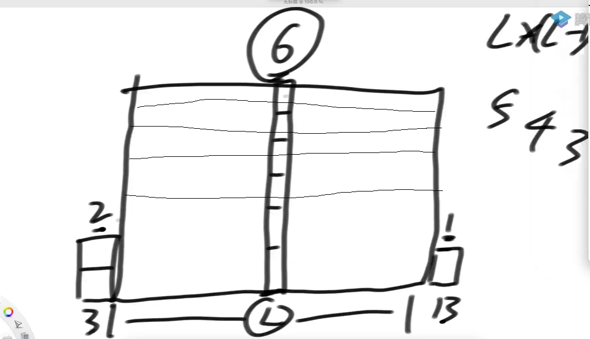

# 定义

一种特别设计的栈结构，为了解决如下的问题：

给定一个可能含有重复值的数组arr，i位置的数一定存在如下两个信息

1）arr[i]的左侧离i最近并且小于(或者大于)arr[i]的数在哪？

2）arr[i]的右侧离i最近并且小于(或者大于)arr[i]的数在哪？

如果想得到arr中所有位置的两个信息，普通方法是遍历当前位置的左和右，找到最近的符合条件的数，时间复杂度是**O(N^2**)，怎么能让得到信息的过程尽量快，**是O(N)**。

结论：你特别关心一个数左边离你最近的比你小的, 一个数左边离你最近的比你大的以及一个数右边离你最近的比你小的, 一个数右边离你最近的比你大的, 你还想所有过程都O(N), 就使用单调栈

# 如何设计

流程：

1. 假设数组中没有重复值，[3，4，2，6，1，7，0]
2. 准备一个栈，栈底到顶，从小到大。[0->3，1->4] 
3. 将2->2放入时，值比1->4小，则弹出栈中1->4
4. 弹出时，生成两个信息：对于1->4来说，让它弹出的就是右侧离他最近并小于的数(2->2)。它压着的就是左侧离他最近且小于的数(0->3)。
5. 没有压东西则左侧返回-1，最后没有让它弹出的数右侧返回-1.

证明: 栈中0->a, 1->b  放入2->c， 无重复值。

1. 当一个数b从栈里弹出时，当前数c就是弹出数b的右侧最近最小。

   因为c一定在b的右侧，b>c时，b和c中间的数不可能有小于b的数，因为小于会弹出b。

2. 当一个数b从栈里弹出时，在栈中，弹出的数b压着的数a，a就是b的左侧最近最小。

   因为a一定在b的左侧，且b>a，

   若a和b中间的数小于a，因为小于会释放a，所以不可能。

   若a和b中间的数 >a且<b.， 则a和b不会挨着。所以不可能。

3. 栈中挨着，数组中有可能挨着。

数组中有重复值的处理：[1，3，4，5，4，3，1，2]

1. 依次入栈：[0->1，1->3，2->4，3->5]， 用集合存储每个入栈的元素

2. 4->4加入时，弹出3->5(它的左位置最近最小是2->4，右位置最近最小是4->4)

3. 4->4与2->4的值相同，加入集合尾部，[0->1，1->3，{2，4}->4]

4. 5->3加入时，{2，4}->4弹出，并同时结算两个数的信息，信息相同。

   4->4的左位置最近最小是1->3，右位置最近最小是5->3

   2->4的左位置最近最小是1->3，右位置最近最小是5->3

5. 遍历完数组，弹出栈内数组，[{0,6}->1，7->2]

   7->2的左位置最近最小是6->1(集合中最后一个)，右位置最近最小是 -1

时间复杂度为O(N)，因为每个数字都只进栈一次，出一次栈，栈只拿开头。

## 单调栈代码

单调栈的实现

结果是二维数组，只记录原始数组中每个位置的最近左小和最近右小的**索引位置**。

为什么用ArryList，而不用LinkedList，因为数组直接用索引得到，但LinkedList的到Index的值需要从左到右遍历。但是LinkedList有getLast方法，使用此方法，效率差不多。

# 题目

## 正数数组中子数组累加和乘最小值的最大值

给定一个**只包含正数**的数组arr，arr中任何一个子数组sub，

一定都可以算出(sub累加和 )* (sub中的最小值)是什么，

那么所有子数组中，这个值最大是多少？（子数组连续）

**分析**

拆解指标，最大的一定以数组中某个位置作为最小值。以子数组最小值为可变参数，求解

1. 遍历数组，找出以每一个位置作为最小值的子数组的集合，计算其指标，最终得到所有的答案，求出最大值。

2. 当以X为最小的子数组集合中，哪一个子数组的累加和最大。 

   是：X左侧最近最小和X右侧最近最小的范围内的数。 **正数数组，范围变大，累计和一定变大**。

   示例：[3，2，2，4，1]  以2为最小值的子数组有很多如[2,4]，其中最大累计和是[3,2,2,4]

3. 变成单调栈的问题。

   使用单调栈确定以任意位置为最小值的子数组范围，然后用前缀和数组，将前缀和的计算变成O(1).

时间复杂度：O(N)，

1. 生成前缀和数组O(N) 

2. 生成单调栈信息O(N) ，并计算指标，子数组范围和前缀和的计算都是O(1)，
3. 所以共O(N)

单调栈中可以不用集合处理重复的原因：

1. 可以把单调栈在数据相等情况下，直接弹出栈中元素，做错化处理，反正重复值的最后一个能算对。

   因为重复数据的连通性，弹出栈中重复的数据，后面重复的数据的结果，会包含前一计算结果，只会比之前的大。

2. 示例：[3，4，5，4，3]

   按从小到大，依次入栈[0->3，1->4，2->5]

   当3->4入栈时，

   4<5，所以弹出2->5，计算指标：2->5 的左边最近最小是1->4, 右边是3->4， 子数组是[5]，指标为5*5=25.  结果正确。

   4=4，所以弹出1->4，计算指标：1->4的左边最近小于是0->3, 右边是3->4，子数组是[4,5]，指标为4*9=36，结果错误。

   结果为[0->3，3->4]

   当3->4弹出时，以4作为最小值的指标可以计算正确，子数组时[4,5,4]， 指标为4*13=52

   3->4左边最小和1->4的左边最小一样(0->3)，子数组都是扩到0停，所以是连通的。

## 柱状图中最大的矩形

给定一个**非负数**组arr，代表直方图

返回直方图的最大长方形面积。

枚举数组中每一个高，一个最小值的左右最近最小的范围的宽度，乘以最小值的高度，就是一个长方形，还需要和每个位置竖着的长方形做比较。

不需要求精确大小，可做错化处理，后面的重复值会覆盖前面的值的左右最近小于的范围。

和上一题的区别：这道题是 范围的个数*最小值   上一题是 范围的累加和\*最小值。

## 全是1的最大子矩形面积

给定一个二维数组matrix，其中的值不是0就是1，

返回全部由1组成的最大子矩形，内部有多少个1

**分析**

N*N的矩阵中，有N^4个子矩阵。

因为：矩阵任意两个位置可以组成一个子矩形，每个位置的可能性是N\^2，所以子矩阵是O(N^4)的数量级。（其中有重复，但只重复一次，两个位置互换位置）

暴力解：O(N^6)

1. 4个嵌套循环，枚举出所有子矩阵。O(N^4)
2. 2个嵌套循环，枚举子矩阵的每个值是否是1. O(N^2)

最优解：O(N^2)

1. **压缩数组技巧**，以每一行做底，形成的直方图。求出可得**以这一行做底时，哪个矩形最大**。（**遇到0则认为底断掉，重新开始计数**）

   11111   以第0行做底，哪个矩形最大，在直方图为[11111]上求解。
   10111   以第1行做底，哪个矩形最大，在直方图为[20222]， 最大矩形是【222】，6
   11101   以第2行做底，哪个矩形最大，在直方图为[31303]上求解。
   11111   以第3行做底，哪个矩形最大，在直方图为[42414]上求解。

2. 由1组成的子矩形，一定会以二维数组中某一行作为底。穷举再求最大。

3. 每一行使用单调栈，过一遍，是O(N)，共N行，所以复杂度O(N^2)，等同于将整个二维数组看一遍，不会回退。

## 全是1的子矩阵数量

给定一个二维数组matrix，其中的值不是0就是1，

返回全部由1组成的子矩形数量

**分析**

因为子矩阵肯定以某一行为底，所以依次以每一行做底，求得的子矩形都不同。

一个长度为L，宽度为1的矩形，共有 L*(L+1)/2个矩形（等差数列），要计算6，5，4，3高度上每行的子矩形数量。

整理：如 (值和索引关系) Y->b，X->a，Z->c。 b和c是a的左右最近小于的位置。

b和c之间，子矩形的个数公式是：( X - Max(Y，Z) ) * L * ( L + 1 ) / 2

有重复，相等的时候，忽略，弹出不计算，只算最后一个加入的重复数。

示例：2*3的矩形全是1，

1. 以第0行为底，共0行，3\*(3+1)/2=6，[111]
2. 以第1行为底，共有0，1两行，2*6=12（第1行有6种，[0，1]行合成一行有6种）

## 所有子数组最小值的累加和

给定一个数组arr，返回所有子数组最小值的累加和

**分析**

枚举数组中每一个数，统计以当前数为最小值的子数组的个数。

1. 示例：位置(值) 5(5)  10(7)  15(4) ,  5和15是10位置的左右最近小于的位置。

2. 则6.....10和10.....14 之间都有5个位置，所以是5*5=25个子数组。以10位置为最小值的累计和就是25\*7。（6-10，6-11，6-12，6-13，6-14）.....（10-10，10-11，11-12，12-13，13-14）

3. 抽象化：Y->k.....X->i......Z->j   以 i 位置为公式：( i - k ) * ( j - i ) * X

数组中有相等值的去重策略：示例[2，4，3，6，9，7，3，8，3，5]

2. 重复位置3.，每个重复位置都计算，以下一个重复位置**前结尾**。(**右边相等停**)
3. 第一个2->3，从0->2到6->3之间的子数组，索引位置：[1,2],[1,3],\[1,4],[1,5].....[2,2],[2,3],[2,4],[1,5].....
4. 第二个2->3，从0->2到8->3之间的子数组，索引位置：[1,6],[1,7],.....[2,6],[2,7].....
5. 第三个2->3，从0->2到9->5之间的子数组，
6. 左边不阉割，右边阉割

也可以反过来，

1. 重复位置3.，每个重复位置都计算，以上一个重复位置**后开始**。(**左边相等停**)
2. 第一个2(3)，从0(2)到10(null)之间的子数组，共18个，索引位置：[1,2],[1,3],\[1,4],[1,5].....[1,9]，[2,2],[2,3],[2,4],[2,5].....[2,9]
3. 第二个6(3)，从2(3)到10(null)之间的子数组，共16个，索引位置：[3,6].....[3,9]，[4,6].....[4,9]，[5,6],.....[5,9]，[6,6],.....[6,9]，
4. 第三个8(3)，从6(3)到10(null)之间的子数组，共4个，索引位置：[7,8],[7,9]，[8,8],[8,9]
5. 右边不阉割，左边阉割

## 总结

**直方图问题用单调栈解。**

重要想法：依次以每一行做底，形成的直方图，在上面使用单调栈求解。

解决算法问题：需要在基本事实和基本经验的前提下，再进行逻辑思考。

**优化单调栈**：可以使用数组手写栈，优化常数时间。 因为系统栈使用的是动态数组。

通过索引计算长度：L，R。 

1. 如果包含L和R位置，则R-L+1。 
2. 包含L，不包含R，则R-L
3. 不包含L，R，则R-L-1

**思维传统**：以某一个i位置数作为某一个标准下的答案，则数组中所有数作为某一标准下的答案，就是总答案。如子数组以某个位置结尾的情况下，怎么样。每个位置的数建立一个标准，再求解。

