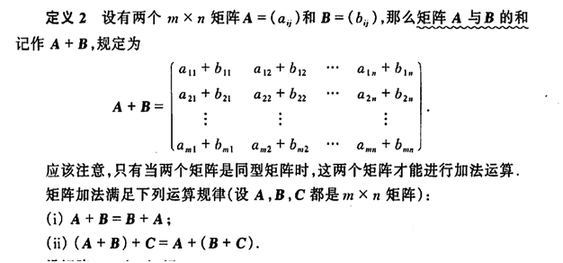
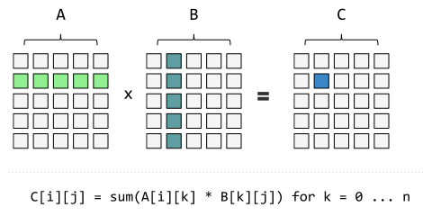
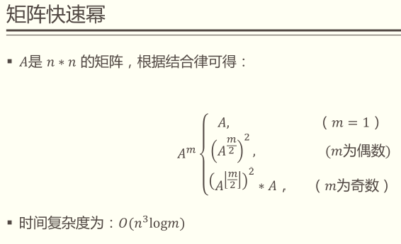
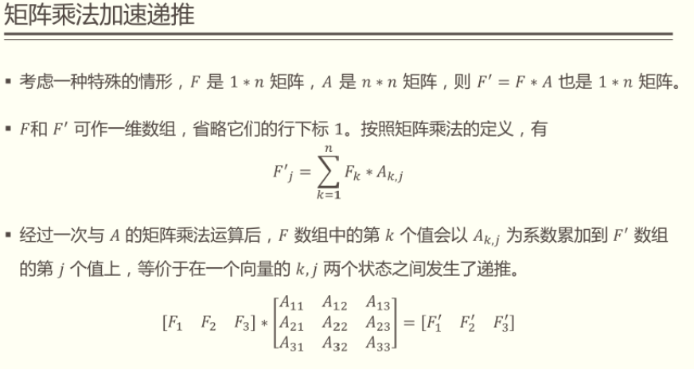
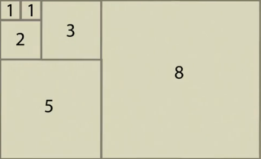
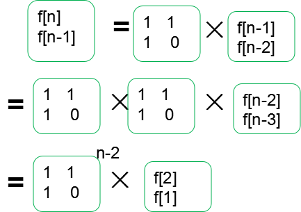

# 矩阵基础知识

[矩阵分析与应用](https://zhuanlan.zhihu.com/p/132681782?utm_source=wechat_session)

[矩阵乘法与斐波那契数列](https://www.cnblogs.com/tlx-blog/p/12676643.html)

参考：北大丘维声的《高等代数》、北理史荣昌的《矩阵分析》、清华张贤达的《矩阵分析与应用》

本质：（万物皆矩阵）矩阵论主要研究矩阵，对于图像、神经网络等可表示成矩阵形式，然后结果矩阵的处理方法，对其进行操作，例如分解，基本运算等。

## 定义

是一个数字阵列，一个二维数组，n行r列的阵列被称为n*r矩阵。

N阶方阵（N阶矩阵）：行数m与列数n相同的矩阵

单位矩阵：它是个方阵，从左上角到右下角的对角线（称为主对角线）上的元素均为1。除此以外全都为0。类似乘法的1.

证明：|$\matrix{1,0\\0,1}$| * |$\matrix{a,b\\c,d}$| = |$\matrix{a,b\\c,d}$| =>   (1\*a+0\*c)=a,  (1\*b+0\*d)=b,  (0*a+1\*c)=c,  (0\*b+1\*d)=d。

特殊矩阵：

1、只有一行n列的矩阵，称为**行向量**；

2、只有一列n行的矩阵，称为**列向量**；

3、行向量X列向量，所得的矩阵为一行一列（一个单元格），称为**向量內积**；

4、列向量X行向量，所得的矩阵为n行n列，称为**向量外积**。

## 矩阵加法

## 矩阵乘法

矩阵乘法中，第一个矩阵的列要等于第二个矩阵的行， 矩阵乘法的复杂度是O(n^3)

1*7+2\*9+3\*11 = 58

一个m*n的A矩阵，和一个n\*p的B矩阵相乘，将得到m\*p的矩阵C，公式：
$$
C(i,j)=\sum_{k=1}^{n}A(i,k)\ast B(k,j)
$$
**运算定律**

1. 不满足交换律
2. 满足结合律：(AB)C=A(BC)
3. 满足分配律：(A+B)C=AC+BC，A(B+C)=AB+AC

## 矩阵快速幂

矩阵乘法中方阵可以用快速幂加速递推

方阵C=An,因为矩阵满足结合律可以随意拆开乘再合并

# 斐波那契数列

**线性代数的思想基础：就是为了解决严格递推第几项的问题才发明的。**

## 几何意义

给一张图，奥妙无穷。

## 求斐波那契数列矩阵乘法的方法

1. 斐波那契数列的线性求解（O(N)）的方式非常好理解

   1，1，2，3，5，8，13.........      a(n)= a(n-1)+a(n-2);

   求第N项的结果，一项项加，是O(N)的方法

2. 有条件转移的示例：(求解N位置的数，没有O(logN))的方法。）

   布尔类型数组，arr[True，True，False，False，True，True]

   第一，二项为1，后面的项根据布尔值进行表达，

   为True时：F(n)=F(n-1)+F(n-2)；为False时：F(n)=F(n-1)

   得到：【1，1，1，1，2，3】

3. 而斐波那契数列没有条件转移，是严格的递推式 a(n)= a(n-1)+a(n-2); 都有O(logN)的方法。

4. 公式分析：F(n)=F(n-1)+F(n-2)，减的最多的是2，则它是一个2阶递推。

   当斐波那契数列的第一项和第二项：F1=1,F2=1 ，则必定存在以下关系：

   **F3与F2组成的行列式，等于F1与F2组成的行列式 乘以 2*2的矩阵**

   |F3，F2| = |F2，F1| *  |$\matrix{a,b\\c,d}$|，|F4，F3| = |F3，F2| *  |$\matrix{a,b\\c,d}$|

   将斐波那契数列的值代入公式，求二阶矩阵：

   |2，1| = |1，1| *   |$\matrix{a,b\\c,d}$|  ，|3，2| = |2，1| *   |$\matrix{a,b\\c,d}$|  

   矩阵乘法：2 = (1*a + 1\*c)  ，1 = (1\*b + 1\*d)，3 = 2a+c，2 = 2b+d

   通过4个方程式，可得a=1，b=1，c=1，d=0

5. 上面的分析中得出的关系解析：要维护$f_n$

   考虑如何由$f_{n-1}$得到$f_n$，那我们先写一个不全的递推式：$f_{n-1}\rightarrow f_n$
   
   根据题意，使使等号成立：$f_n=f_{n-1}+f_{n-2}$
   
   构造出下一项：$f_{n-1}=f_{n-1}+0\ast f_{n-2}$
   
   用找到的规律画一张表，标出相应的系数：

|                              | $f_{n-1}$ | $f_{n-2}$ |
| :--------------------------- | --------- | --------- |
| $f_{n-1}\rightarrow f_n$     | 1         | 1         |
| $f_{n-2}\rightarrow f_{n-1}$ | 1         | 0         |

   得到**转移矩阵**和矩阵$A_{n-1}$，构造一维递推式和相同维数的方阵

   

   

6. 结论：**斐波那契数列的第N项求解，利用线性代数**，可以推出另一种表示

   |F3，F2| = |F2，F1| *  |$\matrix{1,1\\1,0}$|
   |F4，F3| = |F3，F2| *  |$\matrix{1,1\\1,0}$|
   |F5，F4| = |F4，F3| *  |$\matrix{1,1\\1,0}$|\.......
   |Fn，F(n-1)| = |F(n-1)，F(n-2)| *  |$\matrix{1,1\\1,0}$|

   将上一个|F3，F2|行列式代入下一个公式中，得到第N项的计算公式：

   **| F(N) , F(N-1) |= | F(2), F(1) |  \*  某个二阶矩阵的N-2次方**

   |Fn，F(n-1)| = |F(2)，F(1)| *  |$\matrix{x,y\\z,t}$| = |1，1| *  |$\matrix{x,y\\z,t}$| =   |x + z，y + t| 
   
   **所以第N项：F(n) = x + z**
   
   从公式中可看到，只要这个二阶矩阵的N-2次方求的足够快，则斐波那契数列的第N项就算的足够快，

一个矩阵的N次方如何求最快：**矩阵快速幂**

1. 先思考一个数的N次方怎么算最快：10^75

   一个一个往上面乘，则乘法运算进行75次.

   但先进行乘法得$10^2$,然后对$10^2$再执行37次乘法，这样去计算，则乘法运算执行38次。已经比75次要少。所以为了快速算的整数幂，就会考虑这种结合的思想.

   快速计算：

   75的二进制数是：1001011 (64,32,16,8,4,2,1)， 1+2+8+64 = 75

   T =  10^1 => 10^2 => 10^4 => 10^8 => 10^16 => 10^32 => 10^64 (T乘以自己)

   按位二进制数的位考察，是否需要，结果ans=1 * 10^1 \* 10^2 \* 10^8 * 10^64 

   为什么快：T只和自己乘来逐渐靠近N次方，最多乘以logN次。然后计算结果时，T在需要时乘，不需要则不乘，也是logN次。总共2*logN次计算。

   所以计算出10^N，时间复杂度可以是O(logN)

   **思想基础是2分法，而且二进制二分，比75/2的二分方式要优良。**

2. 矩阵|a|的75次方

   ans= 单位矩阵 * |a|^1 \* |a|^2 \* |a|^8 * |a|^64 

## 类似斐波那契数列的递归优化

推广：如果某个递归，除了**初始项**之外，具有如下的形式

F(N) = C1 \* F(N) + C2 \* F(N-1) + … + Ck \* F(N-k) ( C1…Ck 和k都是常数)

并且这个递归的表达式是严格的、不随条件转移的

那么都存在类似斐波那契数列的优化，时间复杂度都能优化成O(logN)

**解题思路：**

**矩阵快速幂是用来求解递推式的**

1. **第一步先要列出递推式：**F(n) = 7\*F(n-1) + 3\*F(n-2) + 4\*F(n-3)， 最多减3，则是一个3阶的递推。

2. **第二步是建立矩阵递推式，找到转移矩阵：**给全初始项后，等号左边是几阶，就有几项，因为是3阶，

   公式则是：

   |F4，F3，F2| = |F3，F2，F1| *  |3*3的矩阵|\.......
   |Fn，F(n-1)，F(n-2)| = |F(n-1)，F(n-2)，F(n-3)| *  |3*3的矩阵|\
   |Fn，F(n-1)，F(n-2)| = |F1，F2，F3| *  |3\*3的矩阵|^(N-3)\

3. **简写成T \* A(n-1)=A(n)，T矩阵就是那个3\*3的常数矩阵**， **矩阵T就叫做转移矩阵，T的幂是n-阶乘数，**它能把A(n-1)转移到A(n)，

4. **然后这就是个等比数列，直接写出通项：**$A_n=T^{n-3}*A_1$,**此处A1叫初始矩阵**

系数的不同，只会影响3*3的矩阵。不影响关系。

**求解：**

**主要通过把数放到矩阵的不同位置，然后把普通递推式变成"矩阵的等比数列"，最后快速幂求解递推式。**

## **简单的递推式**

1. f(n)=a\*f(n-1)+b*f(n-2)+c；（a,b,c是常数)
   $$
   \bigg(\matrix{a\quad b\quad 1\\1\quad 0\quad 0\\0\quad 0\quad 1}\bigg)\ast \bigg(\matrix{f_{n-1}\\f_{n-2}\\C}\bigg) = \left(\matrix{f_n\\f_{n-1}\\C}\right)
   $$

2. f(n)=c^n-f(n-1) ；（c是常数）
   $$
   \left(\matrix{-1\quad c\\0\quad c}\right)\ast \left(\matrix{f_{n-1}\\c^{n-1}}\right)=\left(\matrix{f_n\\c^n}\right)
   $$

# 题目 

## 斐波那契数列矩阵

斐波那契数列递推公式为：F[n] = F[n-1] + F[n-2]. 由f[0]=0,f[1]=1,可以递推后面的所有数。

用for循环,直接递推的局限性：

1. 本题让你递推的斐波那契数n高达10亿。测试时间仅1秒的时间，for循环用递推公式递归导致超时。

2. 想要打表实现随机访问根本不可能，先把斐波那契数列求到10亿，然后想去进行随机访问。题目未给出那么多内存，数组也开不到10亿。
3. 因此它可以用矩阵快速幂来写。

## 一个人迈上N级台阶的方法数

一个人可以一次往上迈1个台阶，也可以迈2个台阶

返回这个人迈上N级台阶的方法数

**分析**

递推公式：fn = f(n-1) + f(n-2)   减的最多的是2，则它是一个2阶递推。每一项依赖于$f_{n-1},f_{n-2}$。

f(n-1)=f(n-1) + 0*f(n-2)

## 母牛生小牛, N年后牛的数量

第一年农场有1只成熟的母牛A，往后的每年：

1）每一只成熟的母牛都会生一只母牛

2）每一只新出生的母牛都在出生的第三年成熟

3）每一只母牛永远不会死

返回N年后牛的数量

**分析**

f1=1(A)，f2=2(A,AA)，f3=2+1(A,AA1,AB)，f4 = f3 + f1(A,AA2,AB1,AC)，f5=f4+f2(A,AA3,AB2,AC1,AD,AAA)    AA1代表是A的孩子，1表示出生后第一年。

出生3年后才成熟可以生小牛，所以今年的牛，是去年的牛，再加上满3年的牛生成的小牛。

**第一种方法：**

递推公式：fn = f(n-1) + f(n-3)   减的最多的是3，则它是一个3阶递推。每一项依赖于$f_{n-1},f_{n-2},f_{n-3}$。

|                              | $f_{n-1}$ | $f_{n-2}$ | $f_{n-3}$ |
| ---------------------------- | --------- | --------- | --------- |
| $f_{n-1}\rightarrow f_n$     | 1         | 0         | 1         |
| $f_{n-2}\rightarrow f_{n-1}$ | 1         | 0         | 0         |
| $f_{n-3}\rightarrow f_{n-2}$ | 0         | 1         | 0         |

计算转移矩阵并建立矩阵递推式： $\left(\matrix{f_{n}\\f_{n-1}\\f_{n-2}}\right)=\left(\matrix{1,0,1\\1,0,0\\0,1,0}\right)\ast \left(\matrix{f_{n-1}\\f_{n-2}\\f_{n-3}}\right)$

$\left(\matrix{f_{n}，f_{n-1}，f_{n-2}}\right)=\left(\matrix{f_{n-1}，f_{n-2}，f_{n-3}}\right)\ast \left(\matrix{1,1,0\\0,0,1\\1,0,0}\right)$

**第二种方法：可以直接套公式，再往出推转移矩阵：**

前六项结果是1，2，3，4，6，9：

|f4,f3,f2| = |f3,f2,f1| * $\left(\matrix{abc\\def\\ghi}\right)$；3a+2d+g=4；3b+2e+h=3；3c+2f+i=2；

|f5,f4,f3| = |f4,f3,f2| * $\left(\matrix{abc\\def\\ghi}\right)$；4a+3d+2g=6；4b+3e+2h=4；4c+3f+2i=3；

|f6,f5,f4| = |f5,f4,f3| * $\left(\matrix{abc\\def\\ghi}\right)$；6a+4d+3g=9；6b+4e+3h=6；6c+4f+3i=4;

4a+3d+2g=6 (-) 3a+2d+g=4 => a+d+g=2;

6a+4d+3g=9 (-) 4a+3d+2g=6 => 2a+d+g=3;

2a+d+g=3 (-)  a+d+g=2 => a=1.

### 题目变型

若再加一个条件，母牛5年后会死，则递推项：F(n)=F(n-1) +F(n-3)-F(n-5)。是一个5阶的递推问题。O(logN）

## 由0和1构成的达标字符串

给定一个数N，想象只由0和1两种字符，组成的所有长度为N的字符串

如果某个字符串,任何0字符的左边都有1紧挨着,认为这个字符串达标

返回有多少达标的字符串

**分析**

n=1时，（0，1），只有1达标，结果是1

n=2时，（01，10，00，11），只有10，11达标，结果是2

n=3时，（000，001，010，100，011，110，101，111），只有101，11，110达标，结果是3

计算初始的结果：1，2，3，5，8，观察得出，是一个以1，2为初始值的斐波那契数列。

**也可以使用尝试，探寻规律:**

递归尝试：f(int i)函数：代表i的前一个位置一定是1的情况下，i之后的位置填0或1，有多少个达标的。

所以当N=6时，第一个位置必须是1，所以还有5个位置需要填，就需要调用f(5)，因为剩余5个格子符合f函数的条件。

f(5)内要处理两种情况：

1. 第一个位置为1，则达标数就是f(n-1)
2. 第一个位置为0，第二个位置必须是1，则达标数就是f(n-2)

两种情况的和就是N=6的总达标数。

没有条件转移，时间复杂度一定是O(logN)

## 区域铺瓷砖

用1*2的瓷砖，把N\*2的区域填满

返回铺瓷砖的方法数

**分析**

当N=2时，是一个2*2的区域，有两种铺瓷砖的方法。（上下，左右）

是一个以1，2为初始值的斐波那契数列，f(n) = f(n-1) + f(n-2)

递归尝试：因为区域高度总是2，所以每次铺瓷砖有两种方式：

1. 竖着铺，只占用一列，所以剩下的位置铺瓷砖的方法是f(n-1)
2. 横着铺，下面只能再横铺一个，所以剩下的位置铺瓷砖的方法是f(n-2)

# 总结

目前为止，学过的模型（套路），具有启发意义的：

1. 二叉树的递归套路
2. 从左往右的尝试模型
3. 范围上的尝试模型
4. 样本对应的尝试模型
5. 业务限制的尝试模型
6. 斐波那契数列矩阵乘法模型 O(logN)模型

**精华：**

如果自由写递归尝试，发现递推项是严格的，不要错过O(logN)的优化。有条件转移的没办法。