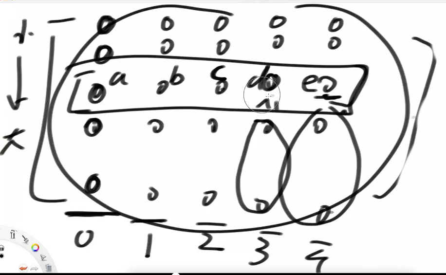

# bfprt算法

5个大牛的名字首字母，解决查找无序数组中第K小的数的问题。

算法导论第九章，3单元证明时间复杂度是O(N).

重要思想：选出一个能确定淘汰一定比例数据的特殊划分值，进而能够规避掉最差情况，使得算法拥有严格的时间复杂度。

## 在无序数组中求第K小的数

给定一个无序数组arr中，长度为N，给定一个正数k，返回第 k个小的数

### 改写快排

**时间复杂度**：

1. 最坏的情况，12345678，每次都选最右侧进行比较，遍历剩下全部，所以时间复杂度是O(N^2)

2. 最好的情况：表达式为：T(N) = T(N/2) + O(N)  整个过程需要遍历N次，而子过程的数据规模是一半N/2，左右两部分只取一部分。

3. 使用Master公式，log(2,1) < 1 所以时间复杂度是O(N)

   因为随机选择数，所以好情况和坏情况是概率事件，在数学上求它的期望是O(N)

**结论**：是最优解，时间复杂度O(N)，空间复杂度O(1)   缺点是概率上的期望。

过程：

1. **随机**选划分值P
2. 荷兰国旗问题，<P的放左边，=P的放中间，>P的放右边。
3. 看等于P的区域是否命中K，命中则返回，不命中，则左右两侧只走一侧。

### bfprt算法   

**意义**：上面的方法虽然是最优解，但时间复杂度需要用概率解释，而bfprt算法能不用概率解释，也可以做到时间复杂度O(N)。

**核心**：

1. 快排中分区时，选划分值P很重要，太偏的时候复杂度会变差，正中心时复杂度最优，
2. bfprt算法的核心，就时聚焦在划分值P如何选取，而不再是随机选

**过程**：是一个 bfprt函数 (arr,K) , 参数是数组，k值，返回第k小的数

1. **讲究的**选划分值P

   1. 5个数分一组，逻辑概念，**时间复杂度O(1)**
   2. 小组内部排序，因为是固定5个数，所以每个小组排序额时间复杂度是O(1)，共有N/5个小组，所以整个过程的**时间复杂度O(N)**
   3. 选出每个小组的中位数，组成一个新的数组M。若小组不满5个是偶数，选上中位数，数组大小N/5。 **时间复杂度O(N)**
   4. 求数组M的中位数 P=bfprt(M, N/10)   第N/10小的数，就是M的中位数。若整个复杂度是T(N)，则第四步复杂度是**T(N/5) 规模。**

2. 最终得到划分值。荷兰国旗问题，<P的放左边，=P的放中间，>P的放右边。 **时间复杂度O(N)**

3. 看等于P的区域是否命中K，命中则返回，不命中，则左右两侧。 所以**复杂度是T($\displaystyle\frac{7}{10}\ast N$) 规模**

   计算步骤三的最差情况，需要得到大于P和小于P的最多的规模，即可以先求小于等于P和大于等于P是多少，再用整体N减。

   估计>=P的至少有多少个数，假设图中C是整个数组M(长度N/5)的中位数P，至少有N/10个数大于等于C，而对于整个数组来说，**至少**有$\displaystyle\frac{3}{10}\ast N$个数大于等于P，那么得出结论整个数组小于P的数**最多**有$\displaystyle\frac{7}{10}\ast N$。

   同理可得，小于等于P至少有$\displaystyle\frac{3}{10}\ast N$，那么大于P最多有$\displaystyle\frac{7}{10}\ast N$。

   

**精髓**：用选定的划分值，可以在每一次递归中，当K小于或大于P的情况下，都会淘汰掉$\displaystyle\frac{3}{10}\ast N$个数。

**时间复杂度**

表达式：T(N)=T($\frac{7}{10}\ast N$)+T($\frac{N}{5}$)+O(N)。

无法用Master公式估计，因为子过程的时间复杂度不一样。

**常见问题**：

1. 为什么要5个数一组，因为是5个人发明的，人家喜欢，3或7个数一组，也可以收敛到O(N)

## 无序数组中求Top K

给定一个无序数组arr中，长度为N，给定一个正数k，返回top k个最大的数

不同时间复杂度三个方法：   

1. O(N\*logN)   

   从大到小排序，排序算法O(N\*logN)   ，再取前K个数返回。

2. O(N + K\*logN)   

   把一个无序数组用从底向上推，变成大根堆，时间复杂度是O(N)

   大根堆弹出前K个数，每次弹出后的调整是logN

3. O(n + k\*logk)   

   先找到第K个大的数P，准备大小为K的数组M  O(N)

   遍历原数组，比P大的数如果有K-10 个，则剩下的10个都是等于P的数  O(N)

   对大小为K的数组M，进行排序， 时间复杂度O(K*logK)

总结：因为K是小于等于N的，所以最优解是第三种方法。

# 蓄水池算法

解决的问题：

## 机器所有吐出的球都等概率放进袋子里

假设有一个源源吐出不同球的机器，

只有装下10个球的袋子，每一个吐出的球，要么放入袋子，要么永远扔掉

如何做到机器吐出每一个球之后，所有吐出的球都等概率被放进袋子里

**分析**

难点：吐球机是流，保证每次吐出的球和之前所有吐出的球，被选进袋子的概率全部相等。是动态的。

流程机制：

1. 如果吐球机只吐出10个球，没有**淘汰机制**，则10个球进袋子的概率均等是100%

2. i号球，以$\frac{10}{i}$的概率决定这个球要不要进袋子，

   实现一个函数f(i)，传入i后，等概率返回0~i之间的一个数字，数字如果在1-10之间，则放入袋子，不然永远丢掉，不再找回

3. **淘汰机制**：袋子只能装10个球，所以需要等概率丢掉一个球，让i号球进入。

证明：当吐球机吐出第1729号球的时候，计算3号球还在袋子中的概率。

1. 10号球之前，3号球在袋中存活概率是1
2. 11号球到来时，3号球淘汰的概率就是${10}\over{11}$ * ${1}\over{10}$ (11号球被选入袋子的概率 乘以 三号球被选中淘汰的概率)，3号球在袋中存活概率是${10}\over{11}$
3. 12号球到来时，3号球在袋中存活概率是${11}\over{12}$  .........
4. 到1729号球的时候，3号球在袋中存活概率$P=1 \ast \frac{10}{11}\ast \frac{11}{12}\ast \frac{12}{13}\cdots\ast \frac{1728}{1729}=\frac{10}{1729}$

尝试：当吐球机吐出第1729号球的时候，计算17号球还在袋子中的概率$P=\frac{10}{1729}$

所以1729个球都是以等概率放入袋子。

## 服务器今天登录所有用户抽出100个幸运观众

所有的服务器上，用户在1月1日0点到1月2日0点之间，登录的用户抽出100个幸运观众，

设计抽奖系统，

1. 暴力解：记录所有登录用户，直到1月2日0点，在这些用户中可以等概率抽取100名幸运观众。

2. 蓄水池算法：

   所有服务器和一台服务器联系

   服务1：判断某一个用户在登录的时候，是不是首次登录，

   服务2：查询用户首次登录的序号index。（全球第几号登录）

   以100/index的概率决定是否进奖池。若不进，则不能中奖，若进入，则以1/100的概率踢掉中奖名单中的一位i。

   到1月2日0点，就可以直接公布100个中奖名单