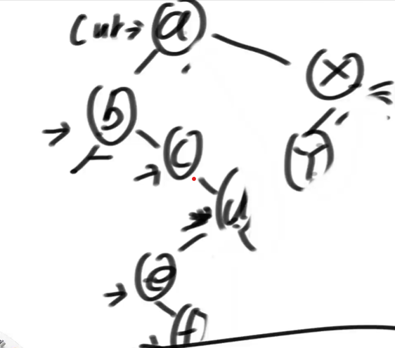
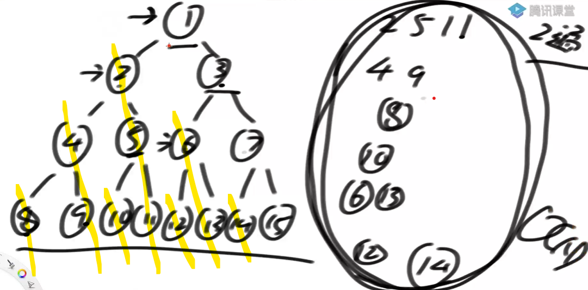
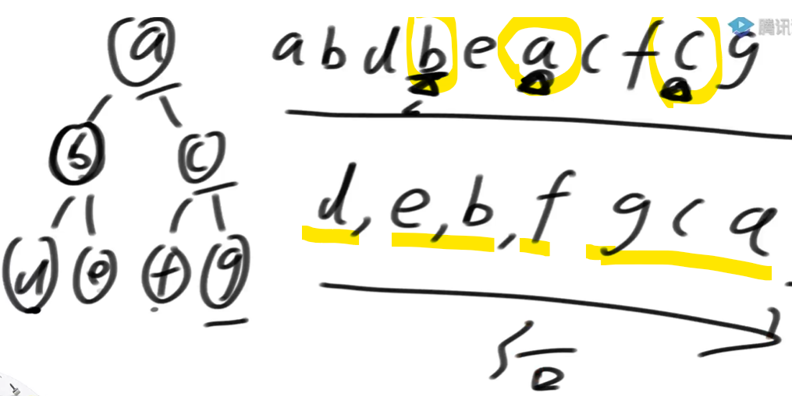

# 定义

一种遍历二叉树的方式，时间复杂度O(N)，额外空间复杂度O(1)

通过利用原树中大量空闲指针的方式，达到节省空间的目的。（树中的空闲空间，就是叶子节点的左右节点为空（指向null）的位置，底层节点有空闲空间）

之前的递归先序遍历的额外空间复杂度O(logN)，就是树的高度。（系统栈存储）

# 遍历细节

（Morris序）cur顺序：a->b->c->d->e->f->d->a->x->y->x

假设来到当前节点cur，开始时cur来到头节点的位置，**两个临时变量cur和mostRight.**

1. 如果cur没有左孩子，cur向右移动（cur=cur.right）
2. 如果cur有左孩子，找到左子树上最右的节点mostRight，并赋值
   1. 第一次到达，mostRight的右指针指向空，则让其指向cur，然后cur向左移动（cur=cur.left）
   2. 第二次到达，mostRight的右指针指向cur，则让其指向null，然后cur向右移动（cur=cur.right）
3. cur为空时，遍历停止。

流程的实质：（与递归栈的区别）

1. 用当前节点的左子树上的最右节点的右指针状态，来标记第一次到当前节点cur，还是第二次。
2. 而在递归遍历中，使用栈来存储当前节点的中间信息，这样可以知道第几次到达当前节点（共3次）
3. 越底层的代码需要的空间复杂度越低。节省空间。

# 遍历实质

morris遍历建立一种机制：

1. 对于没有左子树的节点只到达一次
2. 对于有左子树的节点会到达两次，（第二次到达时，左子树已遍历完）

**时间复杂度**：

虽然遍历每个节点，都要遍历它的左树的右边界，Morris遍历的时间复杂度依然是O(N)。

原因：每个节点的左树右边界的遍历都不重复，都是一条条不相交的斜线，最多就是整个树的规模N，虽然都是两次，但所有左子树的右边界的遍历的总代价就是O(N)。

# 实现：先，中，后序

1. morris实现前序遍历

   对于能到达两次的，第一次的时候处理

   对于只能到达一次的，直接处理。

2. morris实现中序遍历

   对于能到达两次的，第二次的时候处理

   对于只能到达一次的，直接处理。

3. morris实现后序遍历（难点）

   在能到达两次的位置进行处理，

   到达b时，逆序打印左子树的右边界d

   到达a时，逆序打印左子树的右边界e，b

   到达c时，逆序打印左子树的右边界f

   最后逆序打印整个树的右边界，g，c，a

   

   不用栈，如何逆序打印节点的右边界：使用链表反转。右边界的遍历增加两遍，不影响时间复杂度，因为忽略常数项。

# 题目

## 二叉树的最小深度

给定一棵二叉树的头节点head，求以head为头的树中，最小深度是多少？

二叉树的递归套路

morris遍历。

1. level随着cur节点更新。

   第一次到达的节点，有左子树左移或没有左子树右移，下一个节点的深度是level++

   第二次到达的节点，当前节点的深度=level - 左子树右边界的长度

2. 正确的发现叶节点。

   第二次到达的节点，检查左子树的最右节点是否为叶子节点（判断左子树是否为空）

## 判断二叉树是不是搜索二叉树

中序遍历，若是从小到大升序则是搜索二叉树

morris中，可以在中序遍历中，去与前一个节点的值比较。

在morris遍历中，不能直接返回，因为morris遍历过程中修改过树节点的指向，中途退出，树的结构错误。

## 二叉树递归套路和Morris的区别

1. 如果某个节点需要左树和右树收集完全部信息，才能整合出自己的全部信息。对左右有强依赖。

   只能用二叉树递归，因为Morris只有个别节点才能到达一个节点两次。

2. Morris只需要左树或右树的信息，没有严格依赖，这时是最优解，可以省空间

