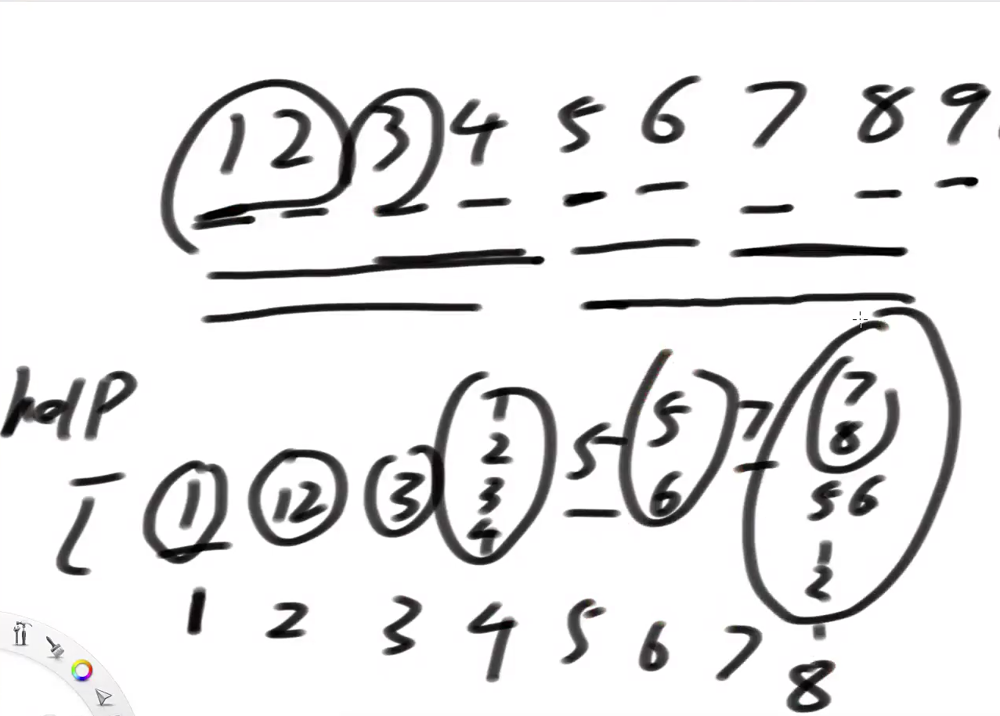
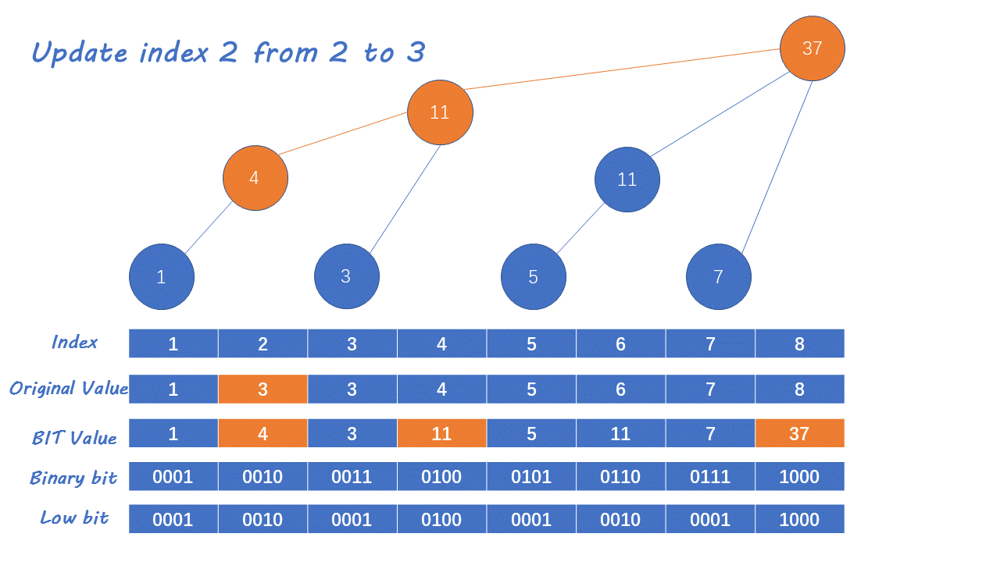
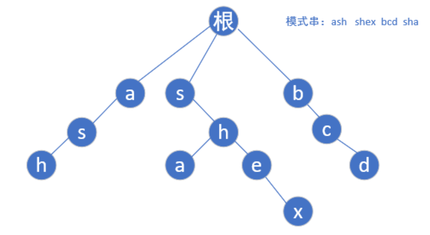
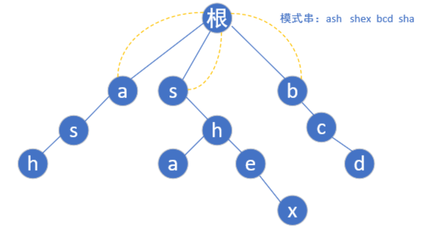
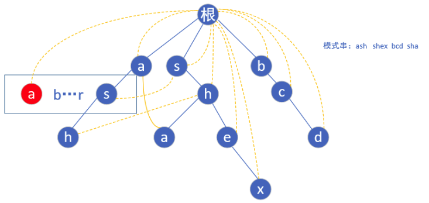

# 引入

解决数组的范围内数字的累加和问题：

1. 前缀和数组：适用于数组初始化后，不会修改。
2. 线段树：一维数组的范围增加，更新，累加和查询。（推二维很麻烦）
3. IndexTree：多维数组的累加和查询单点更新

# IndexTree

> 树状数组或二叉索引树（英语：Binary Indexed Tree），又以其发明者命名为Fenwick树。其初衷是解决数据压缩里的累积频率（Cumulative Frequency）的计算问题，现多用于高效计算数列的前缀和， 区间和。它可以以O(logn)的时间得到任意前缀和，并同时支持在O(logn)时间内支持动态单点值的修改。空间复杂度O(n)
>
> 摘自[维基百科](https://zh.wikipedia.org/zh-hans/树状数组)

特点：

1. 支持区间查询
2. 只支持单点更新
3. 没有线段树的适用性广，但很容易改成一维，二维或三维的结构

实现

1. **help辅助数组，维护指定范围的累加和。**

   分组计算累加和：当前组的长度为S，往左移动S步，得到之前的组；如果当前组的长度和之前的组的长度相同，则合并。当前组的长度变长一倍，当前组位置向左移动2*S步，直到不满足条件，或越界(左)。

   

2. 求出help数组中某一个索引位置的组包含原数组的索引范围：

   规律：某一个索引位置Index（8）：二进制值是00001000，则index位置的结果，组中包含原数组的索引范围是：index的二进制值的最后一个1拆开，再加1，然后到它自己（00000001.......00001000）是原数组中索引1~8范围内的数。

   示例index=29时，组中只管自己。11101-11101

3. 区间查询：1......index范围内的前缀和：

   下标关系规律：当前索引的二进制，不断移除最右的1，直到为0。在过程中，Index索引的变化值在help数组上，累加结果。

   示例：index=33，则1~33的前缀和是，help中01000001和01000000位置的和。

   分段示例：index=52，二进制为00110100 

   ​			help[00110100] 包含的原数组的索引范围是：arr[00110001~00110100]

   ​			help[00110000] 包含的原数组的索引范围是：arr[00100001~00110000]，结尾是上一段的开始

   ​			相当于分段求，再相加。				    

4. 区间查询：L......R范围内的前缀和：

   (1……R) - (1……L-1)  类似于前缀和数组。

5. 原始数组的单点更新：

   原始数组初始化都是0，help数组1-N也都是0，

   如果原数组arr中某个位置元素被更新，则help数组中哪些位置需要更新。

   下标关系规律：通过不停的累加Index二进制的最右侧的1，直到数组右边界。

   index升级到2\^n时，之后的index都是2^n。（index=12（001100），16（010000），32（100000）
   
   

总结：

1. 更新的时候索引加最右侧的1，求前缀和时索引减去最右侧的1再加1.

   二进制序列中最右侧的1，公式 ：n&(~n+1) < - > n&(-n)

2. 两个操作的时间复杂度都是O(logN)，因为二进制加(减)1的位数最多logN。

## 二维

实现：

1. help辅助数组也是二维，help[i]\[j]表示，在原二维数组中，以[1,1]为左上角，[i,j]右下角的区域的累加和。

2. 当原数组单点更新，help中需要修改的区域：

   arr[00110100]\[00111000]=？ 原数组52行56列的值修改，

   help中，上面行（52），列（56）所影响到的所有组合（hlep矩形的右下角中的值）都受影响。

3. update更新某一索引位置的值，需要**原二维数组**的值，计算得到add增加的值是多少。

区间查询：L......R范围内的前缀和：注意边界（[3,3]~[4,4]中，减去的空间4不变，3-1=2）

时间复杂度O(log行*log列)

三维就是3个范围的组合

# AC自动机

作用：解决在一个大字符串中，找到多个候选字符串（敏感词）的问题。

算法核心：在字符串的前缀树(trie tree)上，使用KMP算法的思想优化。

1. KMP是用于一对一的字符串匹配，而trie虽然能用于多模式匹配,但是每次匹配失败都需要进行回溯，如果模式串很长的话会很浪费时间。
2. 所以AC自动机应运而生,如同Manacher一样,AC自动机利用某些操作阻止了模式串匹配阶段的回溯,将时间复杂度优化到了O ( n ) ，n为文本串长度

实现流程：

1. 把所有匹配生成一颗前缀树：如模式串`"ash","shex","bcd","sha"`,然后我们根据模式串建立如下trie树:

   

2. 根据**BFS宽度优先搜索**，给前缀树的所有节点增加**fail指针（失配指针）**

   1. 前缀树的**头节点**的fail指针，指向null

   2. 前缀树的头节点的直接下级节点（**第一层**）的fail指针，指向头部head。（每个模式串的首字母的fail指针肯定是指向根节点，因为原文章中当前字符匹配前缀树的第一层字符失败，则原文章中下一个字符从前缀树的根节点重新匹配其子节点）

      

   3. **第二层及之后**节点的fail指针设置：不断向父节点方向跳，判断上一层的fail指针。

      a的子节点为s，前缀树的根节点的子节点范围是从`a-z`，直接通过index获取，如果不存在这个子节点我们就让他指向根节点(如下图红色的`a`)

      由于存在`s`这个节点,我们就让他的fail指针指向他父亲节点(`a`)的fail指针指向的那个节点(`根`)的具有相同字母的子节点(`第一层的s`),

      
      
      敏感词为：aabc,bbcd,ccde时，第二个a的节点的fail指针指向第一个a节点。若字符串是aaabccde.....；

3. fail指针的含义：如果必须以前缀树上的当前字符结尾，在敏感词上形成路径str，寻找哪一个**敏感词字符串的前缀和str的后缀，拥有最大匹配长度**。fail指针就指向那个字符串最后一个字符所对应的节点。

   当匹配失败后，跳到fail指针指向的下一个节点继续配。尽可能的保留已匹配的字符，再去匹配其它敏感词。

   fail指针按层从上往下赋值，所以fail指针的遍历，就是按层从下往上跳转，直到根节点。

4. 查询匹配过程：大字符串（abcd）敏感词（a,bc,abc,abcd）大字符串当前位置index

   Index到a时，不断查找fail指针，直到转到根节点，发现只匹配到**（a）**，收集答案。

   Index到b时，不断查找fail指针，直到转到根节点，沿途没有敏感词的匹配。

   Index到c时，匹配到**（abc）**，不断查找fail指针，直到转到根节点，发现匹配到**（bc）**，收集答案。

   

   index每到一个位置，都查一遍fail，试图找到其他被当前敏感词包含的敏感词。**和当前敏感词无法匹配，跳到fail指针指向的位置不同**。

   前缀树中的当前匹配的节点， 表示大字符串到index位置时，匹配到敏感词的位置，如果为根节点，则说明没有匹配到。

代码：

1. AC自动机中，和前缀树一样，字符是放在路径上，而不是节点上。

2. insert全部敏感词后，build前缀树和失配指针。

3. **不用查找匹配最长的敏感词**，因为父节点的fail指针保证了它指向最长，如果下一路径一样，则当前节点也指向的是最长。如果父节点的fail指针的下一路径不一样，则选fail指针指向节点的fail指针，看它是否有相同的下一路径。

   **所有匹配的可能性，通过父节点的fail指针保留下来，因为fail指针是从下层到指向上层，所以最先匹配到的，一定是前缀和后缀的最长长度匹配。**