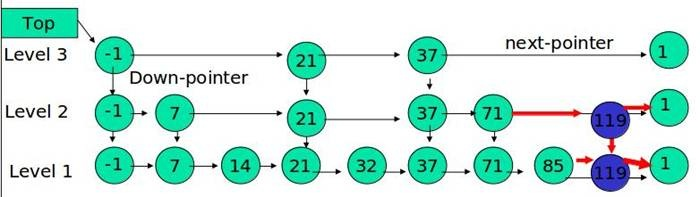

# 引言

关系型数据库，最重要的技术就是索引。

数据库最大的优化就是建索引。建索引的前提是，被索引的字段是可排序的（比如任何字符串可排序）。

排序是如何帮助我们加速找数据的？底层数据写在硬盘上是顺序的，但数据库在它之上建立索引，通过索引找到真实物理结构中的位置。

索引就是一棵有序树。

如果数据库没有顺序范围查找，比如查找17到27岁的患者。就可以使用HashMap，增删改查的操作都是O(1)。

还有比如查找姓氏的开头是abc的，HashMap只能遍历，只有有序的结构才可以完成快速查找。

# 搜索二叉树

注意项：

1. 搜索二叉树一定要说明以什么标准来排序。
2. 经典的搜索二叉树，树上没有重复的用来排序的key值。
3. 如果由重复节点的需求，可以在一个节点内部增加数据项。

## 操作

如何组织一颗搜索二叉树（搜索二叉树插入新的key）？

1. 开始树为空，直接将key=5放在根节点，
2. 放入key=1时，从根节点开始找，比5小则往左滑，左子树为空，直接挂在根节点的左边
3. 放入key=2时，从根节点开始找，比5小则往左滑，来到左子树上节点值为1，2比1大，挂在1节点的右子树上，为空，则挂在1的右边。
4. 放入key=7时，从根节点开始找，比5大则往右滑，右子树为空，直接挂在根节点的右边

搜索二叉树查找key，从根节点开始。

1. 如果当前节点的value==key，返回true
2. 如果当前节点的value<key，当前节点往左滑
3. 如果当前节点的value>key，当前节点往右滑
4. 如果当前节点变为null，返回false。

搜索二叉树的删除key

1. 先找到key所在的节点

2. 如果该节点没有左右子树，直接删除。

3. 如果该节点有左孩子，没有右孩子，则直接用左孩子顶替该节点

4. 如果该节点没有左孩子，有右孩子，则直接用右孩子顶替该节点

5. 如果该节点既有左孩子，也有右孩子，则用该节点的后继节点顶替该节点。

   搜索二叉树的性质：

   X节点的右子树的最左节点L，一定是离X的值最近，且比X大。

   X节点的左子树的最右节点R，一定离X的值最近，且比X小

   它们就是X的后继节点。

   后继节点取L，一定没有左孩子，若有右孩子，则让后继节点的父节点的左孩子接着。

   后继节点取R，一定没有右孩子，若有左孩子，则让后继节点的父节点的右孩子接着。

## 问题

这棵树的瓶颈来自于树的高度。

- 基础的搜索二叉树，添加、删除时候不照顾平衡性
- 如果按大小顺序给值1，2，3，4.....，则组成的搜素二叉树就没有效率可言，变为顺序查找。
- 算法性能是由用户的输入顺序决定的。数据状况很差时，性能就很差。
- 时间复杂度按最坏的情况估计，所以这种方式不可取。

## 平衡搜索二叉树

所以只能进行树的操作，就是平衡搜索二叉树，在一颗树的搜索性上，再保证平衡性。

平衡性是指，树上有N个节点，最高的高度是logN，则效率最高。

保证树的平衡性的操作（不会破坏搜素性）：

1. 左旋：先指定头节点，比如以A为头节点左旋，A要倒向右孩子B的左边，B的左孩子给A的右边，A的左边和B的右边都不变。如下图：圆圈是节点，方块是左右子树。

   

2. 右旋：先指定头节点，比如以A为头节点右旋，A导向左孩子B的右边，B的右孩子给A的左边，A的右边和B的左边保持不变。

   

# 有序表的实现

有序表是接口标准，而经典的有序表有多种实现：AVL树，SB树，红黑树。

应用：关系型数据库的索引。

关系型数据没落的原因：使用有序表不易拆分，无法水平扩展，只能单例，升级性能只能使用大型机。

JAVA中提供的系统有序表：TreeMap,TreeSet。（内部实现是红黑树）

系统有序表没有提供的方法：查找key<=7的个数。需要手改有序表。

## AVL树

区别于二叉搜索树的增删改查，AVL树增加了自己专属的保证平衡性的操作。

**平衡性调整**：

1. 有最严格的平衡性，任何节点的左树高度和右树高度差，不超过1。|左高 - 右高| < 2。

2. 往上沿途检查每个节点时，都去检查四种违规（**平衡性被破坏**）情况：

   LL：节点A上增加左孩子B，B上增加左孩子C，导致LL方向的长度过长，**只做一次右旋**调整平衡性

   RR：节点A上增加右孩子B，B上增加右孩子C，导致RR方向的长度过长，**只做一次左旋**调整平衡性

   LR：节点A上增加左孩子B，B上增加右孩子C，导致A的左右子树高度相大于1，利用旋转让**A的孙C**上到顶部

   RL：节点A上增加右孩子B，B上增加左孩子C，导致A的左右子树高度差大于1，利用旋转让**A的孙C**上到顶部

   既是LL型，也是LR型违规的情况，按LL型处理，因为有些情况按LR处理出错。

   既是RR型，也是RL型违规的情况，按RR型处理。

   

3. 一个节点的每次平衡的调整时间都是O(1)，因为就是有限几个位置的数据互换。

4. 插入，删除时，从最底层被影响到的节点开始，对**向上路径的节点（父节点）**做平衡性（4种情况）检查。

   树的高度是LogN，每个节点调整的时间是O(1)，所以整棵树的调整代价是O(logN)。

   插入和普通的删除，都是从受影响的节点开始，向上检查其父节点的平衡性。（**递归后序实现**）

   如果要删除的节点，有左子树和右子树，从后继节点原来的位置，开始向上检查其父节点的平衡性。

示例：若左树高度是7，右树高度是5，平衡性被破坏，需要追究是B的左树和右树哪个长，结果发现左树高度5，右树高度6，则说明头节点A**属于LR的违规情况**，因为是头节点A的左孩子的右子树过长，导致失衡。

平衡性调整：让C旋转到A的位置。（先对B左旋，C顶替B的位置，再对A右旋）

上图中，若K高度为6，S高度改为4，则属于LL和LR型情况，按LR处理，K=6,S=4是B的左右子树，高度差大于1。

既是LL型，也是LR型，或者既是RR型，也是RL型，都是因为删除操作引起的，删除后头节点的子节点人左右子树的高度一样。

## SB树

Size-Balanced-Tree，节点个数是**平衡因子**。

应用：系统提供的有序表可能无法解决刷题中的问题，需要深度的改有序表才可以。而sb树的结构特别好改。

**平衡性调整：**

1. 让每一个叔叔节点为头的树，其节点个数都不少于其任何一个侄子节点。

   较大子树的节点数不能超过较小的子树的节点数的2倍+1以上。

   

2. 平衡性检查：从底层受影响的节点，开始在向上的路径上，为每个节点做检查。

3. 四种违规类型：

   

4. 调整方式：LL（做一次右旋）、RR（做一次左旋），LR和RL（利用旋转让底层那个上到顶部）

   **调整后，哪个节点的孩子发生变化，再对变化的节点做检查（递归）**。

   

   需要递归检查的原因：

   AVL树的平衡性很敏感，约束严格，每次增加、删除节点，都会在向上的路径上调整树的平衡性。

   但SB树的平衡性约束较宽松，可能很久才做一次调整，这就需要在每次调整后，将孩子变化的节点再做检查

   虽然调整的复杂度上升，但均摊到树上的每次的增、删操作上，时间复杂度还是O(logN)。

改进：

1. 删除的时候可以不检查，把平衡性的调整放在插入的时候。

   删除节点的最差情况，是把树变成一个单向链表，查询效率降低。但可以被接受的。

   因为对于原本拥有N个节点的树来说，删成单链表，其长度是logN，所以不会很大。

   在查询性能和平衡性之间，得到一种不太影响查询性能，又能降低平衡性调整次数代价的方法。

2. 这种只要孩子节点变化，就递归调整的特性，其它树没有。

3. 可以在节点上封装别的数据项，增加功能。

## 红黑树

平衡性规定：

1. 每个节点不是红就是黑

2. 整棵树的头节点一定是黑，叶子节点包含null空节点，一定为黑，

3. 两个红节点不能相邻，父子不能都红。

4. 每一个子树左右链，黑节点的数量一样。

   最长的链（黑红黑红）和最短的链长度（黑黑）不能超过两倍以上。

特征：

1. 平衡性规定很诡异

2. 平衡性调整复杂：插入的违规5种，删除的违规8种。

3. 优点是：每次插入、删除扰动较好（对内存的IO消耗比较低）。

   但优势微弱，贪图扰动小的话，**B+树、2-3-4树**可能更好。（所以选择有序表的结构，要看需要什么）

   除此之外，和AVL，SB，跳表相比，并不占优

## 总结

它们的共性：

1. 都是搜索二叉树

2. 插入，删除，查询，和搜索二叉树的操作一样。

3. 保证平衡的基本操作：**只有左旋和右旋**。

4. 插入，删除时，从最底层被影响到的节点开始，对向上路径的节点做平衡性检查。

5. 时间复杂度一样，增删改查的操作，都能保证做到O(logN)。

   因为只对一条向上路径的每个节点做O(1)的检查和调整
   
   红黑树提高效率，就提升的常数时间。

它们的不同：

1. 平衡性的约束不同

   AVL树最严格，SB树稍宽松，红黑树更宽松。

2. 插入和删除的操作和搜索二叉树一样，但是额外做各自的平衡性调整。

   各自的平衡性调整所使用的动作都是左旋或者右旋。

积压结构：

1. 如ArrayList的动态扩容。在某一时刻在扩容的时候有单点的性能瓶颈。每次扩容的代价是一个等比数列，求和公式是O(N)，再除以加入的总量N，单次就是O(1)。HashMap的扩容也一样。
2. SB树和红黑树也一样，有积压操作，但整体的每次操作一定能收敛到O(logN)，所以这是B树，B+树，红黑树现在流行的原因。
3. 但AVL没有。所以AVL无法应用在硬盘组织的结构上，引发IO次数太多。
4. 如果硬盘和内存一样快，则这种有积压结构的，也会没落。

# 跳表

SkipList，全称为跳跃列表，它允许快速查询，插入和删除一个有序连续元素的数据链表。（面试需要手撸）

## **引入**

一个有序数组的高效率查询方法是二分查找。如果数组长度为N，则二分查找的时间复杂度是O(logN)。

一个有序链表的高效率查询方法是：

1. 因为链表只能从头到尾往后找，不适用于二分查找。

2. 在原始链表上，增加一个索引链表，想要定位到结点20，先访问索引链表，再顺着索引链表的结点向下，找到原始链表的结点20。

   这个过程，就像是先查阅了图书的目录，再翻到章节所对应的页码。

   由于索引链表的结点个数是原始链表的一半，查找结点所需的访问次数也相应减少了一半。

   

3. 数据多的时候，多层索引可以进一步提升查询效率。

**示例**：假如原始链表有N个节点，

1. 索引的层级就是log(N)-1。

2. 每一层的访问次数是常量（最多遍历两个节点），所以查询任意数据的时间复杂度为O(2*logN)，省略常数项就是O(logN)。

3. 每层索引的节点总数是n/2+n/4+n/8+n/16+......4+2=n-2，约等于N。

   基于链表的优化增加了额外的空间开销，空间复杂度是O(N)，优化后的数据结构所占空间是原来的2倍。

4. 是典型的**以空间换时间**。

而通过对链表加多级索引的结构，就是跳表。

## 思想

主要思想：**逐渐建立索引，加速查找与插入**

- 不停的的向跳表中插入元素，就可能会造成两个索引之间节点过多的情况，查询效率就会降低。
- 所以需要维护索引和原始链表的大小平衡，就是节点增加，索引也相应增加。
- 而跳表通过一个随机函数来维护这个平衡，在插入数据的同时，随机插入到某一层的索引上，有效的防止跳表退化，而造成效率变低。

## **实现**

1. 链表头尾都是空节点，分别表示负无穷大与正无穷大，链表头head包含所有层。

2. 在插入时确定数值的层数，以0.5的概率增加层数K，随机变量K满足参数为p=0.5的几何分布，K的期望值E[K]=1/p=2，也就是说各个元素的层数，**期望值是2层**。

3. 是一个多层次的链表，最底层包含所有节点，且每一层链表中的元素是下一层链表元素的子集

   第一层N个，第二层有N/2个，第三层有N/4个......，因为是以0.5的概率升层，每次都是下一层的一半

示例：1-64的数放入跳表，0.5的概率下会产生7层，

- 理想中最高层（第七层）的1个数为32，可以将整体均匀2分。
- 第6层的2个数16，48，可以把整体均匀4分
- 但实际情况是：任一个数出现在最高层，是等概率的。

## **特点**

1. 与二叉搜索树无关

2. 利用随机概率分布来使得高层索引可以无视数据规律，做到整体性能优良

   用随机概率与输入规律解耦。

3. 设计思想是所有有序表中最先进的。

4. 若结构简单，就是多级链表。

5. 平均查找和插入时间复杂度都是O(logn)

## 操作

**查找**

从最上层开始，查找值S和当前节点比较后，右移（小于等于S）或跳入下一层（大于S）。

每一层往右跳或进入下一层，而在有N个数的最底层，会跨过多个节点，所以时间复杂度logN（多少层）。

**插入**

先确定该元素占据的层数K，随机。

如果K大于最大层数max_level，则在head头节点中增加层节点。

按照跳表查找结点的方法，在最底层上，找到待插入结点的前置结点（仅小于待插入结点）。

按顺序在 Level 1 ... Level K 各个层的链表都插入元素。

例子：插入 119， K = 2

**删除**

按照跳表查找结点的方法，找到待删除的节点。

按顺序在 Level 1 ... Level K 各个层的链表中删除节点

若最高层的节点删完了，则消减一层。

因为单链表中的删除操作需要拿到要删除结点的前驱结点，然后通过指针操作完成删除。所以在查找要删除的结点的时候，一定要获取**前驱结点**。

# 题目

## 区间和达标的子数组数量

给定一个数组arr，和两个整数a和b（a<=b）

求arr中有多少个子数组，累加和在[a,b]这个范围上

返回达标的子数组数量

**分析：**

和《体系班03 归并和快速排序》中归并修改的题目一样。

共有四种时间复杂度由小到大的解法：O(N^3) -> O(N^2) -> O(N*logN) -> O(N\*logN)

从3层暴力循环，前缀和数组加速，归并排序（递归合并）最终到二叉搜索树（SB）。

**数组的累加和推论：**

数组[0-i]的**累加和**是S，子数组以i位置结尾，求落在[a，b]范围上的子数组数量。等同于求i之前有多少个**前缀和**落在[S-b，S-a]范围上。

示例：

- 数组[0-17]范围的累加和是100，那么以17位置为结尾的子数组的累加和，有多少个落在[10，60]范围上。
- 本质上就是求：必须从0出发，有多少个累加和是在[40，90]范围上。
- 比如[0-7]范围的累加和是70，那么[8-17]的累加和是30。
- 如果70在[40，90]范围上，则30一定在[10，60]范围上

**实现方法：**

求[3，-2，4，3，6]  在[1，5]范围上的子数组个数。

实现一个结构，接收前缀和，初始有一个前缀和的值为0.

当以0位置结尾，则当前的前缀和是3，之前的前缀和为0，则看它之前的前缀和落在[-2，2]上的个数是1，再把当前的前缀和3放入结构中。

当以1位置结尾，则当前的前缀和是1，之前的前缀和为(0，3)，则看它之前的前缀和落在[-4，0]上的个数是1，再把当前的前缀和1放入结构中。

当以2位置结尾，则当前的前缀和是5，之前的前缀和为(0，3，1)，则看它之前的前缀和落在[0，4]上的个数是3，再把当前的前缀和5放入结构中.....

如果结构能快速查出每个位置的个数，最后都累加，就是结果。

**结构要求**

1. 可以往里加入元素（是整数）add

2. 可以接收重复值。

   有序表不能接收重复值，修改的方式：在节点上增加数据项PathCount，表示经过或到达节点的节点个数。

3. 可以查询范围上[a，b]有多少个key。

   因为结构有序，则可以转换为f(b+1) - f(a)。

   比如范围是[5，10]，则用小于11的个数减去小于5的个数，就是结果。

   最后只需要提供**查找小于某个key的个数**的方法。

**计算小于key的个数：**

1. 从头节点开始，若是小于key则右滑，则小于key的数至少是左子树和头节点的个数，就是头节点的PathCount减去右节点的PathCount。如查找<46的个数。就是100-70=30。

2. 若大于key，则左滑，无操作。

3. 若等于key，就加上左树的值。

   

**代码bug：左，右旋转中，更新pathCount，pathCount写为size，导致有重复值时，结果有差异。**

## 滑动窗口中位数

有一个滑动窗口（讲过的），给定宽度：

1）L是滑动窗口最左位置、R是滑动窗口最右位置，一开始LR都在数组左侧

2）任何一步都可能R往右动，表示某个数进了窗口

3）任何一步都可能L往右动，表示某个数出了窗口

想知道每一个窗口状态的中位数（严格意义的中位数：若数组有序[1，2，3，5]的中位数是2.5.

**分析：**

窗口范围的数，用一个结构存储。

此结构需要支持4个功能：增加，删除，可以有重复值，获取index位置的值。

计算中位数：如果结构的size为奇数时，中间的数就是中位数；如果为偶数，取中间的两个数字，相加除2就是中位数。

1. 窗口数据，使用数组和插入排序，时间复杂度O(N)
2. 窗口数据，使用有序表，时间复杂度O(logN)

示例：查找key=77的数，一定是右子树上的第37个。递归求。(重复值使用附加数据项的处理方式)

## 设计复杂度为O(logN)高效数据结构

设计一个结构包含如下三个方法：

- void add(int index, int num)：把num加入到index位置
- int get(int index) ：取出index位置的值
- void remove(int index) ：把index位置上的值删除

要求三个方法时间复杂度O(logN)

注意：index是加入的顺序，类似于原始数组的索引，而不是排完序的索引。

**分析**

java的ArrayList：移除某个位置index的元素，等同于index后的数都左移，时间复杂度O(N)。

LinkedList：移除某个位置index的元素，除非是头或者尾，才会高效，双链表结构，需要找到index所在的位置之后才能插入或者读取，时间复杂度O(N)

SbtList是平衡搜索二叉树，所以插入或者读取时间复杂度都是O(logN)

有些脚本语言，如python，PHP语言中的数组功能和效率很强，因为其底层不是纯粹的数组结构或双链表，而是改进后的数组。所以刷题不用脚本语言，需要先确认其结构是否干净。

**实现**

1. 没有key，不需要排序，使用加入的自然时序。所以每个加入新元素都生成新的节点，内存地址独立。不需要判断是否已存在。

   size既是平衡因子，也参与业务，是不同的节点的个数，也是节点的数量。

   **注意：index索引和size之间的换算关系**

2. 对于重复值的处理，使用对象封装，内存地址不同，区分相同的数。

3. 按加入顺序挂在最右节点的右子树上，然后有序表维持平衡，进行左旋。

   **调整平衡时，左旋和右旋，不会改变加入的顺序。**

示例：在1位置加入7。先检查size查找位置。不停左移，有1位置的数，挂在它左边，并调整平衡size.

**代码异常：remove方法移除时，需要对root重新赋值，否则之后的操作都会有异常。**

## 根据身高重建队列

假设有打乱顺序的一群人站成一个队列，数组 people 表示队列中一些人的属性（不一定按顺序）。每个 people[i] = [hi, ki] 表示第 i 个人的身高为 hi ，前面 正好 有 ki 个身高大于或等于 hi 的人。

请你重新构造并返回输入数组 people 所表示的队列。返回的队列应该格式化为数组 queue ，其中 queue[j] = [hj, kj] 是队列中第 j 个人的属性（queue[0] 是排在队列前面的人）。

**示例：**

输入：people = [[7,0],[4,4],[7,1],[5,0],[6,1],[5,2]]
输出：[[5,0],[7,0],[5,2],[6,1],[4,4],[7,1]]
解释：
编号为 0 的人身高为 5 ，没有身高更高或者相同的人排在他前面。
编号为 1 的人身高为 7 ，没有身高更高或者相同的人排在他前面。
编号为 2 的人身高为 5 ，有 2 个身高更高或者相同的人排在他前面，即编号为 0 和 1 的人。

**分析**

题意可以理解为：一群人的信息按输出排列，但被打乱后就形成了输入，希望用一种算法把打乱顺序的数组重新还原。

贪心策略：

1. 先按h降序，若h相同，则按k升序。（**比较器**）

   先将高个子放入新集合，这样的话，在高个子前或后插入矮个子，都不影响当前高个子的k值。

   k值较大的较后插入。

2. 然后按上述的顺序，将每个人的信息按k值加入到新集合中。

改写SB树，提高插入和读取的效率。

## 总结

改写有序表的题目核心点

1. 分析有序表的节点上增加什么数据项可以支持题目中的业务。
2. 有序表一定要保持内部参与排序的key不重复
3. 在平衡性调整时，保证新加数据项也能正确更新
4. 剩下就是搜索二叉树的接口实现问题。

