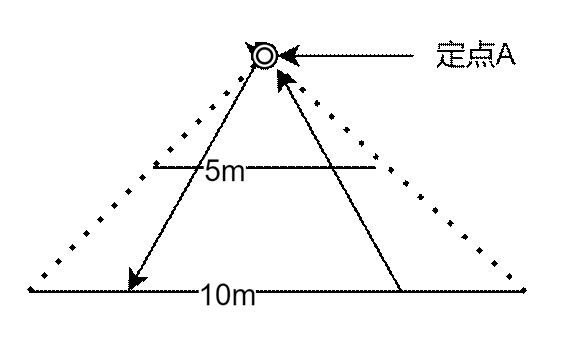

# 定义

卡特兰数又称卡塔兰数，英文名Catalan number，是组合数学中一个常出现于各种计数问题中的数列。以比利时的数学家欧仁·查理·卡塔兰 (1814–1894)的名字来命名。

其前几项为（从第零项开始） : 1, 1, 2, 5, 14, 42, 132, 429, 1430, 4862, 16796, 58786, 208012, 742900, 2674440, 9694845, 35357670, 129644790, 477638700, 1767263190, 6564120420, 24466267020, 91482563640, 343059613650, 1289904147324, 4861946401452, ...

当$k(0)=1,k(1)=1$时，如果接下来的项满足以下通项公式：
$$
\large \begin{cases}
k(n)=k(0)*k(n-1)+k(1)*k(n-2)+\dots+k(n-2)*k(1)+k(n-1)*k(0)&(1)\\
or\\
k(n)=c_{2n}^n-c_{2n}^{n-1}&(2)\\
or\\
k(n)=\frac{c_{2n}^n}{n+1}&(3)
\end{cases}
$$
就说这个表达式，满足卡特兰数，常用的是范式(1)和(2)，(3)几乎不会使用到。  

## 组合数公式

组合是数学的重要概念之一。从 n 个不同元素中每次取出 m (0≤m≤n)个不同元素，不管其顺序合成一组，称为从 n 个元素中不重复地选取 m 个元素的一个组合。所有这样的组合的种数称为组合数。

在线性写法中被写作C(n,m)

计算公式：$C_n^m=\frac{n(n-1)(n-1)\dots(n-m+1)}{m!}=\frac{n!}{m!(n-m)!},C_n^0=1$。

互补性质：即从*n*个不同元素中取出*m*个元素的组合数=从*n*个不同元素中取出 (*n-m*) 个元素的组合数；，例如C(9,2)=C(9,7)。

组合恒等式：C(n,m)=C(n,n-m)=C(n-1,m-1)+C(n-1,m)。

规定：C(n,0)=1 C(n,n)=1 C(0,0)=1

## 集合关系

已知两个**无关联的可数**集合A，B，若有从A到B的1对1映射f函数，还有从B到A的1对1映射g函数，则集合A，B的数量一定相等。

示例：

- 若干家族，若干旗帜，
- 每个家族的徽章对应一个旗帜，则家族的数量**>=**旗帜的数量。
- 每个旗帜的颜色对应一个家族，则旗帜的数量**>=**家族的数量。
- 所以，家族的数量一定等于旗帜的数量。

**等势：**数学结论中，整数和偶数的数量一样多，因为任何一个整数乘以2是一个偶数，且任何一个偶数除以2是一个整数。

示例：

- 5米长的线段，和10米长的线段，

- 两条线平行，在5米线的上方找一个定点，

- 5米线中任一个点和定点连成的直线，能对映上10米线上的一个点。

- 10米线中任一个点和定点连成的直线，能对映上5米线上的一个点。

- 所以：它们的点的数量一样多。

  

**延申：长度为0的线段有无数多个点**

示例：长度为1的线段，

1. 分成3段，去掉中间的一段，则在$\frac23$长度里有两个点。
2. 左右两段继续分三段，并去掉中间的一段，则在$\frac49$长度里有4个点。
3. 。。。不断下分，$\frac23$的无穷大次方是0，所以有无数多个点。

# 题目

## 左右括号各N个组合出来的括号配对是否合法

假设给你N个左括号，和N个右括号，随意组合的情况下，有多少个满足括号结合的组合数。

**分析**

括号组合合法的条件：每个组合字符串中的任意前缀里，右括号不多于左括号的数量。因为多出来的右括号的前面不会有匹配的左括号。

解法：用所有的组合数减去不合法的组合数，结果就是合法的组合数。

总的组合数是：$C_{2n}^n$，在2N个位置上选N个左括号的位置（剩下的就是右括号） 

不合法的情况：

1. 组合的字符串中一定存在一个**最短的前缀，其中右括号的个数比左括号多一个**，如N=3：**( ) )** ( ( )

2. 集合A（由N个右括号，N个左括号组成不合法的组合数），集合B（由N+1个右括号，N-1个左括号，组成所有的组合数）

   **映射关系f：将最短前缀之后的部分，进行反转，左括号变右括号，右括号变左括号**，如：( ) ) **) ) (**

   集合A的元素，通过映射关系f，可以变成集合B中的某一个元素。

   集合B的元素，通过映射关系f，可以变成集合A中的某一个元素。

   所以集合A的数量等于集合B的数量，$C(B)=C_{2n}^{n-1} or C_{2n}^{n+1}$

卡特兰数第二个通项公式：$K(n)=C_{2n}^n-C_{2n}^{n-1}$

## N个0,N个1自由组合满足条件达标结果数

假设给你N个0，和N个1，你必须用全部数字拼序列

返回有多少个序列满足：任何前缀串，1的数量都不少于0的数量

**分析**

与括号合法匹配问题一样，可以转换成卡特兰数的模型计算。

## 二叉树N个节点无差别能形成多少种不同的结构

有N个二叉树节点，每个节点彼此之间无任何差别

返回由N个二叉树节点，组成的不同结构数量是多少？

**分析**

节点无差别，结构不同的组合方式：列出N的不同情况

有0个节点，空树，1种方法

有1个节点，只有头节点的树，1种方法

有2个节点，头节点和左节点，头节点和右节点，2种方法

有N个节点时

1. 左节点数为0个，右节点数为n-1个，有$f(0)*f(n-1)$种方法
2. 左节点数为1个，右节点数为n-2个，有$f(1)*f(n-2)$种方法
3. 左节点数为N个，右节点数为0个，有$f(n-1)*f(0)$种方法

符合卡特兰数的第一个通项公式。所以可以直接用第二个通项公式算结果。

# 总结

任何前缀上0的数量不少于1的数量：很多题目都可以转化为这种问题来处理，比如

1. 出栈入栈问题：有N个数都要进栈并出栈，有多少种合法的方式。（括号问题，进栈表示左括号，出栈为右括号，出栈个数不能比入栈的个数多即为合法）
2. 股票涨法，要么向上45度，要么向下45度，共做N次交易，有多少种有效的交易。（x轴以下无效）
3. 人员站队问题。

需要敏感度，来运用卡特兰数的算法原型，需要牢牢记住以下3点

1. 卡特兰数的通项公式1和2.

2. 括号模型问题：第一个题目，符合公式2。

3. 如二叉树问题，若符合公式1，就等同于公式2。

   需要写出暴力递归来判断是否符合公式1.

