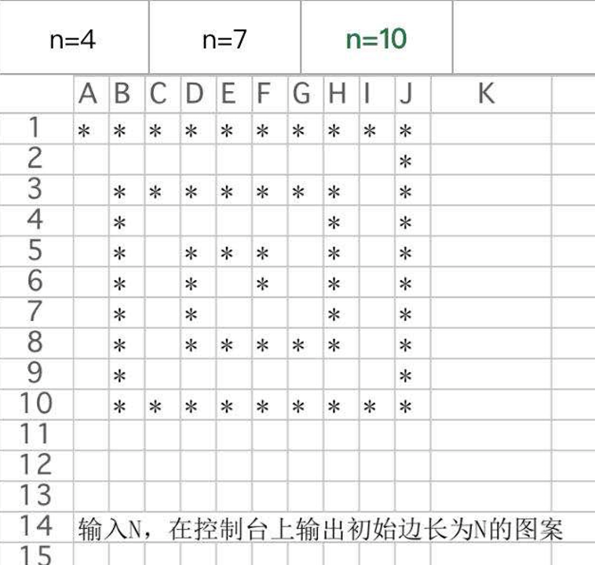

# 子数组达到规定累加和的最大长度系列问题

## 正整数组子数组累加和等于K的最大长度|累加和等于sum的子数组最长多长

给定一个正整数组成的无序数组arr，给定一个正整数值K

找到arr的所有子数组里，哪个子数组的累加和等于K，并且是长度最大的

返回其长度

## 整数数组子数组累加和等于K的最大长度

给定一个整数组成的无序数组arr，值可能正、可能负、可能0

给定一个整数值K

找到arr的所有子数组里，哪个子数组的累加和等于K，并且是长度最大的

返回其长度

## 整数数组子数组累加和小于等于K的最大长度

给定一个整数组成的无序数组arr，值可能正、可能负、可能0

给定一个整数值K

找到arr的所有子数组里，哪个子数组的累加和<=K，并且是长度最大的

返回其长度

## 整数数组子数组平均值小于等于V的最大长度

给定一个数组arr，给定一个值v

求子数组平均值小于等于v的最长子数组长度

## 总结

题目一主要技巧：利用单调性优化

题目二主要技巧：利用预处理结构优化 + 讨论开头结尾

题目三主要技巧：假设答案法+淘汰可能性（很难，以后还会见到）

# 矩阵操作问题

## 原地旋转正方形矩阵

给定一个正方形矩阵matrix，原地调整成顺时针90度转动的样子

a b c    g d a

d e f    h e b

g h i     i  f  c

## 转圈打印矩阵

给定一个长方形矩阵matrix，实现转圈打印

a b c  d
e f  g h
i  j  k  L

打印顺序：a b c d h L k j I e f g

## zigzag打印矩阵

给定一个正方形或者长方形矩阵matrix，实现zigzag打印

0 1 2
3 4 5
6 7 8

打印: 0 1 3 6 4 2 5 7 8

## 转圈打印N边星号正方形

