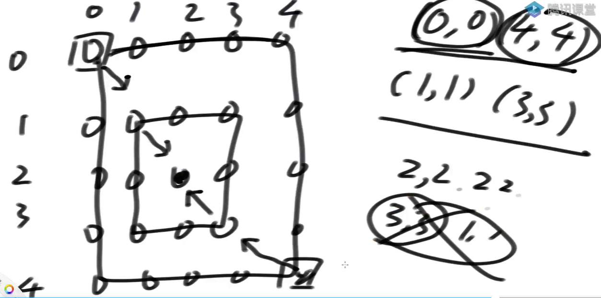

# 子数组达到规定累加和的最大长度系列问题

## 正整数数组子数组累加和等于K的最大长度

给定一个正整数组成的无序数组arr，给定一个正整数值K

找到arr的所有子数组里，哪个子数组的累加和等于K，并且是长度最大的

返回其长度

**分析**：

也就是：累加和等于K的子数组最长多长。

使用滑动窗口。【L，R】

1. 窗口的累加和<K：R++;

2. 窗口的累加和=K：记录长度R-L+1。

   非负数组：要R++，因为后面的数字可能是0，会让子数组长度更长。

   正整数组：要L++或R++或L++,R++。

3. 窗口的累加和>K：L++；

非负数组的窗口存在单调性：

- 窗口范围变大，累加和只可能变大或不变。
- 窗口范围变小，累加和只可能变小或不变。

窗口滑动能解决的问题一定具有某个范围对应指标（累加和）的单调性。

## 整数数组子数组累加和等于K的最大长度

给定一个整数组成的无序数组arr，值可能正、可能负、可能0

给定一个整数值K

找到arr的所有子数组里，哪个子数组的累加和等于K，并且是长度最大的

返回其长度

**分析：**

1. 有负数，累加和没有单调性，不能使用窗口滑动。

2. **子数组问题可以将求解流程定为：以每个位置为结尾的情况下的结果**。

   当以index=10位置的数为结尾，**向左移多长的距离**，其累加和等于K=30。

   **若0~10位置的累加和是100，之前有前缀和（0-7）等于70，则8-10位置的累加和必为30。**

   也就是查找之前的哪一个前缀和最早出现70的，然后推出以10结尾的最长子数组。

3. map存储：key=前缀和（0-1,0-2,0-3...），value=它最早出现的位置。

   **必须先加入初始记录：（0，-1）表示子数组一个数也没有时，前缀和为0的最早出现的位置是-1.**

   否则会错过以0开头的子数组。如[5，5，-1，1]，k=10，index=1时，preSum-k=0，子数组长度为1-（-1）=2

**同类问题：**

一个整数数组中，找到-1和1一样多的最长子数组。

可以转换为：处理原数组，除-1和1之外的数都设为0，然后求累加和等于0的最长子数组。

## 整数数组子数组累加和小于等于K的最大长度

给定一个整数组成的无序数组arr，值可能正、可能负、可能0

给定一个整数值K

找到arr的所有子数组里，哪个子数组的累加和<=K，并且是长度最大的

返回其长度

**分析**

数组三联问题。

前缀和+有序表：O(N*logN)

最优解：O(N)

1. 增加辅助数组

   minSum[i]：表示以i位置开头的子数组中，最小的累加和是多少。

   minSumEnd[i]：这个最小累加和的结束位置是多少。

   原数组；[7,-2,4,-3]，从右到左遍历填：当i=1时，minSum[i+1]>0，所以不用往右括，最小累加和就是自己。

   只用查看i+1位置的结果，因为它已是i+1位置开头的子数组中的最小累加和。

   minSum[5,-2,1,-3]，minSumEnd[1,1,3,3]；

2. 原数组从左往右遍历

   若minSum[0]>k，表示以0位置开头的子数组中，最小的累加和都大于k，则说明以0位置开头的任何子数组的累加和都不可能<=k

   若minSum[0]<=k，minSumEnd[0]=6，说明0-6范围内的累加和<=k，且6+1<arr.length，**可以往后扩**。

   若minSum[0]+minSum[7] (3) <=k，则最长子数组范围是0~minSumEnd[7] (8)。否则为0~minSumEnd[0]。

3. 后面的流程如果每个位置都需要从开头往后扩，找到最长子数组范围，**有回退（最长子数组范围的右边界加到开头位置），时间复杂度是O(N^2)**

4. 若以0位置开头的最长子数组范围是0-8。其累加和为sum=minSum[0]+minSum[7]

   判断原数组1位置时，sum"=sum-arr[0]，就是1-8位置的累加和，**可以往后扩**，判断sum"+minSum[9] 是否 <=k。

   **窗口的右边界不回退。时间复杂度是O(N)**

**示例：**

原数组[-100，70，20，10，10]，k=0

minSum[0]=-100，右边界可以往右移，以0位置开头最长子数组范围0-3，长度是4

以1位置开头，当前窗口范围是1-3，判断4位置的最小累加和。**长度小于4的子数组的结果不考虑。**

**只关注把答案（子数组长度）推高的可能性。会淘汰部分可能性**

1. 以1位置为开头的最长子数组范围是：1-5。（加上minSum[6]会>k)
2. 以2位置为开头的最长子数组范围，初始为2-5，若加上minSum[6]会>k，则2位置为开头的子数组都淘汰。
3. 以5位置为开头的最长子数组范围，初始为5-5，若加上minSum[6]会>k，则5位置为开头的子数组都淘汰。
4. 到6位置初始结果的窗口为0，继续以6位置为开头，左边界为6，右边界往右移。

## 整数数组子数组平均值小于等于V的最大长度

给定一个数组arr，给定一个值v

求子数组平均值小于等于v的最长子数组长度

**分析**

处理原数组，每个元素都减v，则只需求子数组的累加和小于等于0的最长子数组长度。如题目3。

## 总结

题目一主要技巧：利用单调性优化

1. 利用窗口滑动，前提是具有单调性
2. 窗口滑动的3种模型：窗口右滑R++,L++；窗口缩小L++,R--；窗口扩大L--,R++。
3. 敏感度：当指标(如累加和)的范围变化时，是否有单调性。

题目二主要技巧：利用预处理结构优化 + 讨论开头结尾

1. 记录一个最早前缀和出现的位置，能解决遍历的问题。
2. 子数组问题的解题流程：定位为以每个位置结尾（或起始）的情况下求解。

题目三主要技巧：假设答案法+淘汰可能性（很难，以后还会见到）

1. 只要有可能性舍弃的题目都很难。
2. 原理：L~R已有一个答案len，若L+1为开头的答案比len短，则丢弃。因为只关心全局最长。

# 矩阵的调整和打印

## 原地旋转正方形矩阵

给定一个正方形矩阵matrix，原地调整成顺时针90度转动的样子

a b c    g d a

d e f    h e b

g h i     i  f  c

**分析**

分圈结构：对角线的两个点（左上[a,b]和右下[c,d]），同时往中间移动，每次形成的正方形，进行旋转。

假设一个**具体的数据示例**：

先是每条边的第0个点（4个角）进行旋转替换。然后是每条边的第1个点进行旋转替换。

n*n的矩阵，有n-1个点的旋转次数。

**进行抽象化：**

左上角是（a行，b列)，右下角是（c行，d列），形成的矩形就是d-b+1（5*5），这个矩形有d-b个组的点要旋转。

m[a]\[b+i]（第0组的第1个），m[a+i]\[d]（第0组的第2个），m[c-i]\[d]（第0组的第3个），m[c]\[d-i]（第0组的第4个）

## 转圈打印矩阵

给定一个长方形矩阵matrix，实现转圈打印

a b c  d
e f  g h
i  j  k  L

打印顺序：a b c d h L k j I e f g

## zigzag打印矩阵

给定一个正方形或者长方形矩阵matrix，实现zigzag打印

0 1 2
3 4 5
6 7 8

打印: 0 1 3 6 4 2 5 7 8

**分析**

宏观调度，用一条斜线的移动，来输出。

在左上角上有两个点A（先往右移，到了右边界，再往下移），B，（先往下移，到了下边界，再往右移）

每一次移动，A和B都组成一条斜线，相邻斜线的遍历方向是相反的（通过bool值控制，每次取反）。

## 转圈打印N边星号正方形

**分析**

两层算作一个近似完整的矩形，左上角和右下角的点，在对角线上每次向中心跳两格，形成 新的两层矩形。

## 总结

分圈结构，是宏观调度。（如果只考虑局部位置怎么变，那思想就错了）

先假设好具体简单的数据示例，串流程，走通流程后，然后再抽象化，最后进行代码实现。