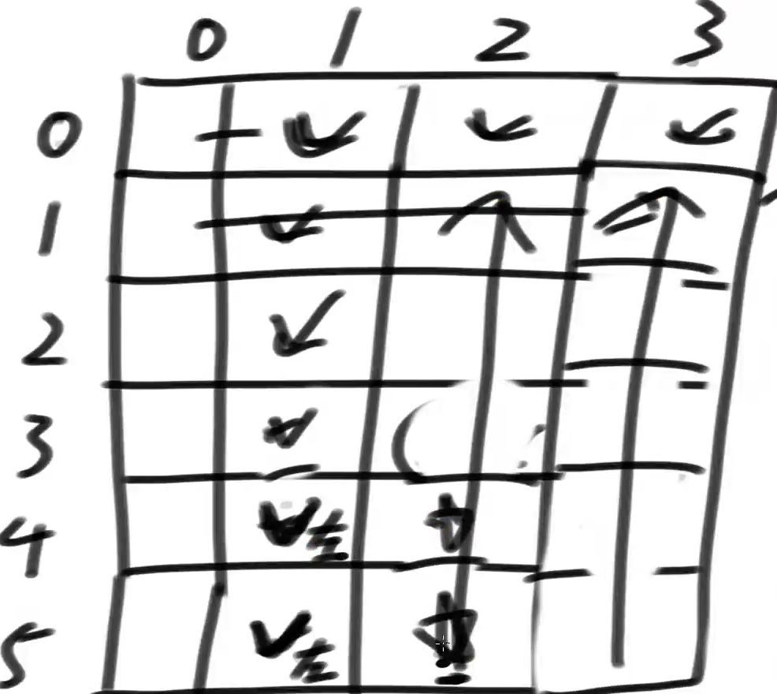

# 区间划分的现象

区间划分问题中，划分点不会退。

## 题目

### 非负数组切分成左右两部分累加和的最大值

给定一个非负数组arr，长度为N，那么有N-1种方案可以把arr切成左右两部分

每一种方案都有，min{左部分累加和，右部分累加和} 

求这么多方案中，min{左部分累加和，右部分累加和}的最大值是多少？

整个过程要求时间复杂度O(N)

**分析**

使用预处理的整体累加和：总的累加和 - 左部分的累加和 = 右部分的累加和

### 非负数组切分成左右两部分累加和的最大值的数组

把题目一中提到的，min{左部分累加和，右部分累加和}，定义为S(N-1)，也就是说：

S(N-1)：在arr[0…N-1]范围上，做最优划分所得到的min{左部分累加和，右部分累加和}的最大值

现在要求返回一个长度为N的s数组，s[i] =在arr[0…i]范围上，做最优划分所得到的min{左部分累加和，右部分累加和}的最大值，【就是下面的瓶颈结果】

得到整个s数组的过程，做到时间复杂度O(N)

**分析**

min{左部分累加和，右部分累加和}的最大值就是，左右部分的累加和最接近的时候。

在【0~index】范围上的划分点右移过程中不回退的证明：

- 因为数组为非负，划分点右移具有单调性，划分点在最左时，左部分累加和最小，右部分累加和最大。
- 右移过程中左部分变大，右部分变小，min{左部分累加和，右部分累加和}慢慢变大，直到下一个点结果变小，则当前点为最优划分点。
- 因为结果变小时，左部分累加和大于右部分，再右移，右部分的累加和会越来越小，结果也越小。

在【0~index+1】范围上，上一步的划分点也不回退的证明：

- 【0~index】的划分点的左部分小于右部分，左部分是瓶颈结果。（不能左移，因为左部分会更小）

- 【0~index】的划分点的右部分小于左部分，右部分是瓶颈结果。

  - 若右部分加上index+1位置的数后，左部分比右部分小，变成瓶颈结果。（原因同上）

  - 若右部分加上index+1位置的数后，右部分仍然是瓶颈结果，比左部分小。（不能左移，因为上一步的划分点已是最优，右部分不能再通过左移来增大。）

    示例：【3，100，**|**，8，9，10】，0-3的划分点，在0-4范围上不左移。

所以整个过程要求时间复杂度O(N)。

**重点**：不证明。

没有严格的数学证明，使用例子实现思路。

**使用对数器：实现暴力解和单调性的优化解，进行对比。**

单调性判断：

1. 没有0的情况；前面的划分点的瓶颈结果 <  后面的划分点的瓶颈结果，则右移。
2. 有0的情况：前面的划分点的瓶颈结果 < = 后面的划分点的瓶颈结果，则右移。

## 总结

每个位置的答案：推出通式，
$$
\displaystyle ans=max\big(min\big(左累加和，右累加和\big)\big)\\\Rightarrow ans=最优\big(最差\big(左指标结果，右指标结果\big)\big)\\\Rightarrow ans=最差\big(最优\big(左指标结果，右指标结果\big)\big)
$$
敏感度点：指标和数组的区间大小有单调性。如累加和。

只要满足通式和敏感度，就存在区间划分不回退现象。（不需要证明，使用对数器）

# 四边形不等式技巧

## 特征

1. 两个可变参数（L和R）的区间划分问题

2. 每个格子有枚举行为

3. 当两个可变参数固定一个，另一个参数和指标答案之间存在单调性关系

4. 而且两组单调关系是反向的：(升 升，降 降) (升 降，降 升)

   R不变时，L变小，指标答案变大；L变大，指标答案变小

   L不变时，R变小，指标答案变小；R变大，指标答案变大

5. 能否获得指导枚举优化的位置对：由上+右，或，左+下。（**提供上下边界，只有这两种搭配**，**由单调性推出**）

## 注意点

1. 不需要证明，用对数器验证

2. 枚举的时候面对最优答案相等的时候怎么处理？用对数器尝试。

3. 可以把时间复杂度降低一阶

   O(N^3) -> O(N^2)

   O(N^2 * M) -> O(N * M) 

   O(N * M^2) -> O(N * M) 

4. 四边形不等式有些时候是最优解，有些时候不是

   不是的原因：尝试思路，在根儿上不够好

## 题目

### 合并石子的得分

摆放着n堆石子。现要将石子有次序地合并成一堆

规定每次只能选相邻的2堆石子合并成新的一堆，

并将新的一堆石子数记为该次合并的得分

求出将n堆石子合并成一堆的最小得分（或最大得分）合并方案

**分析**

范围上的尝试模型：arr[L....R]上最优的合并方案，就是以下范围i枚举的最优结果

1. 最后一步：arr[L....L+1] + arr[L+2......R]，再继续拆分。
2. 最后一步：arr[L....L+2] + arr[L+3......R]，再继续拆分。。。。。

动态规划表dp：dp[L]\[R]的含义是：arr[L.....R]范围上的最优结果。示例：arr[1，4，2，3]

| L/R  | 0    | 1    | 2    | 3    |
| ---- | ---- | ---- | ---- | ---- |
| 0    | 0    | 5    | 13   | 20   |
| 1    | *    | 0    | 6    | 14   |
| 2    | *    | *    | 0    | 5    |
| 3    | *    | *    | *    | 0    |

1. L<R的结果都无效，设为*。然后按对角线的顺序填（从下往上，从左往右）：
2. L=R时，不需要合并，所以值为0	
3. R-L=1时，值为两个数的累计和，
4. R-L=2时，值为三个数的累加和，再加上Min（dp[L]\[L]+dp[L+1]\[R]，dp[L]\[L+1]+dp[R]\[R]）
5. R-L=3时，累加和，再加上**R-L范围上的枚举结果的最小值**。
6. 因为每个单元格都有枚举行为，所以时间复杂度是O(N^3)

枚举的优化：

1. dp[L]\[R]的值，表示在L.....R的上，每次划分成不同范围的两部分，记录L....R上的最优划分点。

2. 因为数组是非负，所以指标累加和具有单调性：

   当L参数固定时，dp[L]\[R+1]的值，可以直接从L....R上的最优划分点**开始**，右移进行枚举判断。

   当R参数固定时，dp[L+1]\[R]的值**有单调性**，范围变小，合并代价变小或不变；右移进行枚举判断，到L....R上的最优划分点**结束**。

3. 记录最优划分点，可以减少每个单元格的枚举次数，让O(N)变为O(1)。

### 画匠问题

给定一个整型数组 arr，数组中的每个值都为正数，表示完成一幅画作需要的时间，再 给定 一个整数 num，表示画匠的数量，每个画匠只能画连在一起的画作。所有的画家 并行工作，请 返回完成所有的画作需要的最少时间。

【举例】：

arr=[3,1,4]，num=2。

最好的分配方式为第一个画匠画 3 和 1，所需时间为 4。第二个画匠画 4，所需时间 为 4。 因为并行工作，所以最少时间为 4。如果分配方式为第一个画匠画 3，所需时 间为 3。第二个画 匠画 1 和 4，所需的时间为 5。那么最少时间为 5，显然没有第一 种分配方式好。所以返回 4。

arr=[1,1,1,4,3]，num=3。

最好的分配方式为第一个画匠画前三个 1，所需时间为 3。第二个画匠画 4，所需时间 为 4。 第三个画匠画 3，所需时间为 3。返回 4。

**分析：**

从左到右的尝试模型：就是数组中每个位置的画，在当前剩下的画家中选一个，最终返回最短的时间画完的选择。

**动态规划表：**O(N^2*K)

1. dp[i]\[j]表示，0~i范围上的画，由j个画家画，完成的最短时间是多少。表的右下角就是最终结果。

2. dp[100]\[6]可能性分解：(在N上做枚举)

   0-100 由5个画家负责，第6个画家为0

   0-99 由5个画家负责，第6个画家为100-100。。。。。。。

   0-0 由5个画家负责，第6个画家为1-100

   0 由5个画家负责，第6个画家为0-100

3. 填表：

   dp[0]\[j]第一行：0-0只有一幅画，就是这幅画的时间。

   dp[i]\[0]第一列：0个画家，结果无效。

   dp[i]\[1]第二列：1个画家，0~i幅画的累加和。

4. 位置依赖关系：

   dp[i]\[j]依赖dp[0]\[j-1] ~ dp[i]\[j-1]，左侧一列0-i的值。

**四边形不等式分析**：dp[i]\[j]中，i和j两个参数：O(N*K)

1. 画的个数不变，画家变多，时间变小，画家变少，时间变大

2. 画家不变，画的个数变多，时间变大，画的个数 变小，时间变小。

3. 枚举优化位置对：左（i不变，j增加时，时间变小）下（j不变，i变大时，时间变大）。

   最后一行，没有下限，只依赖左列。所以从左往右，从下往上填表。

   最优划分点：在其它画家负责的画作的位置。（左部分为其它画家，右部分为当前画家）

   当只有一幅画时，为-1，表示当前画家负责0-0位置的画，其他画家不负责。

   当只有一个画家时，为-1，表示0-i位置的画，由当前画家完成，其他画家不负责。

   

那么在其它题中，普遍位置若是右上的位置对，则从上往下，从右往左填。

**最优解：**

完成时间肯定小于等于数组的累加和Sum，不能让答案超过X（X<Sum)，最少需要几个画家。

示例【<u>2</u>，<u>3，1</u>，<u>4</u>，<u>2，1</u>，<u>3</u>】，若把完成时间定为4，则需要5个画家（只要累加和大于4，就加1个新画家）

示例【2，3，1，5，2，1，3】，若把完成时间定为4，无法达成。（第4幅画无法画完）

流程：

1. 若累加和Sum=100，画家为7个；Sum进行二分。
2. 若目标答案定为50，需要4个画家，不超过7，在左部分0 ~ 49上继续二分，
3. 若目标答案定为25，需要9个画家，超过7，则在右部分25+1 ~ 50上继续二分，目标答案为38。
4. 直到最后一个不超过7的，就是最终答案。

累加和Sum不大的情况下，这种猜测方法是最优解，若Sum比long类型还大，则四边形不等式为最优解。

### 邮局选址问题

一条直线上有居民点，邮局只能建在居民点上。给定一个有序正数数组arr，每个值表示 居民点的一维坐标，再给定一个正数 num，表示邮局数量。选择num个居民点建立num个 邮局，使所有的居民点到最近邮局的总距离最短，返回最短的总距离

【举例】

arr=[1,2,3,4,5,1000]，num=2。

第一个邮局建立在 3 位置，第二个邮局建立在 1000 位置。那么 1 位置到邮局的距离 为 2， 2 位置到邮局距离为 1，3 位置到邮局的距离为 0，4 位置到邮局的距离为 1， 5 位置到邮局的距 离为 2，1000 位置到邮局的距离为 0。这种方案下的总距离为 6， 其他任何方案的总距离都不会 比该方案的总距离更短，所以返回6

**分析：**

有序正数数组中，只有一个邮局的情况下，

- 数组为奇数，建在中点（中位数）位置是最优的。
- 数组为偶数，上中点和下中点一样都是最优。

**预处理结构表**minDistance[L]\[R]表示：L.....R范围上，只有一个邮局的情况下，最短的总距离是多少。

1.  如minDistance[3]\[100]，要计算中点到3的累加和，加上中点到100的累加和。

2. 示例：arr=【3，9，20，27，30】，只有1个邮局

   minDistance[0]\[0]：1个居民点， 邮局在0位置，代价为0；

   minDistance[0]\[1]：2个居民点，邮局在0或1位置，保持上一个位置0，代价为9-3=6；两位置的代价一样，邮局搬到最右的位置1;

   minDistance[0]\[2]：3个居民点，邮局在1位置，保持上一个位置1，代价为6+20-9=17；

   minDistance[0]\[3]：4个居民点，邮局在1或2位置，保持上一个位置1，代价为17+27-9=35；两位置的代价一样，邮局搬到最右的位置2;

   minDistance[0]\[4]：5个居民点，邮局在2位置，保持上一个位置2，代价为35+30-20=45；

3. 得出结论：**L不变，R增大，邮局位置点具有单调性，只会变大，不回退**。

4. 使用动态规划让：L-R上的求解复杂度，从O(N^3)变为O(N的2次方)

**动态规划表**dp[i]\[j]表示：0~i范围上的居民点，用j个邮局划分，得到的最短的总距离。

1. dp[7]\[3]的枚举拆分：在0-i上的遍历。
2. 0-6的居民点，由2个邮局划分，7-7由最后一个邮局划分：dp[6]\[2]+minDistance[7]\[7]
3. 0-5的居民点，由2个邮局划分，6-7由最后一个邮局划分：dp[5]\[2]+minDistance[6]\[7]
4. 依赖关系是：左侧的列dp[0-i]\[j-1]。
5. 居民点个数i=0时，第一行结果为0；邮局个数j=0时，第一列结果无效；邮局个数j=1时，第二列为minDistance[0]\[i]中的值。
6. 若邮局个数j大于居民点个数i，则结果为0，不用求解。i+1<=j（加1是因为i从0开始计数）

四边不等式分析：和画匠问题类似。枚举优化的配置对是左下。

1. 当前（最后一个）邮局的位置bestIndex：从左开始，到下结束。
2. 居民点的个数i不变，邮局增加，bestIndex只会右移。
3. 邮局的个数j不变，居民点的个数i变大，则bestIndex只会左移

### 双蛋问题

李永乐老师的双蛋和K蛋问题

在有100层楼的大厦里扔鸡蛋，会有一个临界楼层X，X以下的楼层上扔鸡蛋，鸡蛋不会碎；X以上的楼层扔鸡蛋，鸡蛋会碎，碎了不能再用。

若有N个蛋，最少扔M次，在最坏的情况下，找到的临界楼层。

1. **N=1，只有一个鸡蛋**，

   第一次扔，不能在50层进行尝试，因为如果碎了，只能知道临界楼层在1-50之间，而没法确认是那一层。

   所以第一次只能先从1层扔，碎了临界楼层就是第一层，没碎则在第二层尝试。。。。。。

   最差的情况是到100层（可能碎或不碎）。M=100次。

2. **有无限个蛋**，就可以使用二分法。

   第一个鸡蛋在50层尝试，若碎了能知道临界楼层在1-50之间，继续在25层尝试；

   若不碎能知道临界楼层在50-100之间，继续在75层尝试；不断二分，直到范围间隔为0；

   $2^M\geq100\Rightarrow M\geq6.64$，M取整，所以在最坏的情况下，M=7次。

3. **N=2，有两个蛋**（A和B）

   第一个蛋的作用是尽量把楼层的范围缩小，然后由第二个蛋在这个范围上一层层的尝试（同N=1)。

   1. 第一种方法

      A在楼层为（10，20......90，100）上扔鸡蛋，最多扔10次。

      若A鸡蛋在10层没碎，在20层碎了，则B鸡蛋需要在（11，12.....18，19）上尝试。最多扔9次。

      所以A若在10层碎了，则需要扔10次，但最坏情况下，A在100层才碎，则共需要扔19次。

      这个方法的问题：M在（10，19）次之间不平均。因为A的划分是等间隔的，所以扔B的次数总是一样的，而临界楼层越靠后，扔A的次数变大。

      能不能让A扔一次，B的间隔范围缩小一点，总次数就可以平均

   2. 第一种方法

      扔A的间隔范围为（n，n-1......2，1）

      等差数列求和（高斯公式）：$1+2+3+\dots+n=\frac{n(n+1)}{2}\geq100\rightarrow n\geq13.65$，取整n=14。

      可知，A在楼层为（14，27，39，50，60，69，77，84，90，95，99，100）上扔鸡蛋，最多扔12次。

      （因为取整，最后99不用加3，直接到100）。

      A扔第一次就碎了，则B鸡蛋要检验1-13层，共需要扔13+1次。

      A扔第二次就碎了，则B鸡蛋要检验15-26 层，共需要扔12+2=14次。

      A扔第十二次碎了，则不用B鸡蛋去检验， 共需要扔12+0=12次。

      M在（12，14）次之间，最差情况是14次。 

4. 多个鸡蛋，使用递归。

类似题目：一条鳄鱼在圆形小岛周围游弋，鳄鱼的速度是人的四倍，而且鳄鱼总是希望找到一个离人最近的位置，人最开始在岛中心。问这个人该如何运动，才能比鳄鱼先到达这个岛的边缘，从而逃离这个岛。

### 丢棋子问题

一座大楼有 0~N 层，地面算作第 0 层，最高的一层为第 N 层。已知棋子从第 0 层掉落肯定 不会摔碎，从第 i 层掉落可能会摔碎，也可能不会摔碎(1≤i≤N)。给定整数 N 作为楼层数， 再给定整数 K 作为棋子数，返 回如果想找到棋子不会摔碎的最高层数，即使在最差的情况下扔 的最少次数。一次只能扔一个棋子。

【举例】

N=10，K=1。

返回 10。因为只有 1 棵棋子，所以不得不从第 1 层开始一直试到第 10 层，**在最差的情况 下（棋子总是摔不碎）**，即第 10 层 是不会摔坏的最高层，最少也要扔 10 次。

N=3，K=2。

返回 2。先在 2 层扔 1 棵棋子，如果碎了，试第 1 层；如果没碎，试第 3 层。 

N=105，K=2 返回 14。

第一个棋子先在 14 层扔，碎了则用仅存的一个棋子试 1~13。 

若没碎，第一个棋子继续在 27 层扔，碎了则用仅存的一个棋子试 15~26。 

若没碎，第一个棋子继续在 39 层扔，碎了则用仅存的一个棋子试 28~38。 

若 没碎，第一个棋子继续在 50 层扔，碎了则用仅存的一个棋子试 40~49。 

若没碎，第一个棋子继续在 60 层扔， 碎了则用仅存的一个棋子试 51~59。 

若没碎，第一个棋子继续在 69 层扔，碎了则用仅存的一个棋子试 61~68。 

若没碎，第一个棋子继续在 77 层扔，碎了则用仅存的一个棋子试 70~76。 

若没碎，第一个棋子继续在 84 层 扔，碎了则用仅存的一个棋子试 78~83。 

若没碎，第一个棋子继续在 90 层扔，碎了则用仅存的一个棋子试 85~89。 

若没碎，第一个棋子继续在 95 层扔，碎了则用仅存的一个棋子试 91~94。 

若没碎，第一个棋子继续 在 99 层扔，碎了则用仅存的一个棋子试 96~98。 

若没碎，第一个棋子继续在 102 层扔，碎了则用仅存的一 个棋子试 100、101。

若没碎，第一个棋子继续在 104 层扔，碎了则用仅存的一个棋子试 103。 

若没碎，第 一个棋子继续在 105 层扔，若到这一步还没碎，那么 105 便是结果。

**分析：**

**是样本对应的尝试模型。**

转移函数f(N,K)，表示在剩余的N层楼，还有K个棋子，返回扔的最少次数。

f(100，3)的分解：

1. 第一个棋子先在第一层尝试：

   若第一层棋子碎了，则不会摔坏的最高层是0；

   若第一层棋子没碎，则继续求f(99，3)的结果；

   最差的情况就是两种情况的最大值，再加1（当前扔了一次）

2. 第一个棋子先在第二层尝试：max(f(1,2)，f(98,3)) + 1

3. 第一个棋子先在第**i**层尝试：max(f(i+1,2)，f(100-i,3)) + 1

4. 把i的值枚举遍历一遍，就能得到最后的答案。

动态规划表：dp[restN]\[restK]， 还剩多少层楼，还剩多少个棋子。

1. 第一行，第一列，表示楼层为0，或棋子为0，结果都无效。

2. 第二行，楼层为1时，都只需扔一次，结果为1.

3. 第二列，棋子为1时，最差情况下，结果为剩余楼层数。

   右下角就是最终结果。

4. 依赖关系：使用具体例子推导，依赖dp[ 0 - （i-1）]\[ j - 1]和dp[ 0 -（i-1）]\[ j - 1]两列的位置。

四边形不等式分析：

1. 楼层数不变，棋子数增大，结果次数变小；棋子数减少，结果次数变大。

   棋子数不变，楼层数增大，结果次数变大；楼层数减少，结果次数减少。

   都具有单调性，且两对  关系反向。

2. 枚举优化的位置对：**枚举不依赖左位置，所以是上和右**。（从上往下，从右往左填）

最优解：

1. dp[i]]\[j]当有i个棋子，扔棋子的次数为j次，在最差情况下，能搞定最大的楼层数

   第一列，扔棋子的次数为0，数据无效。

   第二列，扔棋子的次数为1，结果为1层楼。

   第一行，只有1个棋子，扔j次，就能解决j层楼。

2. 按列填表，若题目要求100层楼，则从左往右填表，一直到表中出现100的结果时，其所对应的列，就是最终结果。

3. 普遍位置的依赖关系：依赖左和左上位置的格子。

   dp[7]\[10]表示，7个棋子扔10次，能解决多少层楼。

   具体例子：若dp[6]\[9]=50，dp[7]\[9]=55，则dp[7]\[10]=106. 

   就是说：第一个棋子扔在X层，当前楼层数为1.

   若碎了，则变成6个棋子扔9次，**X的下方**的楼层不超过50层，则可以被完美解决。楼层数为50.

   若没碎，则变成7个棋子扔9次，**X的上方**的楼层不超过55层，则可以被完美解决。楼层数为55.

   所以总共能解决的楼层数：就是55+50+1

4. 填充方式：从左往右填，从下往上，

   是单元格的值增长极快的表，类似斐波那契数列。Fn=F(n-1)+F(n-2)。

5. 表的列数不确定，所以使用空间压缩技巧，使用一个数组表示一列。

## 总结

### 最优划分点右移

- 合并石子中，cur < min 或 cur <= min 都对
- 画匠问题中，cur < min 是对的   cur <= min 是错的
- 邮局选址中，cur < min 或 cur <= min 都对
- 丢棋子中，cur < min 是错的   cur <= min 是对的

**说明：**

在画匠问题中，最优划分点右移的条件只能是当前结果小于之前结果cur < min，

也就是说，**只有明显取得好处时(<)，划分点位置才移动!**

举个例子来说明，

1. 比如[2,6,4,4]，3个画匠时候，如下两种方案都是最优:
2. (2,6) (4) 两个画匠负责 | (4) 最后一个画匠负责
3. (2,6) (4,4)两个画匠负责 | 最后一个画匠什么也不负责
4. 第一种方案划分为，[0~2] [3~3]
5. 第二种方案划分为，[0~3] [无]
6. 两种方案的答案都是8，但是划分点位置一定不要移动!

比如上面的两个方案，如果你移动到了方案二，你会得到:

1. [2,6,4,4] 三个画匠时，最优为[0~3\](前两个画家) [无\](最后一个画家)，
2. 最优划分点为3位置(best[3\][3])
3. 那么当4个画匠时，也就是求解dp[3\][4]时
4. 因为best[3\][3] = 3，这个值提供了dp[3\][4]的下限
5. 而事实上dp[3\][4]的最优划分为:
6. [0~2]（三个画家处理） [3~3] (一个画家处理)，此时最优解为6
7. 所以，你就得不到dp[3\][4]的最优解了，因为划分点已经越过2了

这里面会让同学们感到困惑的点：

为啥==的时候，不移动，只有<的时候，才移动呢？例子懂了，但是道理何在？

**不需要证明，使用对数器，测试两个情况的结果。**

### 道与术

算法分为已知怎么算和已知如何尝试。

试法是一切问题的解决方案的本质。

可以用四边形不等式把一个不优良的试法，进行优化。但肯定不会比一个优良的试法快。

决定题目的最优解的两个方面：试法和技巧。

技巧是术，试法是道

1. 试法有：范围尝试模型，从左往右，样本对应模型，是多个试法的抽象总结。
2. 技巧有：四边形不等式。
3. 技巧可以帮助试法达到最优

之前动态规划中，可变参数不用突破到int以上，95%的题都一样。

95%之外的，状态压缩动态规划。