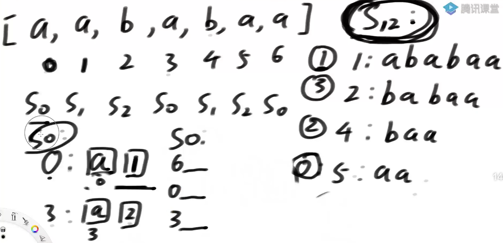

# 前置知识

## 字典序

两个字符串比较大小：

1. 字符串长度一样时，直接比较相对应的每个字符值的大小（ASCII码)
2. 字符串长度不一样时，短的字符串用0（ASCII码的最小值）来补齐，再进行比较。

## 后缀数组

一个字符串的所有后缀，按字典序排序后，形成的后缀索引数组。

示例：

- 字符串：aabaa（索引：0,1,2,3,4)， 
- 后缀字符串有：a(以4开始)，aa(以3开始)，baa(以2开始)，abaa(以1开始)，aabaa(以0开始)
- 按字典排序后：【4，3，0，1，2】，就是后缀数组。

特性：不会有相同排名，因为后缀的长度不同。

生成后缀数组的流程：字符串长度为N，用暴力方法

1. 生成后缀字符串：O(N^2)，要先遍历整个字符串的位置，然后每个位置往后遍历直到结束。
2. 放入N长度的数组中，空间复杂度O(N)
3. 字符串数组排序：**O(N*logN\*N)**，排序的时间乘以字符串比较的时间（后缀串的平均长度是N/2，所以两个后缀串比较代价是O(N)）

**一个字符串可以看成是一个字符数组，所以任意数组都可以求出后缀数组**

## 多维样本排序

N个样本，每个样本有3维（3组数据），进行排序。

样本排序规则：若第一维数据相同，则用第二维比较，最后用第三维

N的值比较大，且样本内数据较小。（比如N=200w，样本数据在10以内。）

**分析：**

因为样本维度比较少，且样本数据不大，可以使用基数排序（不基于比较的排序）；O(N)

先生成10个桶，ABCDE按顺序放入：

以每个样本的第三维的值，依次放入对应的桶中，然后按桶的顺序依次倒出：BDACE；（按第三维排序）

以每个样本的第二维的值，依次放入对应的桶中，然后按桶的顺序依次倒出：BDCEA；（按第二，三维排序）

以每个样本的第一维的值，依次放入对应的桶中，然后按桶的顺序依次倒出：ADCBE；（按第一，二，三维排序）

# DC3算法

整个算法的核心思想就是"**收敛**", 运用递归的思想不断的收敛，直到得到结果为止。

## 生成后缀数组

使用DC3算法，生成后缀数组的时间复杂度是**O(N)**，但常数时间很大。

整个算法一共就分4步，原始数据在nums中，长度为N：

1. S0=[aababaa，abaa，a]，S12=[ababaa，babaa，baa，aa]

2. S12排序：S12以前3位排序得：sortPartArr=[3，0，2，1]（S12中第三个字符串最小），

   Rank=[1，3，2，0]（S12中每个字符串对应得排名，[3]位置元素aa，排在第0位，最小）

   若有重复排名，将n%3\==1的放左边，n%3==2的放右边之后  s12=[1，2，3，0]，递归调用DC3算法。

3. S0排序：以0位置开始的后缀为：{a，1}，3=>{a，2}，6=>{a，0}（后面在S12中没有对应，则取最小值0），

   基数排序后是{6，0，3}

4. S0和S12的合并：S0:{6，0，3}，S12：{5，1，4，2}

   S0和S2的比较：最多比三维

   ​	6和5开头的后缀进行比较，第一个字符相同，6位置后没有字符，所以6的字典序小，

   ​	0和5开头的后缀进行比较，第一个和第二个字符都相同，之后的字符使用S12集合中对应的排名进行比较。

   S0和S1的比较：最多比两维

   ​	0和1开头的后缀进行比较，第一个字符相同，之后的字符使用S12集合中对应的排名进行比较。

1. 数组的索引下标%3，按取余结果，将后缀字符串分成S0，S12两类。

   将(i % 3 == 0)的值取出放入数组S0中；将(i % 3 != 0， i >= 0 and i < N)的值取出来放到一个数组S12中

   按下标分类：S0=[0,3,6,9]，S12= [1,2,4,5,7,8,10]

2. 对S12进行排序：

   先用S12数组中后缀元素的前3位字符，就是三维数据的基数排序，

   S12表示为：['1,2,3','2,3,4','4,5,6','5,6,7','7,8,9','8,9,10','10,x,x'] （不存在的以x代替，nums[x]一定会最小值）

   **排序之后原始排序**如下，放入数组Rank中，长度$\frac23N$，Rank=

   ['1,2,3'=【3】,'2,3,4'=【5】,'4,5,6'=【3】,'5,6,7'=【5】,'7,8,9'=【2】,'8,9,10'=【4】,'10,x,x'=【1】]，

   ​	若任意两个三元组都不相等，说明仅凭前三个字母就可以对后缀确定顺序，则直接执行**步骤3**。

   ​	若有并列结果（重复排名），如后缀的前3位字符有重复，则继续比较后面的字符。

   **接着递归执行**，先得到SA'如下

   ['1,2,3,4,5,6,7,8,9','4,5,6,7,8,9,10,x,x','7,8,9,10,x,x,2,3,4','10,x,x,2,3,4,5,6,7','2,3,4,5,6,7,8,9,10', '5,6,7,8,9,10,x,x,x', '8,9,10,x,x,x,x,x,x']

   1. S1类占左部分，S2类占右部分：

   2. 为了利用上次递归的结果，SA'会被转化成 **s12 = [3，3，2，1，5，5，4]**

   3. 再**递归执行DC3，求出s12的后缀数组，能让S12集合中的重复排名变精确**。

   **要点：**

   1. 之前3维数据的基数排序的结果不变，s12的后缀数组的目标只改变重复排名的排序。

   2. S1和S2分左右两部分的原因：每个重复元素和接下来需要比较的字符位置挨着（因为%3）。

      **其实是为再次递归DC3做准备**。第二次递归DC3，实质上是**取所有后缀的前9个前缀**来进行排序，如果还有相同的，则再次递归采用**前27个前缀**进行排序，直到排出顺序为止

   3. 重复元素可以都在左边S1中，或都在右边S2，或者跨S1，S2。

   4. S1和S2之间插入一个分隔符：是在S1最后一个数后补一个很小的ACSII码0（比nums数组中所有值都要小），作为分界线。

      **而之所以要插分隔符，其实是为了防止类似序列中'7,8,9,10,x,x,2,3,4'中的'2，3，4'参与排序**，毕间7，8，9，10已经是从位置7开始后缀子串的全部内容了，如果2，3，4参与比较就会产生错误。因为buf[x] < buf[i] (i >= 0 && i < n),因此当碰到x, 就会终止排序。

   **时间复杂度：**$T(N)=T(\frac{2}{3}N)+O(N)=O(N)$，s12的长度是$\frac23N$，元素的最大值是N，在这个数组上递归求它的后缀数组，

3. S0集合的排序：由排好序的S12进行推导，

   S0的数据，可以分解成一个二维数据，第一维是后缀串第一个字符，第二维是S12集合中对应的字符串在S12集合中的排名。用基数排序，**O(N)**。

4. S0和S12集合的合并：使用归并排序的合并方式，双指针**O(N)**，得到**后缀数组的有序列表**。

   **为什么要选3这个数字：**

   进行有序合并时，i%3\==1时，会将3元组扩展成4元组，i%3==2时，将3元组扩展成5元组，之后再比较。

   当i%3==1时，如'0,1,2,3', '1,2,3,4' 由于'1,2,3'和'2,3,4'的值我们已经知道了，所以这两个四元组的比较可以简化为'0,s12[1]'与'1,s12[2]'之间的比较，由于s12[1]中的值各不相同，因此'0,s12[1]' 与 '1,s12[2]'必不相同。

   当i%3=\=2时, 如’0,1,2,3', '2,3,4,5'，可以发现s12[3]不存在因为3%3==0, 所以需要将4元素扩展成为5元组，‘0,1,2,3,4','2,3,4,5,6'，这样就可以化简为'0,1,s12[2]', '2,3,s12[4]'来进行比较。

   其实到这里，**为什么不用2就很明显了，因为在最后一步合并时2不满足重用上一步结果的要求**。

## 地位

笔试中，一道题有三个解：暴力解（不过），优化解（通过70%），答案解（通过100%，设置合适数据量）

如果有DC3解，通过率碾压之前的答案解，比过。但因为太难，笔试中，只会用到答案解。

面试中，解释清楚做什么用。**DC3是解决后缀数组相关问题的利器**，时间复杂度O(N)

比赛中用的**倍增算法**，是O(N*logN)，但常数项低。

## 题目

### 按字典序排在最后的子串

https://leetcode.com/problems/last-substring-in-lexicographical-order/

**分析：**

先处理字符串，转换为字符值的数组。

计算数组中的最大和最小值，然后让数组的每个元素减去最小值，再加1，让元素值>=1。

DC算法中获取字典序最大的子串的开始位置，在原字符串上进行截取。

### 插入字符串形成的字典序最大结果

给定两个字符串str1和str2，想把str2整体插入到str1中的某个位置，str1的长度N远远大于str2的长度M

形成最大的字典序，返回字典序最大的结果

 **分析：**

暴力解：

1. 将str2插入的str1的每个位置，得到多个N+M的结果，
2. 然后每一个和上一个进行比较，记录max结果
3. 所以时间复杂度是O(N*(N+M))，而当N远大于M时，简化为O(N^2)

DC3解：

1. 时间复杂度是：O(N+M)+O(M^2)

2. 若str1中，任意位置i开头的后缀的字典序大于str2的字典序，则str2不插入。若都大于，则结果是str1+str2。

3. 若str1中，任意位置i开头的后缀的字典序小于str2的字典序，则可能在此位置【i和(i-1)之间】插入str2.

4. 找到str2插入位置的最左边界O(N)和最右边界O(M)，在左右边界之间找到最终的结果。

   1. 如str1: [i]9993...... str2:9994。则i位置为最左边界，i+3为最右边界（str1小于str2的字符位置）

5. 只需要比较在左右边界之间的字符串，在每个位置上插入str2后，字典序谁最大。

   1. 插入str2后的字符串长度是2M，生成M个字符串，要比对M次，所以时间复杂度是O(M^2)

6. 拼接str1和str2，中间用最小的ACSII码隔开。

   **分隔符之后的字符串不会干扰之前字符串的字典序大小**。  

   字符串先转换为整数数组，都减去【最小值-2】，让最小值为2，才可以让1来做分隔符。

   如：str1[3,2,1]，str2[1,2] => [5,3,4,**1**,3,4]

7. 然后调用DC3算法（要求数组的值都>=1)，得到后缀数组的排序。

### 拼接最大数

给两个长度分别为M和N的整型数组nums1和nums2，其中每个值都不大于9，再给定一个正数K。 你可以在nums1和nums2中挑选数字，要求一共挑选K个，并且要从左到右挑。

返回所有可能的结果中，代表最大数字的结果。

**分析：**

流程示例：当K=3时，分析所有可能性（**分治的思想**）

1. nums1中取3个数，组成最大数字；nums2中取0个；进行合并，返回最大的值。

2. nums1中取2个数，组成最大数字；nums2中取1个；进行合并，返回最大的值。

3. nums1中取1个数，组成最大数字；nums2中取2个；进行合并，返回最大的值。

4. nums1中取0个数，组成最大数字；nums2中取3个；进行合并，返回最大的值。

5. 最后，返回所有可能性中最大的数字。

6. **要根据nums1长度N和nums2长度M,以及K，定制划分方案**，

   如nums1长度比K小时，nums2没有为0的情况。

   划分的范围：nums1上的取数范围【max(0，k-M)，min(N，K)]

每个可能性中主要分两步： 

1. 在数组中取K个数，要保证组成的数字最大。

   1. 多次查询，使用预处理结构：在nums中取K个数的最开始的位置。

   2. 使用动态规划表：dp[i]\[j]表示从nums[i.....]里，挑选j个数字，返回开始的位置。

   3. 如nums=[6,7,4,9,2]，dp[2]\[1]=3（9最大）。

   4. 不挑数字j=0，结果无效；数组剩余个数不足j个nums.length-i<j，结果也无效。

   5. 初始值是对角线 数组剩余个数=j。然后从下往上，一列一列的填。

   6. 依赖关系：当前单元格依赖下方的单元格。

      当arr[i]==arr[dp[i+1]\[j]] 时，取i位置，会让后面的结果变更好

      如：dp[8]\[3]=13{9,9,6}，arr[7]=9，则{9,9,9}是最大在一个的数字，选7为结果值。（不连续）

   7. 数组中挑M个数，需要获取M次数据，就是O(M)

      如M=2时，先从0位置开始往后，挑2个数，若dp[0]\[2]=1，先挑1位置的数；

      ​				   再继续从2位置开始往后，挑1个数。

2. **分治后merge合并**时，要保证组成的数字最大。

   1. 两数组合并，从左往右对应，遇到不同的情况，若左大于右，则要左最开始的位置，左部指针右移。

      两数组每个位置都比较的原因是：选择最大的后缀。时间复杂度是O((N+M)^2)。

      示例：【5，9】和【5，6】，合并最好结果是【5956】，选择必须从左往右不回退。

   2. 其实就是判断字典序大小的问题，所以可以用DC3算法解。

      解法和上一题类似，两数组用分隔符拼接在一起，用DC3算法求有序的后缀数组。

      就可以得到两个数组的字典序大小 。

### 两个字符串的最长公共子串

最长公共子串问题是面试常见题目之一，如何快速找到，同时存在于文件a和文件b中的最长子串

假设str1长度N，str2长度M，需要用到动态规划得到O(N*M)的解法，所以面试场上是答案解。

但其实这个问题的最优解是O(N+M)，需要用到后缀数组+height数组

**分析：**

答案解：

1. 动态规划表dp[i]\[j]表示，str1以结尾，str2以j结尾，最长公共子串长度是什么，
2. 状态转移：若str1[i]==str2[j]，则dp[i]\[j] = dp[i-1]\[j-1]+1；否则dp[i]\[j] = 0；
3. 最大值就是结果答案。O(N*M)

#### DC3算法中的高度数组

1. 时间复杂度：O(N+M)

2. 用sa数组去生成height数组：

   1. h[i]：是原始串中以i开头的后缀，它的排名是X（Rank），找到排名为X-1的以j开头的后缀串，值就是它俩的最长公共前缀的长度。

      求h数组中，查公共子串的时间复杂度是O(N^2)，优化为O(N)的方法如下：

      降阶的关键是：h[i-1]能指导h[i]的答案。h[i-1] -1 <= h[i] 不回退。

   2. height[i]：高度数组，height[0]表示**排名为0**的后缀，对应原始位置i（SA），和自己排名最接近（-1）的后缀串，最长公共前缀是什么。

      sa[i]表示**第i名**的开头是什么。所以就是求sa[i] 和 sa[i-1]的最长公共前缀长度。

h数组：【0，1，1，3，2，1，0】

0位置开头的是 aabaabb，排名为0，-1为负，所以h[0]=0

1位置开头的是abaabb，排名为2，则排名为1的是aabb，以3位置开头，前缀只有1位相同，所以h[1]=1

height数组：【】

#### 高度数组的使用

两个字符串的最长公共子串：

1. 先拼接两个字符串，用最小ACSII做分隔符，
2. 然后使用DC3算法求出高度数组height。O(N)
3. 考察高度数组，若查找排名为i的开头位置SA[i]=X，查找排名为i-1的开头位置SA[i-1]=Y，若X和Y分别落于分隔符的两侧，表示来自不同的后缀串，此时高度数组的值是达标的。其最大值就是最长公共子串。 

## 扩展

离散化：当数组中的值两两的差值很大，最大值很大，基数排序需要的桶就多，常数时间很大。

所以可以将它替换成一个很窄的域，再调用DC3，能减少常数时间。

如【100w，5，1000，10亿】，可以替换为值的大小序号：【3，1，2，4】