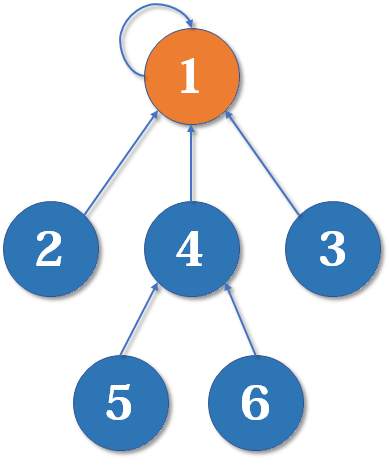

# 并查集

## 定义

它是最简洁而优雅的数据结构之一，主要用于解决一些**元素分组**的问题。

它管理一系列**不相交的集合**，并支持两种操作：

- **合并**（Union）：把两个不相交的集合合并为一个集合。
- **查询**（Find）：查询两个元素是否在同一个集合中。

示例：

1. 有若干个样本a、b、c、d…类型假设是V  
2. 在并查集中一开始认为每个样本都在单独的集合里  
3. 用户可以在任何时候调用如下两个方法  ：
   1.  boolean isSameSet(V x, V y) : 查询样本x和样本y是否属于一个集合 
   2. void union(V x, V y) : 把x和y各自所在集合的所有样本合并成一个集合  

## 实现方法

设计一个数据结构， 让isSameSet和union方法的**时间复杂度是O(1)**，

1. 每个节点都有一条往上指的指针  
2. 节点a往上找到的头节点，叫做a所在集合的代表节点  
3. 查询x和y是否属于同一个集合，就是看看找到的代表节点是不是一个  
4. 把x和y各自所在集合的所有点合并成一个集合，只需要小集合的代表点挂在大集合的代表点的下方即可  
4. 如果合并，查询方法调用很频繁，那么单次调用的代价为O(1)，两个方法都如此

**路径压缩:**

最简单的并查集效率是比较低的，因为合并集合可能会形成一条长长的**链**，随着链越来越长，我们想要从底部找到根节点会变得越来越难。

解决方法：路径压缩，个元素到根节点的路径尽可能短

1. 节点往上找代表点的过程，把沿途的链变成扁平的，减小链长度

2. 小集合挂在大集合的下面， 这样链长度增长慢。

**算法导论**中：在样本量是N，findHead方法调用频繁，超过O(N)的情况下,  使用并查集，单次下来，每次的时间复杂度是O(1)。 

## **重要思想**

**用集合中的一个元素代表集合**。

把集合比喻成**帮派**，而代表元素则是**帮主**。并查集是这样运作的：

1. *对于只有一个元素的集合，代表元素自然是唯一的那个元素*

2. *合并1号和3号所在的集合，1号为代表元素*

3. 最后是一个**树**状的结构，要寻找集合的代表元素，只需要一层一层往上访问**父节点**（图中箭头所指的圆），直达树的**根节点**（图中橙色的圆）即可。根节点的父节点是它自己

   

## 应用

- 连通性的问题

- 解决两大块区域的合并问题

- 常用在图等领域中

两种实现方式：

1. 数组。效率高。
2. Hash表。速度慢，因为HashMap的常数时间是大常数。

## 题目

- 朋友圈: 一个矩阵维护朋友关系，（1，0）认识则值为1，（0，0）不认识则值为0，求有多少个朋友圈。矩阵的对角线两侧对称。https://leetcode-cn.com/problems/friend-circles/
  
  分析：用并查集，遍历任意两个人的关系，认识则union, 最后并查集的长度就是朋友圈个数。
  
- 岛屿数量|岛问题

  给定一个二维数组matrix，里面的值不是1就是0，

  上、下、左、右相邻的1认为是一片岛，

  返回matrix中岛的数量

  三种方法：递归，并查集（表和数组）

- 305.[[岛屿数量 II]] [H]  
  https://leetcode-cn.com/problems/number-of-islands-ii/

- 岛问题[[并行算法]]

  如果matrix极大，设计一种可行的并行计算方案