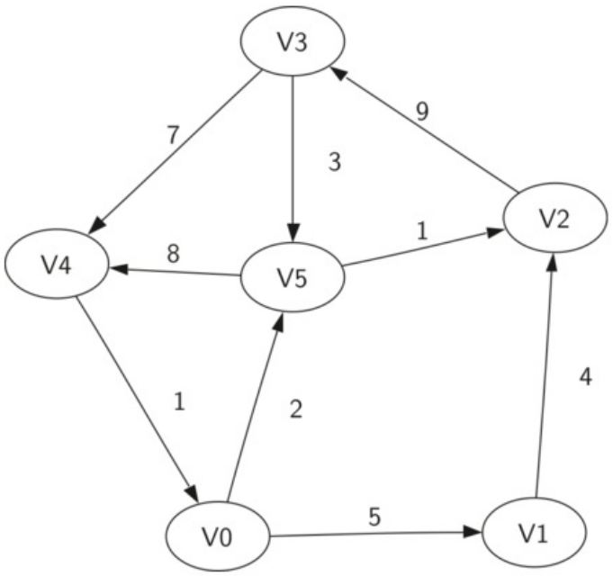
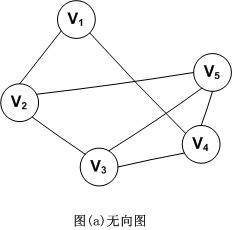
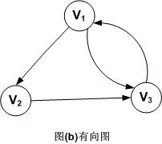
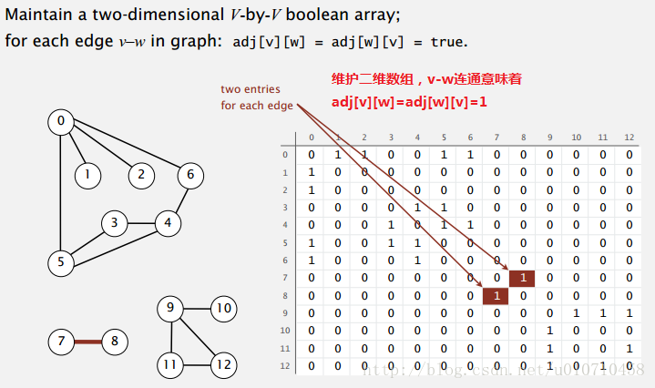
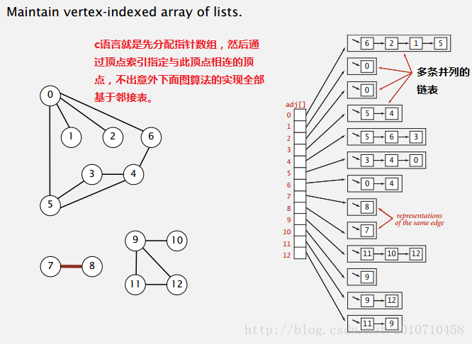

# 定义

图是一种复杂的非线性结构。维护一对多的关系

- 在线性结构中，数据元素之间满足唯一的线性关系，每个数据元素（除第一个和最后一个外）只有一个直接前趋和一个直接后继。
- 在树形结构中，数据元素之间有着明显的层次关系，并且每个数据元素只与上一层中的一个元素（父节点）和下一层的多个元素（孩子节点）相关。
- 在图形结构中，节点之间的关系是任意的，图中任意两个数据元素之间都有可能相关。

图G由由两个集合V（顶点Vertex）和E（边Edge）组成，定义为G=（V，E），每个边是一个元组 (v，w) ，其中 w,v ∈ V 。

- **顶点**（也称为“节点”）是图的基本部分。它可以有一个名称，我们将称为“键”。一个顶点也可能有额外的信息。我们将这个附加信息称为“有效载荷”。
- **边**（也称为“弧”）是图的另一个基本部分。边连接两个顶点，以表明它们之间存在关系。边可以是单向的或双向的。如果图中的边都是单向的，我们称该图是有向图 。
- **权重** 边可以被加权以示出从一个顶点到另一个顶点的成本。例如，在将一个城市连接到另一个城市的道路的图表中，边上的权重可以表示两个城市之间的距离。

加权有向图的示例：边元组中第三位来表示权重

将该图表示为六个顶点的集合：V = { V0，V1，V2，V3，V4，V5 }，和 9 条边的集合 E = {(v0，v1，5)，(v1，v2，4)，(v2，v3，9)，(v3，v4，7)，(v4，v0，1)，(v0，v5，2)，(v5，v4，8)，(v3，v5，3)，(v5，v2，1)}

- **路径** ：图中的路径是由边连接的顶点序列。形式上，我们将定义一个路径为 w1，w2，...，wn ，使得 (wi，wi + 1) ∈ E , 当 1≤i≤ n-1 。

  **未加权路径长度是路径中的边的数目，具体是 n-1**。**加权路径长度是路径中所有边的权重的总和**。

  例如在上图中，从 V3 到 V1 的路径是顶点序列 (V3，V4，V0，V1) 。边是 {（v3，v4,7），（v4，v0,1），（v0，v1,5）} } 。

- **循环（回路）** ：有向图中的循环是在同一顶点开始和结束的路径。例如，在 上图中，路径 （V5，V2，V3，V5） 是一个循环。没有循环的图形称为非循环图形。没有循环的有向图称为有向无环图或DAG

# 概念和术语

## 无向图和有向图

**无向图**

对于一个图，若每条边都是没有方向的，则称该图为无向图。图示如下：

无向图的顶点集和边集分别表示为：

V(G)={V1，V2，V3，V4，V5}

E(G)={(V1，V2)，(V1，V4)，(V2，V3)，(V2，V5)，(V3，V4)，(V3，V5)，(V4，V5)}

**有向图**

对于一个图G，若每条边都是有方向的，则称该图为有向图。图示如下。

有向图的顶点集和边集分别表示为：

V(G)={V1，V2，V3}

E(G)={<V1，V2>，<V2，V3>，<V3，V1>，<V1，V3>}

**有向图和无向图的区别：**

1. 无向图中，(Vi，Vj)和(Vj，Vi)表示的是同一条边。
2. 有向图中，<Vi，Vj>和<Vj，Vi>是两条不同的有向边。
3. 边的表示：**无向图是用小括号，有向图是用尖括号，有向边又称为弧**。
4. 将具有n(n-1)/2条边的无向图称为**无向完全图**。同理，将具有n(n-1)条边的有向图称为**有向完全图**。
5. 虽然存在有向图和无向图的概念，但实际上都可以用有向图来表达

## 顶点的度

对于无向图，顶点的度表示以该顶点作为一个端点的边的数目。比如，图(a)无向图中顶点V3的度D(V3)=3

对于有向图，顶点的度分为**入度和出度**。入度表示以该顶点为终点的入边数目，出度是以该顶点为起点的出边数目，该顶点的度等于其入度和出度之和。比如，顶点V1的入度ID(V1)=1，出度OD(V1)=2，所以D(V1)=ID(V1)+OD(V1)=1+2=3

记住，不管是无向图还是有向图，顶点数n，边数e和顶点的度数有如下关系：
$$
e=\frac{1}{2}\displaystyle\sum\limits_{i=1}^n D(Vi)
$$
有向图(b)，可用公式可以得到图G的边数e=(D(V1)+D(V2)+D(V3))/2=(3+2+3)/2=4

# 表示图

## 邻接矩阵法

1. 使用二维矩阵。（没有直接边，设为空或正无穷）。
2. 在该矩阵实现中，每个行和列表示图中的顶点。
3. 存储在行 v 和列 w 的交叉点处的单元中的值表示是否存在从顶点 v 到顶点 w 的边。
4. 当两个顶点通过边连接时，我们说它们是相邻的。 

下图展示了 上图的邻接矩阵。单元格中的值也可以表示从顶点 v 到顶点 w 的边的权重。

优点是简单，对于小图，很容易看到哪些节点连接到其他节点。但矩阵不是一种非常有效的方式来存储稀疏数据。

## 邻接表法

1. 将每个顶点的所有相连顶点都保存在该顶点对应的元素所指向的一张链表中。
2. 这种结构可以满足典型应用，所以后面实现的各种图数据结构，都是基于邻接表。

优点：

1. 在于总是使用与V+E成正比空间，类似与HashMap<T,List<T>>
2. 可以紧凑地表示稀疏图，
3. 很容易找到直接连接到特定顶点的所有链接。

## 其它方式

其它表达方式的数据结构如下：

1. 用二维数组表示：[ [3，0，7]，[5，1，2]，[6，2，7] ]， 

   每个数组代表一个边，如第一个元素，权重是3，边是从0到7.

2. 用一个数组表示：[3，1，1，1]，用索引表示每一个节点，用值来表示与它相连的节点，但一个节点只能向外出一条指针。

## 图的难点

图的算法都不算难，只不过coding的代价比较高，因为图的表示形式多样化。

1）先用自己最熟练的方式，实现图结构的表达

2）在自己熟悉的结构上，实现所有常用的图算法作为模板

3）使用适配器，把面试题提供的图结构转化为自己熟悉的图结构，再调用模板或改写即可

### 抽象数据类型

- Vertex：值，入度（边指向它），出度（指向其它节点），邻居节点（从我出发找到的邻居节点），边（从我出发找到的边）
- Edge：权重，起点，终点
- Graph 创建一个新的空图。点集，边集。（用户会用整型来指定点，用点来封装整型数据）

### 转换适配器

从二维数组转换，每个数组代表一个边。

# 查询方式

## 宽度优先遍历

1. 利用队列实现 
2. 从源节点开始依次按照宽度进队列，然后弹出  
3. 每弹出一个点，把该节点所有没有进过队列的邻接点放入队列  
4. 直到队列变空  

## 深度优先遍历

1. 利用栈实现 
2. 从源节点开始把节点按照深度放入栈，然后弹出 
3. 每弹出一个点，把该节点下一个没有进过栈的邻接点放入栈 
4. 直到栈变空   

# 算法

### 图的拓扑排序算法

1）在图中找到所有入度为0的点输出  
2）把所有入度为0的点在图中删掉，继续找入度为0的点输出，周而复始  
3）图的所有点都被删除后，依次输出的顺序就是拓扑排序  

要求：有向图且其中没有环  
应用：事件安排、编译顺序  

- 拓扑排序 https://www.lintcode.com/problem/topological-sorting/

### 最小生成树算法之Kruskal

1）总是从权值最小的边开始考虑，依次考察权值依次变大的边  
2）当前的边要么进入最小生成树的集合，要么丢弃  
3）如果当前的边进入最小生成树的集合中不会形成环，就要当前边  
4）如果当前的边进入最小生成树的集合中会形成环，就不要当前边  
5）考察完所有边之后，最小生成树的集合也得到了    

### 最小生成树算法之Prim

1）可以从任意节点出发来寻找最小生成树  
2）某个点加入到被选取的点中后，解锁这个点出发的所有新的边  
3）在所有解锁的边中选最小的边，然后看看这个边会不会形成环  
4）如果会，不要当前边，继续考察剩下解锁的边中最小的边，重复3）  
5）如果不会，要当前边，将该边的指向点加入到被选取的点中，重复2）  
6）当所有点都被选取，最小生成树就得到了  

### Dijkstra算法

1）Dijkstra算法必须指定一个源点   
2）生成一个源点到各个点的最小距离表，一开始只有一条记录，即原点到自己的最小距离为0，源点到其他所有点的最小距离都为正无穷大  
3）从距离表中拿出没拿过记录里的最小记录，通过这个点发出的边，更新源点到各个点的最小距离表，不断重复这一步  
4）源点到所有的点记录如果都被拿过一遍，过程停止，最小距离表得到了  

利用加强堆

某个节点最短距离改变时做动态调整

