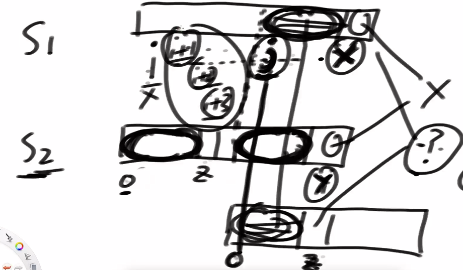
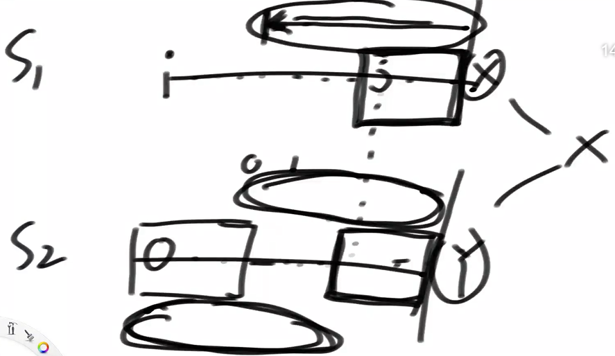

# 定义

**是一个字符串的查找(匹配)算法。**

重要作用：产生一种启发性的思想，影响了很多日常使用的算法。

**示例**：

假设字符串str1长度为N，字符串str2长度为M，M <= N

想确定str1中是否有某个子串(**连续的**)是等于str2的。

**暴力解**

特殊情况：str1:aaaaaaaaaaab, str2:aaab

遍历str1的每个位置，与之后位置和str2比较，每个失败的字符都要验证4次。

最差情况下，时间复杂度**O(N*M)**

暴力的原因：每一个位置验证的结果，都是独立的，做出的所有尝试对之后的位置没有任何指导。

**KPM**

时间复杂度**O(N)**，复杂度变成线性，而且与str2的长度M无关。

先求str2的next数组，相当于知道str2中每个位置i之前字符串中的前缀和后缀的相等长度，且不包含整体

next数组可以让str1在匹配str2时加速。

# 核心

## next数组 

如何理解next数组:

**前缀与后缀串的最长匹配长度**

1. 示例1：abc abc k   设置位置6的信息 ，k不是字符串的一部分，6位置的字符是完全忽略的。

   当前（后）缀长度为1时：【a，c】 不匹配

   当前（后）缀长度为2时：【ab，bc】 不匹配

   当前（后）缀长度为3时：【abc，abc】 匹配

   当前（后）缀长度为4时：【abca，cabc】 不匹配

   当前（后）缀长度为5时：【abcab，bcabc】 不匹配

   在6位置之前的字符串，前缀和后缀长度不能到达整体的情况下，在什么长度下两个时相等且最长的，是3.  所以位置6底下的信息，就是3。

   3表示一种长度，是在6位置之前的字符串中，限定前缀串和后缀串都不能取到整体的情况下，前缀和后缀串的最长相等长度。

2. 示例2：aaaaaK  求K位置的信息。和K无关，和它之前的字符串有关。

   当前（后）缀长度为1时：【a，a】 匹配

   当前（后）缀长度为2时：【aa，aa】 匹配

   当前（后）缀长度为3时：【aaa，aaa】 匹配

   当前（后）缀长度为4时：【aaaa，aaaa】 匹配

   不会尝试长度为5的情况，因为限定：前缀串和后缀串都不能取到整体

   所以K的位置底下的信息是4.

3. 示例3：aabaabsaabt 

   0位置的信息，因为之前字符串为空，**人为规定为 -1**

   1位置的信息，因为违反前缀串不能取整体的限定，**人为规定为0**。（这么规定是为了在实际应用**信息**时，让KMP算法提高效率）

   2位置的信息，前缀后缀长度为1时相等，且不能选全部，**结果为1**

   3位置的信息，前缀长度为1或2，都不存在相等情况，**结果为0.**

   4位置的信息，结果时1，5位置的是2，6位置的是3.

字符串中每个位置的信息组成的数组，是**next数组**。

## 优化的实质

如何利用next数组加速匹配过程，优化时的两个实质！

当S1与S2在匹配的过程中，若S1[i......X] 和 S2[0......Y]不匹配。

S2根据next数组，得到Y之前的前缀和后缀相等长度K，计算出相等的位置。

后缀串在S1中找到对应位置：**j**

1. 下次尝试S1是从  **j ** 位置开头，看能不能匹配S2。

   j之后的字符串[j.....j+K] \(X-1)，和S2的后缀串一样，可以将S2右移到S1的 **j** 位置，

   S1的 [j.....X-1] 与S2的 [0.....K] 相等，**可以加速**，将S2中K后位置设为Z。

   下一次匹配将从 **S1的X**，**S2的Z** 开始。

2. S1[i......j] 位置之间的任意位置开头，都无法匹配S2

   反正法：i和j之间的位置K，从K位置出发可以匹配所有的S2，

   则K到X之间的字符串与S2的前缀串相等。

   但K到X，也是S2中Y之前等量的后缀。而且**S1中X之前和S2中Y之前的字符串相同**

   相当于Y之前存在一个更长的前后缀相等的长度。

   这就与next数组中的位置信息矛盾。所以不会发生

   

**S2右推的实现：**

如果S1的X位置与S2的Y位置不匹配，则S1的X位置，与S2中Y位置在next数组中的信息位置的值进行比对，

通过next数组的值，在S2中往左跳。实现S2往右推。

**示例**

S1：aabaat.......

S2：aabaab

在最后的位置无法匹配，而S2的b位置的信息是2，则下一次匹配从S1 [aat.....]开始 匹配S2.

比较aat和aab的第三个位置。

当比较的位置的信息为0，则继续右移S2，S1的t位置和S2的第一个位置a比较。

当比较的位置的信息为-1，则尝试S1字符串的下一个位置为开始。

## 证明while的复杂度

1. 估计出每个分支命中的次数，就是while的复杂度
2. X和Y的最大值是N，X-Y的最大值是N(因为X最大是N，Y最小是0)
3. 第一个分支：x++,y++,    X变大，Y变大，X-Y不变
4. 第二个分支：x++,            X变大，Y不变，X-Y变大
5. 第三个分支：y=next[y],  X不变，Y变小，X-Y变大

由上可知，X和X-Y这两个量，要么不变，要么变大，没有减少的时候

而X和X-Y的最大值都是N，所以三个分支（互斥）执行次数<=2N

用三个分支总共发生次数的极限，来估计While发生的次数，时间复杂度O(N); 

**总结**

求解时间复杂度的标准，如果只看X和Y的变化，是无法评估的。

想要评估整体的变化幅度，数学上要么做差，要么做除。

## 快速求next数组

（先将流程-再问为什么-最后证复杂度）

1. 数学归纳法，从左往右求，index之前的next信息都求过，是否可以用它来加速得到index位置的信息。

2. index位置的信息**K**和index位置上的字符无关。    

3. 先看index-1位置的信息，如果是7，则说明index-1之前的前缀和后缀串长度为7。

   只需证明S1中7位置的字符是否与index-1的字符是否相等，如果相等，则index位置的信息是8.   K一定<=8。

   index位置的信息不可能超过8，使用反证法，如果index位置的信息为9，则证明0-8和11-19位置的字符串相等，那么index-1位置的信息，一定是8，和之前的7冲突。

4. 如果不相等，则取7位置上的信息3，如果位置3与index-1位置的字符相等，则K<=3+1.

   还是利用反证法，如果取4<K<=8之间的数，则得出的结论，与7位置上的信息3冲突。

5. 涉及到坐标换算

时间复杂度O(M)：两个变量 i 和 i-cn 的变化，都一直变大，直到最大值M。

# 题目

##  判断二叉树是否包含另一颗树

给定两棵二叉树的头节点head1和head2

想知道head1中是否有某个子树的结构和head2完全一样

**分析**

子树从节点出发，所有位置都一样。

暴力解，分两步：

1. 递归遍历head1二叉树的当前节点，左右节点。
2. 递归判断选中节点与head2的结构相同。（当前节点和左右节点）

KMP算法，分两步：

1. 将二叉树通过先序遍历，转化为字符串数组【包含null】，O(N)
2. 使用KPM算法，查询字符串匹配的起始位置。O(N)

## 判断是否是旋转字符串

判断str1和str2是否是旋转字符串

示例：str1="123456" ，把从0到N的左部分转到右边，生成的字符串是原始串的旋转串。

左侧长度为0的旋转串：str2="123456" 

左侧长度为1的旋转串：str2="234561"

左侧长度为2的旋转串：str2="345612"

**分析**

观察后，得到推断：str1+str1如果包含str2，则str1和str2是旋转字符串。

示例：str1：123456  ，str2 和str1长度一样为6，str1+str1= "123456123456 " , 在这个字符串中，任意6个连续的子串，都是旋转字符串。自己拼接自己，穷举所有旋转串。

转换为可以用KMP算法判断是否包含的问题。