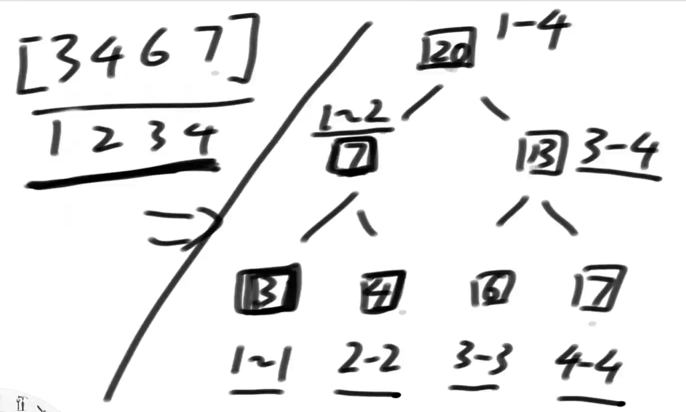
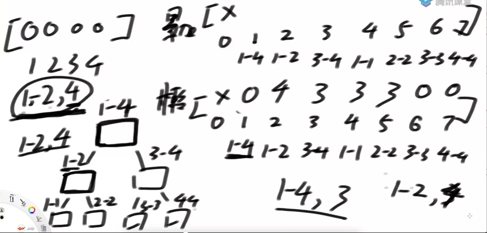

# 定义

一种支持范围整体修改和范围整体查询的数据结构

解决的问题范畴：

- 大范围信息可以只有左、右两侧信息简单的加工出，而不必遍历左右两个子范围的具体状况。
- 比如：最大值，最小值，累加和

# 线段树结构实现

给定一个数组arr，用户希望实现三个方法：

1. void add(int L，int R，int V)  让数组arr[L…R]上每个数都加上V
2. void update(int L，int R，int V)  让数组arr[L…R]上每个数都变成V
3. int sum(int L，int R)，返回arr[L…R]这个范围整体的累加和

要求：这三个方法，时间复杂度都是O(logN)

**分析**

暴力方法：O(N)

递归方法：不用担心实现线段树，让系统栈爆掉，因为深度不会超过64。(N<2^64)

**默认线段树的数组从1开始**。

把范围上的结果改成一个树状结构：

1. 将树的每个节点表示范围内的累计和。
2. 整个范围用最顶(大)的格子存储，然后分成两部分给左右两侧。
3. 一直下分，成一个树状结构。

用**累加和数组**表示树结构：（支持范围划分的物理结构）

1. 申请一个足够长的数组

2. 0位置忽略，默认从1位置开始。

3. 按层遍历树，**1位置**放[1,4]的累加和，20；**2位置**放[1,2]，7；**3位置**放[3,4]，13；**4位置**放[1,1]，3；**5位置**放[2,2]，4；**6位置**放[3,3]，6；**7位置**放[4,4]，7

4. 若7位置的范围还能分，则8，9，10，11，12，13位置，设为空，保存叶子节点的左右空节点，14，15的位置来保存7位置的左右子范围。

   奇数范围[1-3]->[1,1],[2,3] -> [2,2]\[3,3]

5. 父子节点位置公式：

   任何节点**i**的父节点是：i/2

   任何节点**i**的左子节点：i*2

   任何节点**i**的右子节点：i*2+1

6. 如果原数组个数为N，则新数组申请4*N的长度，就足够使用。

   最省空间的原数组长度是$N=2^m$，则新数组需要申请2*N的长度

   当原数组长度为$N=2^m+1$,则新数组需要申请4*N的长度

   等比数列求和公式：$S_n=\frac{a_1(1-q^n) }{1-q}=2^n-1$

**懒更新数组**信息（在上面的树结构数组基础上，新增辅助数组）

1. 示例：在1-1000范围上，求3-875的数加5.

2. 1-1000的范围不停往下二分，如果下面的范围真好包含在3-875内，就不再向下找，直接进行计算，这个范围上的数+5。只要不全包，就下发。

3. 复杂度估计：当一个任务到来，可以认为是从树的左边界下来一次，和右边界下来一次。

4. 任务1：1到4范围上都加3，任务2：1到2范围上都加4

   

5. **新任务到来，先找根节点的懒信息，如果不为0**，则向下发一层，分解掉当前层的懒信息，比如1-2范围加3，分解为1-1和2-2范围上都加3，1-2范围设为0，再加载当前任务的懒信息。（或者可以不下发，直接再当层上加。）

代码：任意根索引位置的累加和=两个子节点的累加和相加。

L~R范围的累加和，填在指定根的下标位置， 范围和下标是解耦的。

base case: L==R 是叶子节点，直接赋值。 

update更新数组, 需要一个是否更新的标志bool数组change，因为数组的值为0时，无法区分，不知道是更新为0，还是没有更新信息。（add时的lazy数组，为0时，没有歧义）

pushdown方法中，解决update和and的配合问题：

1. rt节点有更新任务时，update[rt]为true，
2. 更新左右子节点的update标识，和change任务记录
3. 左右子节点的lazy增加任务，设为0
4. 重新计算左右子节点的累加和
5. rt节点更新结束，update设置为0.

update判断为什么在lazy判断之前？

1. update更新过程中，如果范围节点在任务范围内，则lazy设为0。
2. 所以当一个范围节点上，既有更新update，也有增加lazy信息的任务，则说明update任务之后，又有几次累加add的任务
3. 所以下发任务pushdown中，先发更新，再发加，因为更新是早的，累加是更新之后。
4. 如果一个范围节点的更新任务在最后，则lazy增加任务一定为0.

# 题目

## 方块掉落之后的最大高度

测试：https://leetcode.com/problems/falling-squares/

俄罗斯方块游戏的简化版：

1. X轴是积木最终下落到底的轴线
2. 只会下落正方形积木
3. [a,b] ->代表一个边长为b的正方形积木，积木左边缘沿着X=a这条线从上方掉落
4. 认为整个X轴都可能接住积木，也就是说简化版游戏是没有整体的左右边界的
5. 没有整体的左右边界，所以简化版游戏不会消除积木，因为不会有哪一层被填满。

给定一个N*2的二维数组matrix，可以代表N个积木依次掉落，返回每一次掉落之后的最大高度。

**分析**

示例：[1,3]的积木掉落，相当于[1,3]的线段都加3.，不是[1,4]的原因是防止两积木贴边，计算错误

流程：先要获取下落积木的宽在水平轴上的所在范围上的最大值，落上去以后更新下落积木所占范围上的高度。（不是累加）

实现：是一个更新加查询的线段树结构，线段树的改动：不要累加和，要Max。

## 范围内房子染色的种类

好多民居，1-N号房子，颜色有56种，实现：

- update 可以任意将L-R范围内的房子刷成某种颜色
- query  随时查询L-R范围内的房子，有多少种颜色。

**分析**

用long类型的位信息标识56种颜色哪种出现过。

一个范围上的颜色信息，就是左范围 **或** 右范围的颜色

## 总结

有些问题无法使用线段树：

- 比如提供  更新方法update，设置一个范围内的值；查询方法：范围上哪个数出现的次数最多。
- 出现的次数最多的数，可能既不是左子结果，也不是右子结果，需要从最底层数据计算得出。

线段树只能解决的问题：

有了左侧和右侧信息，不用调研具体状况，父节点的信息就能在O(1)时间内加工出来，可以用线段树