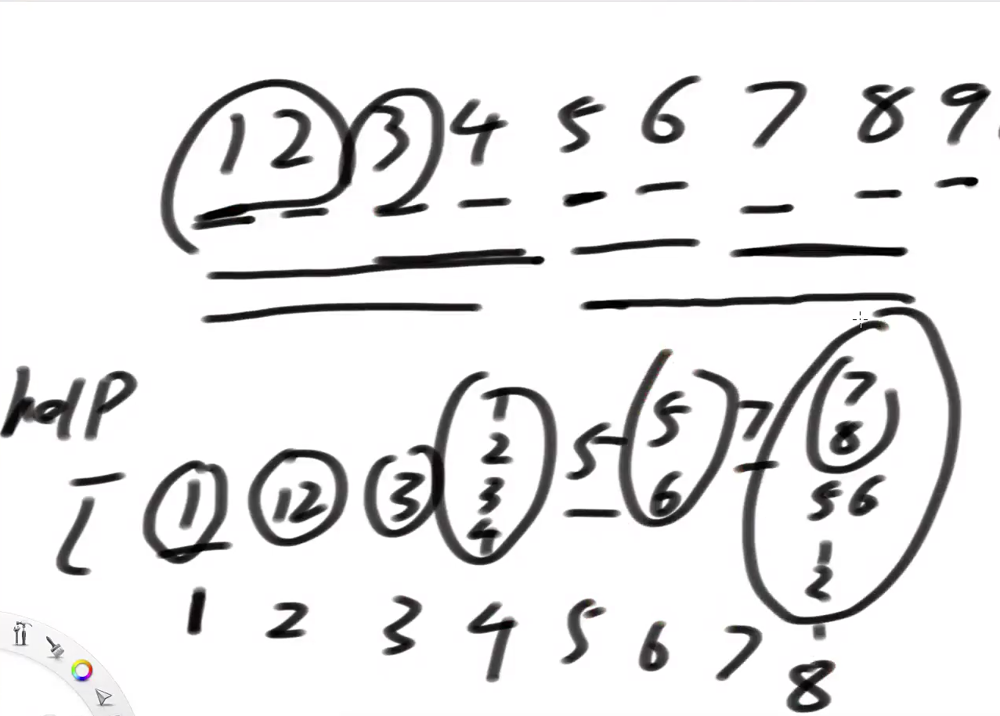
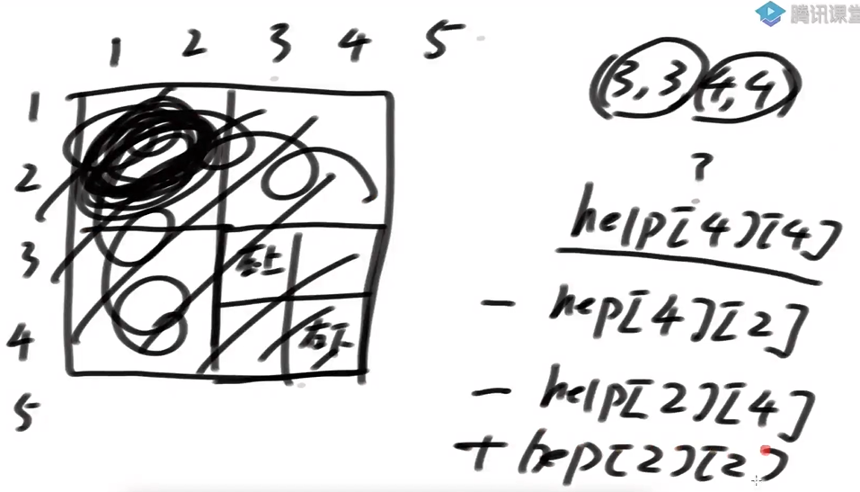

# 引入

解决数组的范围内数字的累加和问题：

1. 前缀和数组：适用于数组初始化后，不会修改。
2. 线段树：一维数组的范围增加，更新，累加和查询。（推二维很麻烦）
3. IndexTree：多维数组的累加和查询单点更新

# IndexTree

特点：

1. 支持区间查询
2. 只支持单点更新
3. 没有线段树的适用性广，但很容易改成一维，二维或三维的结构

实现

1. help辅助数组，维护指定范围的累加和。

   分组计算累加和，如果当前组的长度和上一个组的长度相同，则合并。直到不满足条件，或越界(左)。

   

2. 求出help数组中某一个索引位置的组包含原数组的索引范围：

   规律：某一个索引位置Index（8）：二进制值是00001000，则index位置的结果，组中包含原数组的索引范围是：index的二进制值的最后一个1拆开，再加1，然后到它自己（00000001~00001000）是原数组中索引1~8范围内的数。

   示例index=29时，组中只管自己。11101-11101

3. 区间查询：1......index范围内的前缀和：

   下标关系规律：当前索引的二进制，不断移除最右的1，直到为0。在过程中，Index索引的变化值在help数组上，累加结果。

   示例：index=33，则1~33的前缀和是，help中01000001和01000000位置的和。

   分段示例：index=52，二进制为00110100 

   ​			help[00110100] 包含的原数组的索引范围是：arr[00110001~00110100]

   ​			help[00110000] 包含的原数组的索引范围是：arr[00100001~00110000]，结尾是上一段的开始

   ​			相当于分段求，再相加。				    

4. 区间查询：L......R范围内的前缀和：

   (1……R) - (1……L-1)  类似于前缀和数组。

5. 原始数组的单点更新：

   原始数组初始化都是0，help数组1-N也都是0，

   如果原数组arr中某个位置元素被更新，则help数组中哪些位置需要更新。

   下标关系规律：通过不停的累加Index二进制的最右侧的1，直到数组右边界。

   index升级到2^n时，之后的index都是2^n。

总结：

1. 更新的时候索引加最右侧的1，求前缀和时索引减去最右侧的1再加1.
2. 两个操作的时间复杂度都是O(logN)，因为二进制加(减)1的位数最多logN。

## 二维

实现：

1. help辅助数组也是二维，help[i]\[j]表示，在原二维数组中，以[1,1]为左上角，[i,j]右下角的区域的累加和。
2. 当原数组单点更新，help中需要修改的区域：

3. arr[00110100]\[00111000]=？ 原数组52行56列的值修改，

4. help中，行号范围00110001~00110100，列号范围00110001~00111000，help中的行列全部组合都受影响。

区间查询：L......R范围内的前缀和：

时间复杂度O(log行*log列)

三维就是3个范围的组合

# AC自动机

作用：解决在一个大字符串种，找到多个候选字符串的问题。

算法核心

1. 把所有匹配生成一颗前缀树
2. 前缀树节点增加fail指针
3. fail指针的含义：如果必须以当前字符结尾，当前形成的路径str，除了str之外剩下的哪一个字符串的前缀和str的后缀，拥有最大匹配长度。fail指针就指向那个字符串最后一个字符所对应的节点。

# 题目

## 二维区域和检索 - 可变

