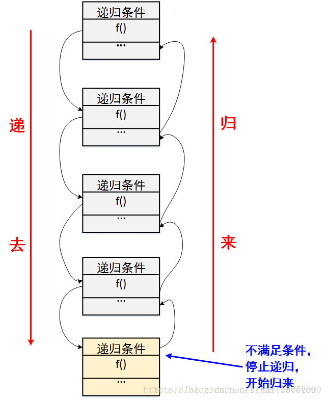
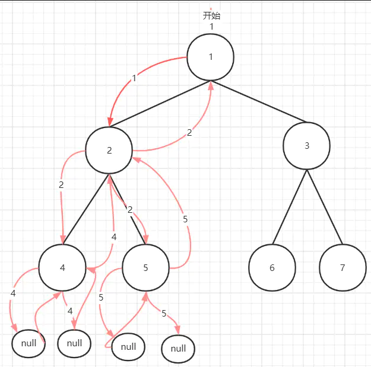

## 01 位运算,算法,简单排序

7种位运算 bitwise：

1. & 与:  遇0则0

2. | 或：遇1则1

3. ! 非：1-0，0-1

4. ^ 异或：相同为0，相异为1.（不进位加法）。实现不用中间变量交换两个数。

5. \>>右移：补符号位。（当前符号位为1补1，为0补0)，首位。

6. <<左移：补0. 末尾

7. \>>>无符号右移：补0. 首位。

算法

1）有具体的问题

2）有设计解决这个问题的具体流程

3）有评价处理流程的可量化指标

**算法的分类**

  1   明确知道怎么算的流程   :诗人拜仑的女儿. 打孔程序.

  2   明确知道怎么尝试的流程  :  图灵, 破解密码, 找出一个原型, 把不知怎么算, 但知道怎么试的问题, 试出来 . 

示例题目

- 题目一: [[阶乘计算]]  
- 题目二: [[选择排序]]  
- 题目三: [[冒泡排序]]  
- 题目四: [[插入排序]]  

插入排序和冒泡的差别：插入排序在好的数据状况下，减少操作时间。而冒泡流程固定，不受数据状况的影响。

都是同样复杂度的算法：O(n^2)

## 02 前缀和数组、对数器和随机行为

数据结构

1）数据结构是存储、组织数据的方式.  任何数据结构都是 连续结构 跟 跳转结构两个 拼出来的

2）精心选择的数据结构可以带来更高的运行或者存储效率

3）数据结构是很多算法得以进行的载体

最基本的数据结构

1）数组: 便于寻址，不便于增删数据

2）链表: 便于增删数据，不便于寻址

对数器的使用

- 选择、冒泡、插入排序的对数器验证

示例题目

-  假设有一个数组arr，用户总是频繁的查询arr中某一段的累加和, 如何组织数据，能让这种查询变得便利和快捷？ **预处理结构(前缀和数组).**
- 调整数出现的概率从x调整为x^2.   **Math.random() 返回[0,1)**
- 概率生成数字问题, 使用等概率函数f(x), (1-5的随机),  返回1-7等概率.   **0,1发生器**.
- a-b等概率随机到c~d的等概率随机生成数字.
- 01不等概率随机到01等概率随机

## 03 二分、复杂度、动态数组、哈希表和有序表

### 二分法

1. [[有序数组中找到num]]   
2. [[有序数组中找到＞=num最左的位置]]   
3. [[有序数组中找到＜=num最右的位置]]   
4. [[局部最小值问题]] , 无序且相邻不等的数组, 找一个局部最小值(比前后都小). 
   1. 若arr[0]>arr[1] 下降 且 arr[n-2]< arr[n-1] 上升, 则mid肯定有局部最小值
   2. 二分不一定有序.

### **时间复杂度**

1. 常数(固定)时间的操作: 1+1, 100w+100w, 数组寻址 arr[3], arr[100w]. 

2. 复杂(变化)时间的操作: 操作时间与数据量有关.

3. 冒泡排序的时间复杂度: 

   1. 等差数列求和: 

      

   3. 时间复杂度: O(n^2), 只关心最高阶是多少. 省略低阶项和系数.
      $$
      Sn = a1*n+\frac{n^2-n}{2}
      	 = \frac{n^2}{2} - (\frac{1}{2}-a1)*n
      	 = a*n^2 + b*n + c
      	 \approx n^2
      $$

   4. 当数据量n很大, 系数项a跟低阶项b*n+c根本不重要, 决定算法运行时间的就是最高阶项

   5. O是最差情况下的算法是几阶。（还有平均情况下，最好情况下的时间复杂度）。

4. 二分法的时间复杂度: O(logN).
   1. 一般来讲底数是被省略了, $O(logN)$默认就是以2为底的, 有时候$O(log_7N)$也写成$O(logN)$   
   2. 因为你底数不管是多少, 它出来的值都很小, long类型, 最大2^64, 这么大的数, 二分的话, 64次就处理完了 ,所以往往就忽略这个底,    
   3. 如果这个底等于2或者比2大, 它出来的结果都会很小, 所以默认就写成 $O(logN)$了 
   
5. 常数操作的时间复杂度: O(1)

6. 分析和拆分算法流程时，确保所有的行为都是常数时间的操作。

动态数组, Java中**ArrayList 扩容**的代价:

1. 从arr[1]到arr[2], 扩容的操作多了两步: 生成新的扩容数组, 将arr[1]拷贝到arr[2]中.
1. 从arr[1]到arr[N], 扩容的代价为1+2+4+8......+N 为等比数列. 时间复杂度是O(N)
1. 但每一步的扩容 时间复杂度是O(1), 
1. 所以动态数组虽然有扩容, 相比固定数组只是常数时间的慢, 但对整体性能的时间复杂度上没有影响.

### 哈希表

哈希表的操作时间复杂度都是O(1)，与数据量无关，但常数时间很大。比加法, 数组寻址的常数操作都慢.

基础类型：按值传递，内存里占用的是这个变量的实际大小。

非基础类型：按引用传递，内存占用的是这个变量内存地址的大小。

- HashMap：有key、有value

  用法：增(put)、删(remove)、改(put)和查(get)。
  remove是按key去删除元素的

- HashSet：有key、无value

  用法：增加 add;，删除 remove;，对比查找 contains;，清空集合 clear();，获取长度 size();

### 有序表

与哈希表的区别：有序表把key按顺序组织，而哈希表完全不组织。放入有序表中的元素，**若不是基础类型，必须提供比较器**，才能让key在内部有序组织。

- TreeMap: 有key、有value 用法同Map
- TreeSet: 有key、无value，用法同Set
- 操作的时间复杂度都是O(logN)

## 04 单链表跟双链表

单链表：值，一条next**指针**

双链表：值，一条last指针，一条next指针

经典题目:

1. 单链表和双链表如何反转

   1. 给定一个单链表的头head，完成链表的逆序调整
   2. 给定一个双链表的头head，完成链表的逆序调整
   3. 逆序调整后必须返回新的头节点, 并重置头节点, 否则JVM会进行垃圾回收.

2. 用双链表实现双端队列( **Java 中的LinkedList，实现了List和Queue** )

   1. 单链表在删除时, 无法找到上一个元素.

3. K个节点的组内逆序调整

   https://leetcode-cn.com/problems/reverse-nodes-in-k-group/   

   给定一个单链表的头节点head，和一个正数k

   实现k个节点的小组内部逆序，如果最后一组不够k个就不调整

   例子:

   调整前：1 -> 2 -> 3 -> 4 -> 5 -> 6 -> 7 -> 8，k = 3

   调整后：3 -> 2 -> 1 -> 6 -> 5 -> 4 -> 7 -> 8

4. 两个链表相加

   https://leetcode-cn.com/problems/add-two-numbers/   

   给定两个链表的头节点head1和head2，

   认为从左到右是某个数字从低位到高位，返回相加之后的链表

   例子   4 -> 3 -> 6    2 -> 5 -> 3

   返回   6 -> 8 -> 9

   解释   634 + 352 = 986

   >先遍历两个链表, 把较长的重新定位一下  
   >
   >1) L 有 S有
   >2) S无 L有
   >3) S无 L无 进阶.

5. 两个有序链表的合并

   https://leetcode-cn.com/problems/merge-two-sorted-lists     

   给定两个有序链表的头节点head1和head2，
   
   返回合并之后的大链表，要求依然有序
   
   例子   1 -> 3 -> 3 -> 5 -> 7     2 -> 2 -> 3 -> 3-> 7
   
   返回   1 -> 2 -> 2 -> 3 -> 3 -> 3 -> 3 -> 5 -> 7
   
   >重新定位一下, cur1指向小头, cur2指向大头

## 05 位图跟位运算

位图: bitmap --> 用bit(位) 实现 map 的功能   

1，位图的功能

2，位图的好处

3，位图的实现

用位运算实现+ - * /加减乘除

1，加法:  {^ 异或, 不进位加法}   +   {&(都为1才进位)后, <<1得进位}
2，减法: 相反数, 求补码. 取反加1.
3，乘法: 若b的最后一位是1, 则结果加1个a, 循环b的每一位是否为1.
4，除法: a/b=c => a=b*2\^1+b\*2\^2+b\*2^n,获取是1的位, 拼成的二进制数就是c,
5,   取余: X & (2^N -1). 只对2的N次方数系有效.  9%4=9&(4-1)=1001&0011=0001=1;

## 06 比较器、优先级队列和二叉树

比较器: 实现Comparator.compare(a,b)和Comparable.compareTo(b)两种方式.

1. 应用在系统排序方法中
2. 应用在与排序有关的结构中，优先级队列（堆）、有序表

字符串排序；字典序

​     1. 长度相同, 转为ASSIC码,比较数值.

​     2. 长度不同, 短的用最低的ASSIC码补齐.

### 堆（Heap）

1. Heap是一种数据结构具有以下的特点：

   1）**完全二叉树**；
   2）heap中存储的值是**偏序**；

2. **Min-heap**小根堆: 父节点的值小于或等于子节点的值；

   **Max-heap**大根堆: 父节点的值大于或等于子节点的值；

3. 优先级队列（堆）PriorityQueue.

### 栈

双端队列LinkedList实现栈的功能 addLast, pollLast.  LIFO. 

### 递归

定义：在数学与计算机科学中，递归(Recursion)是指在函数的定义中使用函数自身的方法。

递归的基本思想：把规模大的问题转化为规模小的相似的子问题来解决，

递归的精髓：递归就是有去（递去）有回（归来），修改动态规划全是递归,



1. “递去”是指：递归问题必须可以分解为若干个规模较小，与原问题形式相同的子问题，这些子问题可以用相同的解题思路来解决；
2. “有回”是指 : 这些问题的演化过程是一个从大到小，由近及远的过程，并且会有一个明确的终点(临界点)，一旦到达了这个临界点，就不用再往更小、更远的地方走下去。最后，从这个临界点开始，原路返回到原点，原问题解决。　

用归纳法来理解递归：

1. 递归的数学模型其实就是 数学归纳法
2. 数学归纳法适用于将解决的原问题转化为解决它的子问题，而它的子问题又变成子问题的子问题，而且我们发现这些问题其实都是一个模型，也就是说存在相同的逻辑归纳处理项。
3. 归纳法的三要素：
   1. 步进表达式：问题蜕变成子问题的表达式
   2. 结束条件：什么时候可以不再使用步进表达式
   3. 直接求解表达式：在结束条件下能够直接计算返回值的表达式

递归的三要素

1. **明确递归终止条件**
2. **给出递归终止时的处理办法**
3. **提取重复的逻辑，缩小问题规模\***

应用场景

1. 问题的定义是按递归定义的（Fibonacci函数，阶乘，…）
2. 问题的解法是递归的。如：斐波那契数列问题。汉诺塔问题
3. 数据结构是递归的（链表、树等的操作，包括树的遍历，树的深度，…）

递归与循环

1. 循环其实和递归具有相同的特性，即做重复任务
2. 从算法设计上看，递归和循环并无优劣之别
3. 在实际开发中，因为函数调用的开销，递归常常会带来性能问题，特别是在求解规模不确定的情况下；而循环因为没有函数调用开销，所以效率会比递归高
4. 问题的递归实现转换成非递归实现：
   1.  自己建立“堆栈(一些局部变量)”来保存这些内容以便代替系统栈，比如树的三种非递归遍历方式；
   2.  把对递归的调用转变为对循环处理。

递归示例：https://blog.csdn.net/sinat_38052999/article/details/73303111

### 二叉树递归遍历

（1）先(根)序遍历（根左右）

（2）中(根)序遍历（左根右）

（3）后(根)序遍历（左右根）

举个例子：


先(根)序遍历（根左右）：A B D H E I C F J K G

中(根)序遍历（左根右） : D H B E I A J F K C G

后(根)序遍历（左右根） : H D I E B J K F G C A

### 递归序

前中后序遍历的代码基本一致。

```java
// 代码是遍历二叉树时常用的递归代码
// 在1位置traverse函数返回值head节点，
// 在2位置traverse函数返回值为左孩子节点，
// 在3位置traverse函数返回值为右孩子节点
public static void traverse（Node head）{
        if(head == null)
            return ;
        // 1 先序
        traverse（head.left);
        // 2 中序
        traverse（head.left);
        //3 后续
    }
```

先序图：



- 根据递归过程，可以发现，二叉树的每个节点会到达三次 ,根据图中，访问顺序为   12444255521...
- 因此在第一次到达节点进行处理就是二叉树的先序遍历，第二次到达进行处理就是中序遍历，第三次到达进行处理就是后序遍历。

**作用**：根据图中的访问顺序可以发现，节点可以收集左右节点的信息，即问题可以得到子问题的信息，是利用树做动态规划的基础。

### 题目

1. 合并多个有序链表 https://leetcode.com/problems/merge-k-sorted-lists
2. 判断两颗树是否结构相同 https://leetcode-cn.com/problems/same-tree
3. 判断一棵树是否是镜面树  https://leetcode-cn.com/problems/symmetric-tree
4. 返回一棵树的最大深度 https://leetcode-cn.com/problems/maximum-depth-of-binary-tree/
5. 用先序数组和中序数组重建一棵树 https://leetcode-cn.com/problems/construct-binary-tree-from-preorder-and-inorder-traversal/
6. 二叉树按层遍历并收集节点 https://leetcode-cn.com/problems/binary-tree-level-order-traversal-ii/
7. 判断是否是平衡搜索二叉树 https://leetcode-cn.com/problems/balanced-binary-tree/
8. 能否组成路径和 https://leetcode-cn.com/problems/path-sum/
9. 收集达标路径和 https://leetcode-cn.com/problems/path-sum-ii/

## 07 归并排序


---

归并排序过程:

1）整体是递归，二分，左边排好序+右边排好序+merge让整体有序  
2）让其整体有序的过程里用了排外序方法  
3）利用master公式来求解时间复杂度  

题目：

1. 不要用任何比较判断，返回两个数中较大的数. 

   使用位运算.

2. 归并排序的递归实现和非递归实现

3. 快速排序的递归实现和非递归实现


## 08 快速排序

### 数组分区

对于数组最后一个值x, <=x的整体放在左边, >x的整体放在右边, 不要用辅助数组, 时间复杂度O(N) 完成这个调整


```text
设计一个区域, 叫<=区, 
拿数组最右侧的数P做划分, 依从从0位置的数往后遍历:  
1) 如果当前数<=P, 当前数和<=区下一个数做交换, 然后<=区右扩, 当前数跳下一个
2) 如果当前数>P, 当前数直接跳下一个
```

```java
public static void splitNum(int[] arr) {
    int lessEqualR = -1;
    int index = 0;
    int mostR = arr.length - 1;
    while (index < arr.length) {
        if(arr[index] <= arr[mostR]) {
            swap(arr, index++, ++lessEqualR);
        } else {
            index++;
        }
    }
}
```

### 分区加强

一个数组中, 拿数组最右侧的数P做划分, 做到:  Px的整体放在左边, =P的整体放在中间, >P的整体放在右边  


```text
小于区放在数组左边, 大于区在数组右边, 当前数从0开始, 有3种可能:
1) 当前数<P, 当前数跟小于区的下一个数交换, 小于区向右扩, 当前数跳到下一个
2) 当前数>P, 当前数跟大于区的前一个数交换, 大于区向左扩, 当前数不动
3) 当前数=P, 当前数直接跳下一个

当前数跟大于区域的边界撞上的时候不用遍历了
最后一个数 跟 大于区域的第一个数交换就做到了
<P的整体放在左边, =P的整体放在中间, >P的整体放在右边
```

```java
public static void splitNum2(int[] arr, int L, int R) {
    int N = arr.length;
    int lessR = -1;
    int moreL = N - 1;
    int index = 0;
    // arr[N-1]
    while (index < moreL) {
        if (arr[index] < arr[N - 1]) {
            swap(arr, ++lessR, index++);
        } else if (arr[index] > arr[N - 1]) {
            swap(arr, --moreL, index);
        } else {
            index++;
        }
    }
    swap(arr, moreL, arr[N - 1]);
}
```


### 快排

#### 基本函数partition

```java
// arr[L...R]范围上, 拿arr[R]做划分值
// L....R     <   =   >
// 返回等于区域的左边界跟右边界
public static int[] partition(int[] arr, int L, int R) {
    int lessR = -1;
    int moreL = R;
    int index = L;
    // arr[N-1]
    while (index < moreL) {
        if (arr[index] < arr[R]) {
            swap(arr, ++lessR, index++);
        } else if (arr[index] > arr[R]) {
            swap(arr, --moreL, index);
        } else {
            index++;
        }
    }
    swap(arr, moreL, arr[R]);

    return new int[]{lessR + 1, moreL};
}
```

#### 递归版本

```java
public static void quickSort(int[] arr) {
    if (arr == null || arr.length < 2) {
        return;
    }
    process(arr, 0, arr.length - 1);
}

public static void process(int[] arr, int L, int R) {
    if (L >= R) { // 等于的时候不用排序
        return;
    }    
    // L < R
    swap(arr, L + (int) (Math.random() * (R - L + 1)), R);
    int[] equalArea = netherlandsFlag(arr, L, R);
    // equalArea[0] 等于区域第一个数
    // equalArea[1] 等于区域最后一个数
    process(arr, L, equalArea[0] - 1);
    process(arr, equalArea[1] + 1, R);
}
```


#### 非递归版本

假设101个数排序 一个任务就是一个L 和 一个 R, 最大的任务是 0~100这个任务  


```java
public static void quickSort(int[] arr) {
    if (arr == null || arr.length < 2) {
        return;
    }
    Stack<Job> stack = new Stack<>();
    stack.push(new Job(0, arr.length - 1)); // 最大的任务
    while (!stack.isEmpty()) {
        Job cur = stack.pop();
        int[] equals = partition(arr, cur.L, cur.R);
        if(equals[0] > cur.L) { // 有小于区域, 才有子任务
            stack.push(new Job(cur.L, equals[0] -1));
        }
        if(equals[1] < cur.R) { // 有大于区域, 才有子任务
            stack.push(new Job(equals[1] + 1, cur.R));
        }
    }
}
```

## 问题

求中点的两种方式：

1. int mid=(a+b)/2.   
2. int mid=a+((b-a)>>2)

推荐第二种，第一种，如果a和b很大，相加后可能越界，大于Int32.MaxValue..

