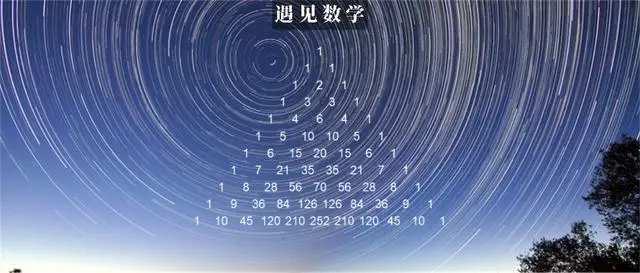
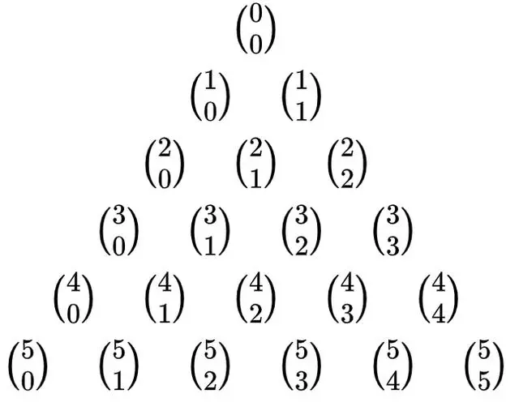
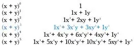
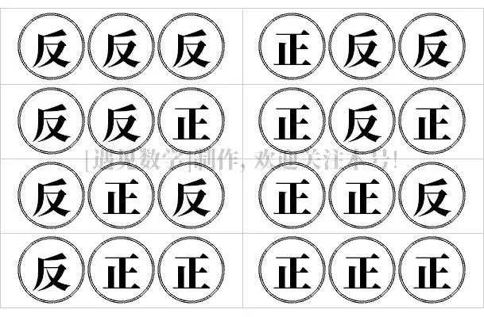

# 定义

杨辉三角形，又称帕斯卡三角形、贾宪三角形、海亚姆三角形，它的排列形如三角形。因为首现于南宋杨辉的《详解九章算法》得名，而书中杨辉说明是引自贾宪的《释锁算书》，故又名贾宪三角形。古代波斯数学家欧玛尔·海亚姆也描述过这个三角形。在欧洲，因为法国数学家布莱兹‧帕斯卡在1653年的《论算术三角》中首次完整论述了这个三角形，故也被称作帕斯卡三角(Pascal's triangle)。  

杨辉三角的前 10 行写出来如下：

杨辉三角的构建

*   在最上面一行的中央写下数字 1
    
*   第二行，写下两个 1，和上一行形成三角形
    
*   随后的每一行，开头和最后的数字都是 1，其他的每个数都是它左上方和右上方的数之和，就是说除每行最左侧与最右侧的数字以外，每个数字等于它的左上方与右上方两个数字之和。
    

每个数是它左上方和右上方的数的和

杨辉三角的美妙之处在于：它是如此足够简单，但本身在数学上却拥有丰富的魅力。这是数学中的最令人称奇的事物之一，随便取诸多数学性质中的某个，就能表明它是多么的精彩绝伦。  

现在让我们一起来探索藏在杨辉三角里的 10 个你可能不知道的秘密吧！

# 秘密

## 1：隐藏数列 

提示：为了有助于找到隐藏的信息，先将杨辉三角按左对齐方式排列。

左对齐后的杨辉三角

前两列倒没什么特别的地方，第一列均为 1，第二列则为自然数。而第三列就是三角形数(Triangular number)。你可以想到，三角数就是能够组成大大小小等边三角形的点的数目，如下图所示。  

类似地，第四列是四面体数(Tetrahedral number)，也叫三角锥体数。顾名思义，它们代表由三角形构成的四面体所需要的点的数目，四面体数每层为三角形数。  

五层高的锥体共包含 35 个球体

往后每一列都延续这一规律，这一规律描述了由三角形数/四面体数到高纬度“单纯形”的拓展。下一列是 5-单纯形数，接着是 6-单纯形数，以此类推。  

> 在几何上，单纯形是某一维度空间中构造最简单的结构，0-单纯形就是点，1-单纯形就是一条线段，2-单纯形就是三角形，3-单纯形就是四面体，4-单纯形就是五胞体。

## 2：2 的幂  

如果你把每一行相加会得到 2 为底的幂，始于 2⁰=1

可以看到每一行的和都是以 2 为底的幂

## 3：11 的幂 

杨辉三角还揭示了 11 为底的幂的值。你要做的就是将每一行的数字挤压到一起。前 5 行足够简单，但出现两位数的时候该怎么办呢？

事实证明，你要做的就是将十位数加到它左侧数字上，比如下图所示的是第六行中出现了上面的情况，如何进行移动以获得 11⁵ 的值

如果出现了三位数同样进位处理即可。

## 4：完成平方数

我们可以通过将右边的数与右下的数相加找到第二列中自然数的平方。 如：  

*   2² → 1+3=4
    
*   3² → 3+6
    
*   4² → 6+10=16 等等
    

## 5：斐波那契数列

为了揭示隐藏的斐波那契数列，将左对齐的杨辉三角对角线相加。比如下图杨辉三角中发现的斐波那契数列前九个数：1，1，2，3，5，8，13，21，34…

按线条所示相加结果即为斐波那契数列(图自维基)

## 6：谢尔宾斯基三角 

放大杨辉三角，将所有的奇数用浅红色标识出来，你看到了什么？

是不是出现了著名的分形图谢尔宾斯基三角了呢？  

## 7：组合数学

或许杨辉三角中发现的最有趣的关系就是我们如何利用它找到组合数。

杨辉三角的前六行写成组合数的表达形式

回忆一下从 n 个不同元素中选 k 个元素的组合公式。我们发现，对于杨辉三角中的每一行数字，从零开始计数，n 是行数，k 是在这一行中的位置。  

所以，如果你想计算 4 选 2，看第 5 行，第 3 个数（因为我们从零开始计数），你会发现，答案是 6.

## 8：二项式展开

在数学上，二项式系数是二项式定理中各项的系数。而二项式系数可排列成杨辉三角，这样可以避免这样的麻烦，直接找到答案。

二项式相乘的标准方法 比如，我们来展开(x+y)³。既然我们把(x+y)的幂提升到了 3，就用杨辉三角第四行的值作为展开项的系数。然后像下面描述的一样填入 x 和 y 的表达式。  

提示：每个单项式的次数和等于 (x+y) 被赋予的幂值。

## 9：二项式定理

(x+y)的幂运算是很酷，但我们多久才会需要解这样的题呢？很有可能，不太经常需要。如果我们能够从上一个章节的结论中总结出一个更有用的形式，会不会更方便？ 好吧，其实这就是二项式定理：

这个公式也称二项式公式或二项恒等式。

更具体内容请见文章《利用杨辉三角形来解释二项式定理》

## 10：二项式分布 

与概率之间的联系：二项式分布描述了具有两种可能结果的实验的概率分布。事实上，杨辉三角的每一行也能揭示了这样的清晰，以最经典就是扔一枚硬币为例吧。

如果考虑抛 3 次硬币，就会有 8 种可能发生的事件：

但其实可以分为 4 类情况：

*   3 次反面 —— 只有 1 次发生
    
*   2 次正面和 1 次反面 —— 有 3 次发生
    
*   2 次反面和 1 次正面 —— 有 3 次发生
    
*   3 次正面 —— 只有 1 次发生
    

这注意 1, 3, 3, 1 正是杨辉三角的第 4 行。同样如果抛 5 次硬币，出现 3 正 2 反 的事情会出现 10 次，这也是出现在了杨辉三角第 6 行。

如果设抛硬币得到正面概率为 p，反面概率为 1–p。想知道扔到正面的可能性，我们可以使用二项式分布的概率质量函数（pmf）找到概率的分布， 其中 n 是试验次数， k 是成功次数。

二项式分布的概率质量函数

嗨，这看起很熟悉啊！这几乎和我们前面提到的二项式定理是一样的公式，只是没有求和公式，同时 x 和 y 被 p 和 1-p 代替了。  

假设成功的概率是0.5(p=0.5)，我们计算扔到正面0次、1次、2次、3次的概率。

在公式中代入 n=3、 k=0, 1, 2, 3 ，得到下面计算结果，请注意杨辉三角里的组合数： 1, 3, 3, 1：

扔到正面 0 次、3 次的可能性都是12.5%，而扔到正面1次、2次的可能性都是37.5%，这与上面分析结果是一致的。